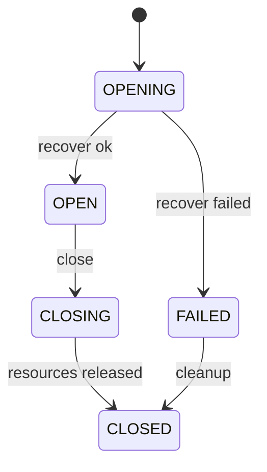
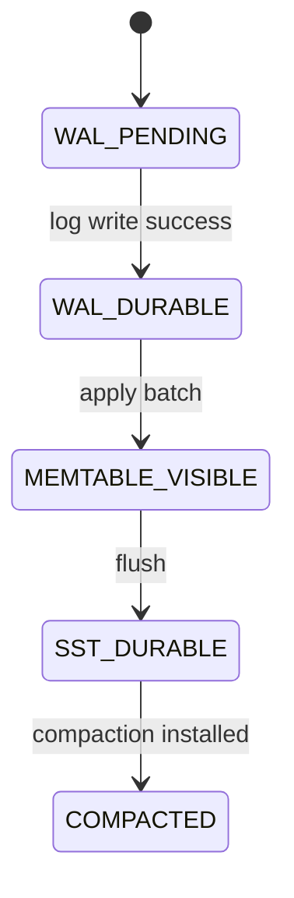
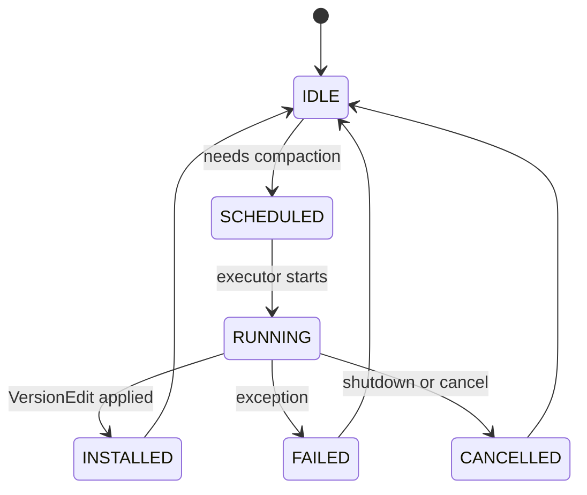
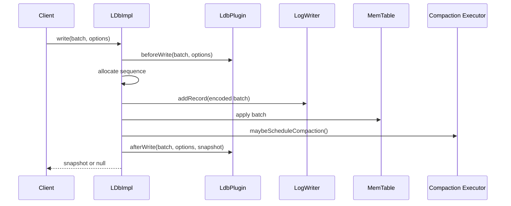
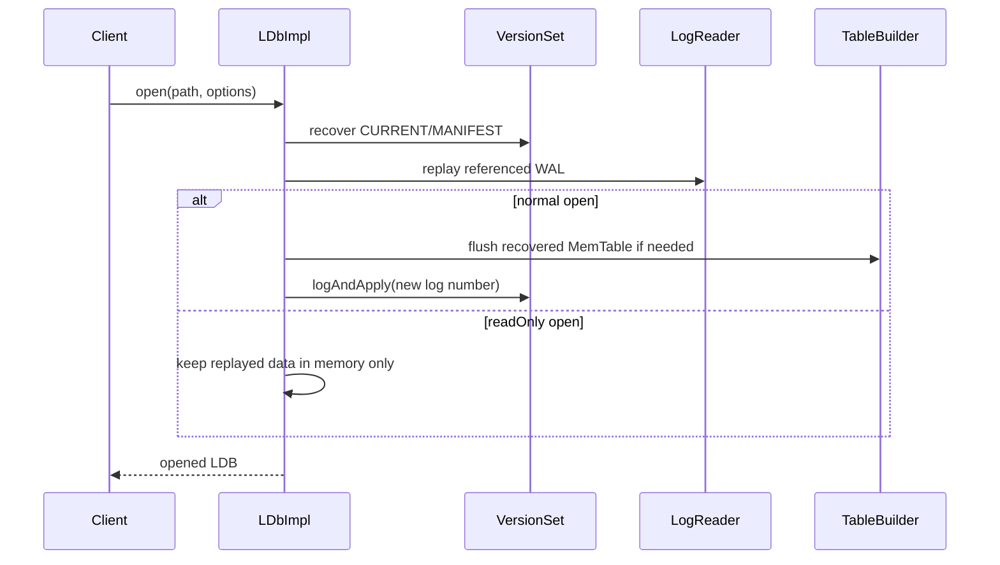

# LDB Project Design

English | [中文](ldb-project-design.md)

## Background

`vexra-ldb` is a Java implementation of an embedded LSM/LevelDB-style key-value store. It is intended for systems that need local persistence, sequential writes, range iteration, recovery, and lightweight operational tooling. The current codebase includes WAL, MemTable, SSTable, MANIFEST/CURRENT, VersionSet, background compaction, column families, plugins, checkpoint, offline check/repair/backup/restore, and a command-line tool entry point.

This document describes the design that is implemented today. It is the baseline for future changes to disk format, recovery semantics, read/write paths, column families, tool commands, and compatibility behavior.

## Goals

- Describe LDB module boundaries, read/write paths, file responsibilities, and recovery flow.
- Document the current API surface, diagnostics, operational tools, and extension points.
- Provide common context for future range delete, column-family lifecycle, WAL lifecycle, API compatibility, and tool work.
- Preserve JDK 8, Gradle, UTF-8, and existing disk-format compatibility.

## Non-Goals

- This document does not propose new runtime behavior.
- It does not promise full RocksDB API or disk-format compatibility.
- It does not introduce new MergeOperator, PrefixExtractor, transactions, TTL, custom Env, or full RocksDB API compatibility.
- It does not replace existing focused design documents such as range delete and API compatibility designs.

## Current Design

### Modules

| Module | Representative classes | Responsibility |
| --- | --- | --- |
| Public API | `LDB`, `DBFactory`, `Options`, `ReadOptions`, `WriteOptions` | Open, read/write, batch write, snapshot, compaction, checkpoint, and diagnostics |
| Write batch | `LdbWriteBatch`, `MergeCapableWriteBatch`, `LdbWriteBatchImpl`, `LdbWriteBatchLog` | Aggregate put/delete/deleteRange/addLong, encode WAL records, and apply to MemTable |
| Core engine | `LDbImpl` | Open, recover, read/write, flush, compact, checkpoint, close, and plugin lifecycle |
| Column-family state | `LdbColumnFamily`, `ColumnFamilyState` | Store per-column-family MemTable, immutable MemTable, and metadata |
| Version management | `VersionSet`, `Version`, `VersionEdit`, `FileMetaData` | Manage MANIFEST, SST file sets, level metadata, compaction candidates, and sequence numbers |
| Log | `LogWriter`, `LogReader`, `Logs` | Write and read WAL/MANIFEST records, checksum records, and report corruption |
| Table files | `TableBuilder`, `Table`, `FileChannelTable`, `MMapTable`, `Block`, `BlockCache` | Build and read SSTables, cache blocks, verify CRC, and iterate |
| Iterators | `SnapshotCursor`, `RawCursor`, `InternalIterator`, `MergingIterator` | Provide snapshot views, internal-key merging, and range traversal |
| Tools and maintenance | `LDBFactory`, `LdbTool` | Offline check/repair, backup/restore, checkpoint command, and JSON reports |
| Plugins | `LdbPlugin`, `LdbPluginContext` | Open, write, checkpoint, and close lifecycle hooks |

### Open Flow

1. Validate `Options` and the database directory.
2. In writable mode, create the directory and acquire `LOCK`.
3. Initialize column-family states from `Options#getColumnFamilies`; the default family is added automatically.
4. Create `TableCache` and `VersionSet`.
5. `VersionSet#recover` reads the MANIFEST referenced by CURRENT and restores the current version, file numbers, WAL numbers, and last sequence.
6. Replay referenced WAL files:
   - In writable mode, replay WAL records into MemTables and flush to Level-0 SST files when needed.
   - In read-only mode, replay WAL records into the instance-local memory view without creating SST, MANIFEST, or a new WAL.
7. In writable mode, create a new WAL and persist the log number to MANIFEST.
8. Delete obsolete files and schedule background compaction if needed.
9. Notify plugins through `onOpen`.

### Write Flow

1. The caller enters the write path through `put`, `delete`, `addLong`, or `write(LdbWriteBatch)`.
2. `LDbImpl` validates database state, read-only state, batch type, and batch content.
3. Plugins receive `beforeWrite`; the batch is validated again afterwards so plugin mutation cannot bypass constraints.
4. A global sequence range is allocated under the mutex; when `groupCommitEnabled` is enabled and the batch is non-empty, write requests first enter the group-commit queue.
5. The batch is encoded as a WAL record: `sequenceBegin + updateSize + operations`.
6. The WAL record is written and synced according to the write options or group sync policy; if any request in a group requires sync, that commit cycle must sync.
7. The batch is applied to the target column-family MemTables.
8. If a MemTable exceeds `writeBufferSize`, it is switched to an immutable MemTable and flush/compaction is scheduled.
9. A post-write snapshot may be returned according to `WriteOptions`.
10. Plugins receive `afterWrite`. This callback happens after commit; failure does not roll back committed data.

### Read Flow

1. Wrap the user key as a sequence-aware `LookupKey`.
2. Search the target column family's current MemTable.
3. Search its immutable MemTable.
4. Search the current `Version` through `VersionSet` and SST files.
5. A delete marker returns no value; a value record returns the value.
6. A snapshot cursor uses a fixed sequence to avoid observing writes made after the snapshot was created.

### Flush and Compaction

- When a MemTable reaches the write-buffer threshold, it becomes immutable.
- Flush writes the immutable MemTable as a Level-0 SST and updates MANIFEST through `VersionEdit`.
- Background compaction runs on a single-thread executor. `VersionSet` selects candidates by compaction score or seek pressure.
- Level-0 may contain overlapping files; Level-1 and above require non-overlapping key ranges within the same level.
- Manual `compactRange` flushes first and then triggers range compaction across levels.
- Compaction supports suspend/resume, close waiting, cancellation cleanup, rate limiting, and diagnostic statistics.

### Maintenance Flow

- `checkpoint(targetDir)`: flushes first, suspends compaction, freezes the file set, builds the copy in a unique temporary sibling directory, copies or hard-links CURRENT, MANIFEST, `COLUMN-FAMILIES`, live SST, referenced WAL, and INFO_LOG files, writes `CHECKPOINT-REPORT.json`, verifies the output, and then publishes it to `targetDir`; failures clean up the temporary directory so half-built outputs are not exposed as successful checkpoints.
- `LDBFactory.check`: offline scan of CURRENT, MANIFEST, `COLUMN-FAMILIES`, SST, and WAL. It returns `CheckReport`, does not acquire the write lock, and does not modify the directory; CURRENT content must be a legal same-directory `MANIFEST-NNNNNN` file name.
- `LDBFactory.repair`: rebuilds MANIFEST/CURRENT from available SST/WAL files, quarantines corrupt files, and writes `REPAIR-REPORT.json`.
- `createBackup/restoreBackup`: creates full backups and restores them through a temporary-directory publish flow, producing JSON reports.
- `createIncrementalBackup/checkBackup`: creates a complete restorable incremental backup directory, preferentially hard-linking same-name same-length SST files from the previous backup and writing `BACKUP-MANIFEST.json`.
- `purgeOldBackups`: removes only published `backup-000001` style directories.

## Core Constraints

| Constraint | Description |
| --- | --- |
| JDK version | `gradle.properties` sets `jdkVersion=1.8` |
| Encoding | Java compilation and documents use UTF-8 |
| WAL policy | A global WAL is used to preserve cross-column-family batch atomicity and global sequence order |
| Disk format | Normal changes must not break existing WAL, MANIFEST, SST, or CURRENT compatibility |
| Concurrency model | Core state is coordinated by the `LDbImpl` mutex and a single-thread compaction executor |
| Read-only open | Does not create WAL, write MANIFEST, delete obsolete files, or acquire the write lock |
| Plugin boundary | `afterWrite` failure does not roll back committed data |
| Resource release | Cursors, tables, WAL, VersionSet, locks, and plugins must be explicitly released or closed by the close path |

## External Developer Constraints (LDB Consumers and Plugin Extension Developers)

The following constraints are part of the external commitment baseline and should be checked before releases and major changes:

- Column family registration: declaration, identifier/name stability, and registry consistency are treated as public boundaries.
- Storage behavior: public `open`, `write`, `batch`, `scan`, `checkpoint`, and `restore` semantics must remain stable.
- `DbStore` mapping: `key-value`, `counter`, `batch`, and `commit/recovery` boundaries follow the committed contract; no additional transaction rollback semantics are promised.
- Plugin behavior: `beforeWrite` failures must not cause partial commit; `afterWrite`/`afterCheckpoint` are post-commit notifications and may require idempotent retries.
- Upgrade boundaries: public API compatibility, on-disk data compatibility, and plugin-hook compatibility follow the minimum acceptance matrix in the external commitment document.

See [vexra-ldb External Commitment for LDB Users](vexra-ldb-external-commitment.en.md) for the full list and minimum acceptance matrix.

## Interface Design

### Public API

| Interface | Description |
| --- | --- |
| `DBFactory#open(File, Options)` | Opens a database and returns an `LDB` instance |
| `DBFactory#destroy(File, Options)` | Deletes the database directory |
| `DBFactory#repair(File, Options)` | Repairs the database directory |
| `LDB#get` | Reads a key from the default or a specified column family |
| `LDB#put/delete/addLong` | Writes a value, deletes a key, or increments a long counter |
| `LDB#write` | Atomically applies a write batch |
| `LDB#createWriteBatch` | Creates a write batch |
| `LDB#getSnapshot` | Gets a snapshot of the current view |
| `LDB#newSnapshotCursor` | Creates a snapshot cursor |
| `LDB#compactRange` | Manually compacts a key range |
| `LDB#checkpoint` | Creates a verifiable checkpoint |
| `LDB#getProperty` | Reads a diagnostic property |
| `LDB#listColumnFamilies` | Returns the current effective column-family snapshot |
| `LDB#createColumnFamily` | Creates a runtime column family and persists `COLUMN-FAMILIES` |
| `LDB#renameColumnFamily` | Renames an active column family while keeping cfId stable |
| `LDB#dropColumnFamily` | Logically drops a non-default column family; dropped cfIds are not reused |

### Main Options

| Option | Default/Semantics |
| --- | --- |
| `createIfMissing` | Default true; creates the directory when missing |
| `errorIfExists` | Fails if the database already exists |
| `readOnly` | Opens without writing new files |
| `writeBufferSize` | MemTable flush threshold, default 64 MiB |
| `maxOpenFiles` | Base capacity for table cache |
| `blockSize` | SST block size, default 4 KiB |
| `blockRestartInterval` | Restart interval for block key prefix compression |
| `compressionType` | Default NONE |
| `verifyChecksums` | Verifies SST block CRC while reading |
| `verifyOnOpen` | Runs full check before opening |
| `forceLogOnClose` | Forces WAL data on close |
| `forceSstOnFlush` | Forces SST data after flush |
| `compactionSuspendTimeoutMillis` | Timeout for compaction suspension |
| `closeTimeoutMillis` | Timeout for waiting on background work during close |
| `level0CompactionTrigger` | L0 compaction trigger |
| `level0SlowdownWritesTrigger` | L0 write slowdown trigger |
| `level0StopWritesTrigger` | L0 write stop trigger |
| `writeSlowdownDelayNanos` | Per-write slowdown delay after the L0 soft trigger is hit |
| `compactionRateLimitBytesPerSecond` | Compaction output rate limit; 0 disables it |
| `groupCommitEnabled` | Default false; concurrent writes enter the group-commit queue when enabled |
| `groupCommitMaxDelayNanos` | Group-commit collection window, default 200 microseconds |
| `groupCommitMaxBatchBytes` | Per-cycle group-commit collection cap, default 1 MiB |

### Tool Commands

| Command | Side effects | Output |
| --- | --- | --- |
| `check <db>` | None | `CheckReport` JSON |
| `properties <db> [property...]` | Read-only open, no disk writes | Property JSON |
| `scan <db> [limit]` | Read-only open, no disk writes | Default-CF key/value base64 JSON |
| `repair <db>` | Rebuilds metadata and quarantines corrupt files | `REPAIR-REPORT.json` |
| `backup <db> <backupRoot>` | Creates a backup directory | `BackupReport` JSON |
| `incremental-backup <db> <backupRoot>` | Creates a complete restorable incremental backup directory | `BackupReport` JSON |
| `check-backup <backupDir>` | Read-only backup-directory validation | `CheckReport` JSON |
| `restore <backupDir> <targetDir>` | Creates a restored target directory | `BackupReport` JSON |
| `checkpoint <db> <targetDir>` | Creates a checkpoint directory | `CHECKPOINT-REPORT.json` |

## Data Structures

### Internal Key

An internal key consists of the user key, sequence number, and value type. The comparator primarily orders by user key and uses sequence ordering so newer versions of the same user key are visible first.

### ValueType

| Type | Semantics |
| --- | --- |
| `VALUE` | Normal value |
| `DELETION` | Single-key delete marker |
| `DELETE_RANGE` | Range delete marker; full semantics are controlled by a focused design |
| `ADD_LONG` | WAL batch operation type; it is applied as a long-encoded value |

### MemTable

MemTable stores recent writes ordered by internal key. Each column family has its own current and immutable MemTable, while WAL remains global.

### SSTable

SSTable contains data blocks, index block, meta/filter block, footer, and block trailers. Reads can verify block-trailer CRC according to `verifyChecksums`.

### Version and VersionSet

`Version` represents the SST file set across levels at a point in time. `VersionSet` is responsible for:

- Recovering the current version from MANIFEST.
- Allocating file numbers.
- Tracking last sequence, log number, and previous log number.
- Applying `VersionEdit`.
- Choosing compaction candidates.
- Retaining active versions so snapshot or iterator-visible SST files are not deleted prematurely.

## State Machines

### Database Instance State

### Write Visibility State

### Compaction State

## Sequence Flows

### Write Sequence

### Open and Recovery Sequence

## Error Handling

| Scenario | Behavior |
| --- | --- |
| Open failure | Closes created resources, releases lock and plugins |
| WAL record corruption | check/repair records corruption; recovery follows the current LogReader behavior for complete records |
| SST verification failure | Read, check, or verifyOnOpen throws or reports a failure with cause |
| Background compaction failure | Records `backgroundException`; later writes or manual compaction check and fail |
| Checkpoint failure | Resumes compaction, throws `DBException`, and preserves cause |
| Close timeout | Cancels background work and records close failure |
| Plugin exception | Open and before-write failures stop the operation; after-write failure does not roll back committed data |

## Idempotency

- `close()` uses `shuttingDown` so repeated calls do not release resources twice.
- `resumeCompactions()` logs a warning when called without a matching suspend and does not make the counter negative.
- `checkpoint` requires a missing or empty target directory, builds through a temporary directory, and publishes only after success, avoiding old-snapshot overwrite and half-built output exposure.
- `backup` builds in a temporary directory and publishes only after verification.
- `repair` writes a report and quarantines corrupt files; callers should inspect existing reports and quarantine results before repeating it.

## Rollback Strategy

- This document introduces no disk-format changes, so no data migration is required.
- Changes limited to memory validation, diagnostics, or tool output can be rolled back by reverting code.
- Any future WAL, MANIFEST, SST encoding or range tombstone semantic change must describe old-version reads, downgrade behavior, and corruption recovery in a focused design.
- Tool commands with side effects should use backup or checkpoint as a rollback point.

## Compatibility

| Dimension | Current strategy |
| --- | --- |
| JDK | Keep JDK 8 compatibility |
| Gradle | Use Gradle Wrapper and `java-library` |
| Disk format | Keep LevelDB-style WAL, MANIFEST, SST, and CURRENT |
| API | Preserve existing signatures; extend primarily through Options, properties, or tool commands |
| Column families | Supports static registration before open, runtime list/create/drop, non-empty drop tombstones, and rename; physical GC and migration policy continue through focused designs |
| RocksDB | Provide partial behavior mapping and diagnostics, not full compatibility |
| Read-only instance | Does not hold write lock or write the directory; suitable for diagnostics and properties command |

## Rollout and Migration

This is a design baseline document and does not change runtime behavior. Future feature rollout should follow this order:

1. Add design and compatibility notes first.
2. Add unit tests and fault-injection tests.
3. Keep new behavior disabled by default and enable it through Options or tool commands.
4. Expose observability through `getProperty`.
5. Verify recoverability with check, backup, checkpoint, or repair reports.
6. Move the feature into the default path only after validation.

## Test Plan

Existing tests cover:

- API behavior and compatibility: `ApiTest`, `LdbApiCompatibilityTest`.
- Core read/write behavior: `DbImplTest`, `LdbCoreBehaviorTest`.
- WAL lifecycle and crash recovery: `LdbWalLifecycleTest`, `LdbCrashRecoveryTest`, `LdbRecoveryMatrixTest`.
- Range delete: `LdbRangeDeleteTest`.
- Snapshot/iterator: `LdbSnapshotIteratorTest`.
- check/repair/backup/tooling: `LdbVerifyCheckTest`, `LdbRepairTest`, `LdbBackupTest`, `LdbToolTest`.
- Compaction, observability, and fault injection: `LdbObservabilityTest`, `LdbFaultInjectionTest`.
- Table/log/utilities: `TableTest`, `FileChannelTableTest`, `MMapTableTest`, `BlockTest`, `LogTest`, and utility tests.

Future changes should add coverage for:

- WAL truncation, checksum errors, and multi-WAL boundaries.
- Interleaved multi-column-family writes, recovery, compaction, and checkpoint.
- Long-lived snapshots concurrent with compaction.
- Tool command exit codes, JSON output, and side-effect directories.
- JDK 8 compilation and UTF-8 document validation.

## Risks

| Risk | Severity | Mitigation |
| --- | --- | --- |
| WAL/SST format change makes old data unreadable | High | Focused design, compatibility tests, downgrade notes |
| Compaction cleanup deletes SST files still referenced by snapshots | High | Active-version retention and snapshot tests |
| Plugins introduce side effects in the write path | Medium | Clear before/after boundaries and preserved causes |
| Read-only open writes the directory by mistake | High | Tests verifying no WAL/MANIFEST creation and no write lock |
| repair/backup/checkpoint overwrites target directories | High | Empty-directory requirement, temporary-directory publishing, failure cleanup, JSON reports |
| Range delete semantics remain incomplete | Medium | Keep focused design and explicit unsupported boundaries |

## Phased Plan

| Phase | Content | Acceptance |
| --- | --- | --- |
| 1 | Add overall README and project design documents | Documents match current code behavior and boundaries |
| 2 | Align completed work in the reliability plan | Tests and property names match documentation |
| 3 | Complete focused designs for range delete, column-family lifecycle, and WAL lifecycle | Each focused design has Chinese and English copies |
| 3.1 | Add designs for non-empty column-family drop/rename/tombstones, Backup Engine reference counts, and long-run benchmark reports | `ldb-column-family-tombstone-design.*`, `ldb-backup-engine-design.*`, and `ldb-longrun-benchmark-design.*` are documented |
| 4 | Improve tool commands and JSON report stability | Tool tests cover exit codes and output |
| 5 | Add longer soak, fault-injection, and compatibility tests | Recovery, compaction, snapshot, backup, and restore paths are covered |
| 6 | Production release gates and operational hardening | `ldb-production-readiness-plan.*` is documented; follow-up acceptance uses `releaseGate`, old-version fixtures, corruption injection, longrun, and runbooks |
| 7 | RocksDB gap and next-version planning | `ldb-rocksdb-gap-next-version-plan.*` is documented; follow-up acceptance is organized by advanced API, WAL/recovery, column-family, backup, compaction/cache, CLI, and observability packages |
