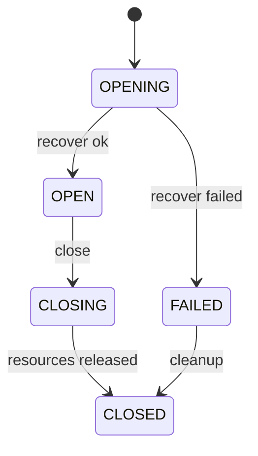
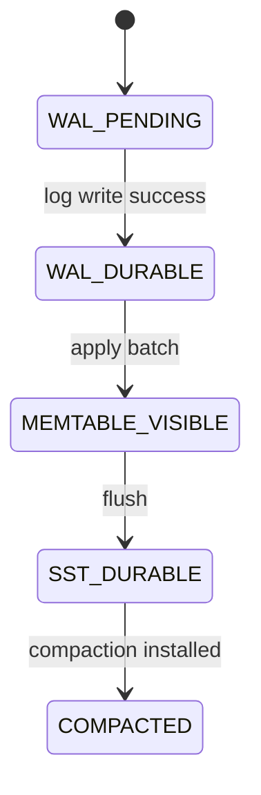
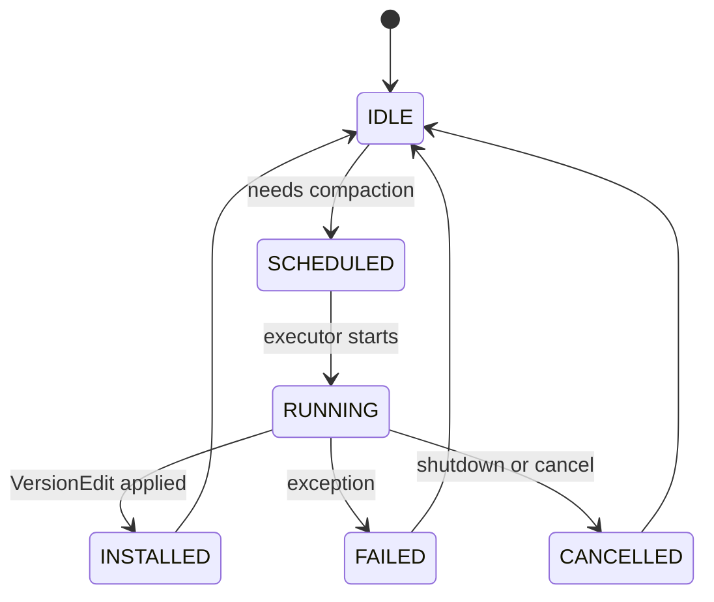
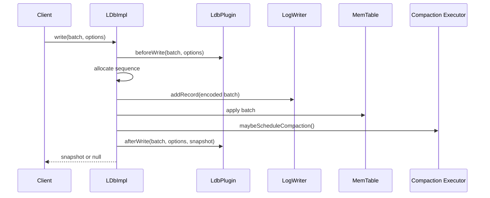
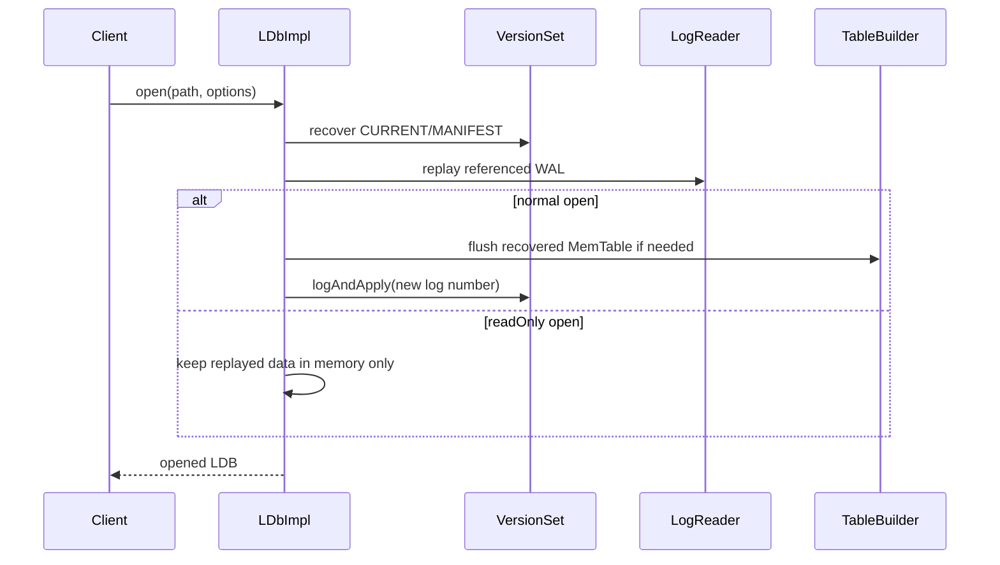

# LDB 项目整体设计文档

[English](ldb-project-design.en.md) | 中文

## 背景

`vexra-ldb` 是一个 Java 实现的本地 LSM/LevelDB 风格 KV 存储库，面向需要嵌入式持久化、顺序写入、范围扫描、故障恢复和轻量运维能力的上层系统。当前代码已经具备 WAL、MemTable、SSTable、MANIFEST/CURRENT、VersionSet、后台 compaction、列族、插件、checkpoint、离线 check/repair/backup/restore 和工具入口。

本文档按当前代码实现整理整体设计，用作后续修改磁盘格式、恢复语义、读写路径、列族、工具命令和兼容性行为时的基线。

## 目标

- 明确 LDB 的模块边界、读写路径、文件格式职责和恢复流程。
- 固化当前 API 能力、诊断属性、运维工具和扩展点。
- 为后续 range delete、列族生命周期、WAL 生命周期、API 兼容和工具增强提供统一设计上下文。
- 保持 JDK 8、Gradle、UTF-8 和现有磁盘格式兼容。

## 非目标

- 本文档不提出新的代码实现需求。
- 不承诺完整兼容 RocksDB API 和磁盘格式。
- 不在本文档内引入新的 MergeOperator、PrefixExtractor、transactions、TTL、custom Env 或完整 RocksDB API 兼容。
- 不替代已有专项设计文档，例如 range delete 和 API 兼容设计。

## 现状/已有流程

### 模块划分

| 模块 | 代表类 | 职责 |
| --- | --- | --- |
| 公共 API | `LDB`、`DBFactory`、`Options`、`ReadOptions`、`WriteOptions` | 对外暴露打开、读写、批量写、快照、压缩、checkpoint 和诊断入口 |
| 写批次 | `LdbWriteBatch`、`MergeCapableWriteBatch`、`LdbWriteBatchImpl`、`LdbWriteBatchLog` | 聚合 put/delete/deleteRange/addLong，编码到 WAL，并应用到 MemTable |
| 核心引擎 | `LDbImpl` | 管理打开、恢复、读写、flush、compaction、checkpoint、关闭和插件生命周期 |
| 列族状态 | `LdbColumnFamily`、`ColumnFamilyState` | 保存每个列族的 MemTable、immutable MemTable 和列族元信息 |
| 版本管理 | `VersionSet`、`Version`、`VersionEdit`、`FileMetaData` | 管理 MANIFEST、SST 文件集合、level 元数据、compaction 候选和 sequence |
| 日志 | `LogWriter`、`LogReader`、`Logs` | WAL/MANIFEST record 写入、读取、校验和损坏监控 |
| 表文件 | `TableBuilder`、`Table`、`FileChannelTable`、`MMapTable`、`Block`、`BlockCache` | SSTable 构建、读取、block cache、CRC 校验和迭代 |
| 迭代器 | `SnapshotCursor`、`RawCursor`、`InternalIterator`、`MergingIterator` | 提供快照视图、内部 key 合并和范围遍历基础 |
| 工具与维护 | `LDBFactory`、`LdbTool` | 离线 check/repair、backup/restore、checkpoint 命令和 JSON 报告 |
| 插件 | `LdbPlugin`、`LdbPluginContext` | 暴露打开、写入、checkpoint、关闭生命周期扩展点 |

### 打开流程

1. 校验 `Options` 和数据库目录。
2. 非只读模式创建目录并获取 `LOCK`。
3. 根据 `Options#getColumnFamilies` 初始化列族状态，默认列族自动加入。
4. 创建 `TableCache` 和 `VersionSet`。
5. `VersionSet#recover` 读取 CURRENT 指向的 MANIFEST，恢复当前版本、文件号、WAL 号和 last sequence。
6. 读取仍被引用的 WAL：
   - 普通模式将 WAL replay 到 MemTable，必要时 flush 为 Level-0 SST。
   - 只读模式将 WAL replay 到当前实例内存视图，不创建 SST、MANIFEST 或新 WAL。
7. 普通模式创建新的 WAL，并把 log number 写入 MANIFEST。
8. 清理过期文件，按需调度后台 compaction。
9. 通知插件 `onOpen`。

### 写入流程

1. 调用方通过 `put`、`delete`、`addLong` 或 `write(LdbWriteBatch)` 进入写路径。
2. `LDbImpl` 校验数据库状态、只读状态、batch 类型和 batch 内容。
3. 插件收到 `beforeWrite`，随后再次校验 batch，防止插件修改后绕过约束。
4. 在互斥锁保护下分配全局 sequence；当 `groupCommitEnabled` 开启且 batch 非空时，写请求先进入组提交队列。
5. 将 batch 编码为 WAL record：`sequenceBegin + updateSize + operations`。
6. 写入 WAL，并按写选项或组内 sync 聚合策略执行 sync；组内任一请求要求 sync 时，本轮提交必须执行 sync。
7. 将 batch 应用到对应列族的 MemTable。
8. 如 MemTable 超过 `writeBufferSize`，切换为 immutable MemTable 并触发 flush/compaction。
9. 可按 `WriteOptions` 返回写后 snapshot。
10. 插件收到 `afterWrite`。该通知发生在提交后，失败不会回滚已提交数据。

### 读取流程

1. 将用户 key 包装为带 sequence 的 `LookupKey`。
2. 优先读取目标列族当前 MemTable。
3. 再读取 immutable MemTable。
4. 最后通过 `VersionSet` 在当前 `Version` 的 SST 文件集合中查找。
5. 查询到 delete marker 时返回空；查询到 value 时返回 value。
6. snapshot cursor 使用固定 sequence 构造可见视图，避免读取到创建 snapshot 之后的新写入。

### Flush 与 compaction

- MemTable 达到写缓冲阈值后切换为 immutable MemTable。
- flush 将 immutable MemTable 写为 Level-0 SST，并通过 `VersionEdit` 更新 MANIFEST。
- 后台 compaction 由单线程 executor 执行，`VersionSet` 按 compaction score 或 seek 触发选择候选。
- Level-0 可有重叠文件；Level-1 及以上要求同层文件 key 范围不重叠。
- 手动 `compactRange` 会先 flush，再按 level 触发目标范围 compaction。
- compaction 支持暂停、恢复、关闭等待、取消清理、限速和统计属性。

### 维护流程

- `checkpoint(targetDir)`：flush 后暂停 compaction，冻结文件集合，在目标目录旁的唯一临时目录中复制或硬链接 CURRENT、MANIFEST、`COLUMN-FAMILIES`、live SST、引用 WAL 和 INFO_LOG，写入 `CHECKPOINT-REPORT.json` 并校验通过后再原子发布到 `targetDir`；失败时清理临时目录，避免把半成品暴露成成功快照。
- `LDBFactory.check`：离线扫描 CURRENT、MANIFEST、`COLUMN-FAMILIES`、SST、WAL，返回 `CheckReport`，不获取写锁，不修改目录。
- `LDBFactory.repair`：从可用 SST/WAL 重建 MANIFEST/CURRENT，隔离损坏文件，并写入 `REPAIR-REPORT.json`。
- `createBackup/restoreBackup`：执行全量备份和恢复，使用临时目录发布，生成 JSON 报告。
- `createIncrementalBackup/checkBackup`：创建完整可恢复的增量备份目录，优先通过硬链接复用上一备份中的同名同长度 SST 文件，并写入 `BACKUP-MANIFEST.json`。
- `purgeOldBackups`：仅清理已发布的 `backup-000001` 风格目录。

## 核心约束

| 约束 | 说明 |
| --- | --- |
| JDK 版本 | `gradle.properties` 指定 `jdkVersion=1.8` |
| 编码 | Java 编译和文档均保持 UTF-8 |
| WAL 策略 | 当前采用全局 WAL，保持跨列族 batch 的原子性和全局 sequence 顺序 |
| 磁盘格式 | 常规改动不得破坏现有 WAL、MANIFEST、SST、CURRENT 文件兼容 |
| 并发模型 | 核心状态由 `LDbImpl` 的互斥锁和单线程 compaction executor 协调 |
| 只读打开 | 不创建新 WAL，不写 MANIFEST，不删除旧文件，不获取写锁 |
| 插件边界 | `afterWrite` 失败不回滚已提交写入 |
| 资源释放 | cursor、table、WAL、VersionSet、锁和插件都必须显式释放或在关闭路径释放 |

## 外部开发者承诺（vexra-ldb 使用方与插件扩展开发者）

以下约束已纳入对外承诺基线，作为发布与新增功能前的检查项：

- 列族注册能力：列族声明、稳定性（id/名称）和 registry 一致性属于公开边界。
- 存储行为：`open`、`write`、`batch`、`scan`、`checkpoint`、`restore` 等公开语义必须保持稳定。
- `DbStore` 映射：`key-value`、`counter`、`batch`、`commit/recovery` 行为边界按现有承诺约束实现，不承诺额外事务级语义。
- 插件约束：`beforeWrite` 失败不应发生部分提交，`afterWrite`/`afterCheckpoint` 视为提交后通知失败可重试。
- 版本升级边界：公共 API、数据目录兼容及插件钩子兼容性以承诺文档中的最小验收矩阵为准。

对应承诺清单与验收矩阵见 [vexra-ldb 外部承诺](vexra-ldb-external-commitment.md)。

## 接口设计

### 对外 API

| 接口 | 说明 |
| --- | --- |
| `DBFactory#open(File, Options)` | 打开数据库并返回 `LDB` 实例 |
| `DBFactory#destroy(File, Options)` | 删除数据库目录 |
| `DBFactory#repair(File, Options)` | 修复数据库目录 |
| `LDB#get` | 按默认列族或指定列族读取 key |
| `LDB#put/delete/addLong` | 写入 value、删除 key 或执行 long 计数累加 |
| `LDB#write` | 原子应用批量写入 |
| `LDB#createWriteBatch` | 创建批量写对象 |
| `LDB#getSnapshot` | 获取当前快照 |
| `LDB#newSnapshotCursor` | 创建快照游标 |
| `LDB#compactRange` | 手动压缩 key 范围 |
| `LDB#checkpoint` | 生成可校验 checkpoint |
| `LDB#getProperty` | 查询诊断属性 |
| `LDB#listColumnFamilies` | 返回当前有效列族快照 |
| `LDB#createColumnFamily` | 运行时创建列族并持久化 `COLUMN-FAMILIES` |
| `LDB#renameColumnFamily` | 重命名活动列族，cfId 保持不变 |
| `LDB#dropColumnFamily` | 逻辑删除非 default 列族，已 drop 的 cfId 不复用 |

### 主要配置

| 配置 | 默认值/语义 |
| --- | --- |
| `createIfMissing` | 默认 true，目录不存在时创建 |
| `errorIfExists` | 已存在时是否失败 |
| `readOnly` | 只读打开，不写新文件 |
| `writeBufferSize` | MemTable flush 阈值，默认 64 MiB |
| `maxOpenFiles` | Table cache 容量基础 |
| `blockSize` | SST block 大小，默认 4 KiB |
| `blockRestartInterval` | block key 前缀压缩 restart 间隔 |
| `compressionType` | 当前默认 NONE |
| `verifyChecksums` | 读取 SST block 时校验 CRC |
| `verifyOnOpen` | 打开前执行全库 check |
| `forceLogOnClose` | 关闭 WAL 时强制落盘 |
| `forceSstOnFlush` | flush SST 后强制落盘 |
| `compactionSuspendTimeoutMillis` | 暂停 compaction 超时 |
| `closeTimeoutMillis` | 关闭等待后台任务超时 |
| `level0CompactionTrigger` | L0 compaction 触发阈值 |
| `level0SlowdownWritesTrigger` | L0 写入降速阈值 |
| `level0StopWritesTrigger` | L0 写入阻塞阈值 |
| `writeSlowdownDelayNanos` | L0 soft trigger 命中后的单次写入降速等待时间 |
| `compactionRateLimitBytesPerSecond` | compaction 输出限速，0 表示关闭 |
| `groupCommitEnabled` | 默认 false；开启后并发写请求进入组提交队列 |
| `groupCommitMaxDelayNanos` | group commit 收集窗口，默认 200 微秒 |
| `groupCommitMaxBatchBytes` | group commit 单轮收集上限，默认 1 MiB |

### 工具命令

| 命令 | 副作用 | 输出 |
| --- | --- | --- |
| `check <db>` | 无 | `CheckReport` JSON |
| `properties <db> [property...]` | 只读打开，无磁盘写入 | property JSON |
| `repair <db>` | 重建元数据、隔离损坏文件 | `REPAIR-REPORT.json` |
| `backup <db> <backupRoot>` | 创建备份目录 | `BackupReport` JSON |
| `incremental-backup <db> <backupRoot>` | 创建可独立恢复的增量备份目录 | `BackupReport` JSON |
| `check-backup <backupDir>` | 只读校验备份目录 | `CheckReport` JSON |
| `restore <backupDir> <targetDir>` | 创建恢复目标目录 | `BackupReport` JSON |
| `checkpoint <db> <targetDir>` | 创建 checkpoint 目录 | `CHECKPOINT-REPORT.json` |

## 数据结构

### 内部 key

内部 key 由 user key、sequence number 和 value type 组成。比较器以 user key 为主，并利用 sequence 保证同一 user key 的新版本优先可见。

### ValueType

| 类型 | 语义 |
| --- | --- |
| `VALUE` | 普通值 |
| `DELETION` | 单 key 删除标记 |
| `DELETE_RANGE` | 范围删除标记，完整语义由专项设计约束 |
| `ADD_LONG` | WAL batch 操作类型，应用后转为 long 编码 value |

### MemTable

MemTable 按 internal key 排序保存最新写入。每个列族维护独立的当前 MemTable 和 immutable MemTable，但 WAL 仍是全局共享。

### SSTable

SSTable 由 data block、index block、meta/filter block、footer 和 block trailer 组成。读取时可根据 `verifyChecksums` 校验 block trailer 中的 CRC。

### Version 与 VersionSet

`Version` 表示某一时刻各 level 的 SST 文件集合。`VersionSet` 负责：

- 从 MANIFEST 恢复当前版本。
- 分配文件号。
- 记录 last sequence、log number、previous log number。
- 应用 `VersionEdit`。
- 选择 compaction 候选。
- 保留 active version，防止被 snapshot 或 iterator 使用的 SST 被误删。

## 状态机

### 数据库实例状态

### 写入可见状态

### Compaction 状态

## 时序流程

### 写入时序

### 打开恢复时序

## 异常处理

| 场景 | 行为 |
| --- | --- |
| 打开失败 | 关闭已创建资源，释放锁和插件 |
| WAL record 损坏 | check/repair 记录损坏；恢复路径按当前 LogReader 策略处理完整 record |
| SST 校验失败 | 在读取、check 或 verifyOnOpen 中抛出带 cause 的异常或报告 failure |
| 后台 compaction 失败 | 记录 `backgroundException`，后续写入或手动压缩检查并失败 |
| checkpoint 失败 | 恢复 compaction，清理临时目录，抛出 `DBException`，保留错误 cause |
| close 超时 | 取消后台任务并记录关闭失败 |
| 插件异常 | 打开和写前异常会阻止操作；写后异常不会回滚已提交写入 |

## 幂等性

- `close()` 使用 `shuttingDown` 保证重复调用不会重复释放资源。
- `resumeCompactions()` 在没有匹配 suspend 时记录警告，不让计数变为负数。
- `checkpoint` 要求目标目录不存在或为空，内部使用临时目录构建并在成功后发布，避免覆盖旧快照或暴露半成品。
- `backup` 使用临时目录构建，通过校验后发布，避免半成品被当成可恢复版本。
- `repair` 输出报告并隔离损坏文件，重复执行前应先确认目录中已有的报告和隔离结果。

## 回滚策略

- 本文档不引入磁盘格式变更，因此无需数据迁移。
- 若后续代码改动只影响内存校验、诊断属性或工具输出，可通过回滚代码恢复行为。
- 若后续改动涉及 WAL、MANIFEST、SST 编码或 range tombstone 语义，必须在专项设计中说明旧版本读取、新版本降级和损坏恢复策略。
- 对有副作用工具命令，应优先通过备份或 checkpoint 保留回滚点。

## 兼容性

| 维度 | 当前策略 |
| --- | --- |
| JDK | 保持 JDK 8 兼容 |
| Gradle | 使用 Gradle Wrapper 和 `java-library` |
| 磁盘格式 | 延续 LevelDB 风格 WAL、MANIFEST、SST、CURRENT |
| API | 对外接口保留现有签名，新增能力优先通过 Options、property 或工具命令扩展 |
| 列族 | 支持打开前静态注册、运行时 list/create/drop、非空 drop tombstone 和 rename；物理 GC 与迁移策略继续按专项设计推进 |
| RocksDB | 提供部分行为映射和诊断说明，不承诺完整兼容 |
| 只读实例 | 不持有写锁，不写目录，适合诊断和 properties 命令 |

## 灰度/迁移

本文档为现状设计补充，不改变运行时行为。后续功能迁移建议按以下顺序推进：

1. 先补设计文档和兼容性说明。
2. 补单元测试和故障注入测试。
3. 默认关闭新能力，通过 Options 或工具命令显式开启。
4. 在 `getProperty` 中暴露观测入口。
5. 通过 check、backup、checkpoint 或 repair 报告验证数据可恢复性。
6. 最后再将能力纳入默认路径。

## 测试方案

现有测试覆盖方向包括：

- API 行为和兼容性：`ApiTest`、`LdbApiCompatibilityTest`。
- 核心读写：`DbImplTest`、`LdbCoreBehaviorTest`。
- WAL 生命周期与崩溃恢复：`LdbWalLifecycleTest`、`LdbCrashRecoveryTest`、`LdbRecoveryMatrixTest`。
- range delete：`LdbRangeDeleteTest`。
- snapshot/iterator：`LdbSnapshotIteratorTest`。
- check/repair/backup/tool：`LdbVerifyCheckTest`、`LdbRepairTest`、`LdbBackupTest`、`LdbToolTest`。
- compaction、观测和故障注入：`LdbObservabilityTest`、`LdbFaultInjectionTest`。
- table/log/util：`TableTest`、`FileChannelTableTest`、`MMapTableTest`、`BlockTest`、`LogTest` 和 util 测试。

后续变更应根据影响面补充：

- WAL 半写、checksum 错误、多 WAL 边界。
- 多列族交错写入、恢复、compaction 和 checkpoint。
- 长生命周期 snapshot 与 compaction 并发。
- 工具命令退出码、JSON 输出和副作用目录。
- JDK 8 编译和 UTF-8 文档校验。

## 风险点

| 风险 | 严重性 | 缓解 |
| --- | --- | --- |
| WAL/SST 格式改动导致旧数据不可读 | 高 | 单独设计、兼容测试、保留降级说明 |
| compaction 清理误删仍被 snapshot 引用的 SST | 高 | 依赖 active version 和 snapshot 测试 |
| 插件在写入链路中引入副作用 | 中 | 明确 before/after 边界，失败时保留 cause |
| 只读打开误写目录 | 高 | 测试验证不创建 WAL/MANIFEST，不获取写锁 |
| repair/backup/checkpoint 误覆盖目标目录 | 高 | 要求空目录、临时目录发布、失败清理、JSON 报告 |
| range delete 语义不完整 | 中 | 保持专项设计和显式边界，避免静默承诺完整能力 |

## 分阶段实施计划

| 阶段 | 内容 | 验收 |
| --- | --- | --- |
| 1 | 补齐整体 README 和项目设计文档 | 文档反映当前代码能力和边界 |
| 2 | 对齐可靠性计划中已完成能力 | 测试和属性名称与文档一致 |
| 3 | 完善 range delete、列族生命周期、WAL 生命周期专项设计 | 每个专项有中文和英文副本 |
| 3.1 | 补齐非空列族 drop/rename/tombstone、Backup Engine 引用计数、长期压测报告框架设计 | `ldb-column-family-tombstone-design.*`、`ldb-backup-engine-design.*`、`ldb-longrun-benchmark-design.*` 均已落档 |
| 4 | 增强工具命令和 JSON 报告稳定性 | 工具测试覆盖退出码和输出 |
| 5 | 增加长时间 soak、故障注入和兼容性测试 | 覆盖恢复、compaction、snapshot 和备份恢复 |
| 6 | 生产级发布门禁与运维硬化 | `ldb-production-readiness-plan.*` 落档，后续以 `releaseGate`、旧版本样本、损坏注入、longrun 和 Runbook 验收 |
