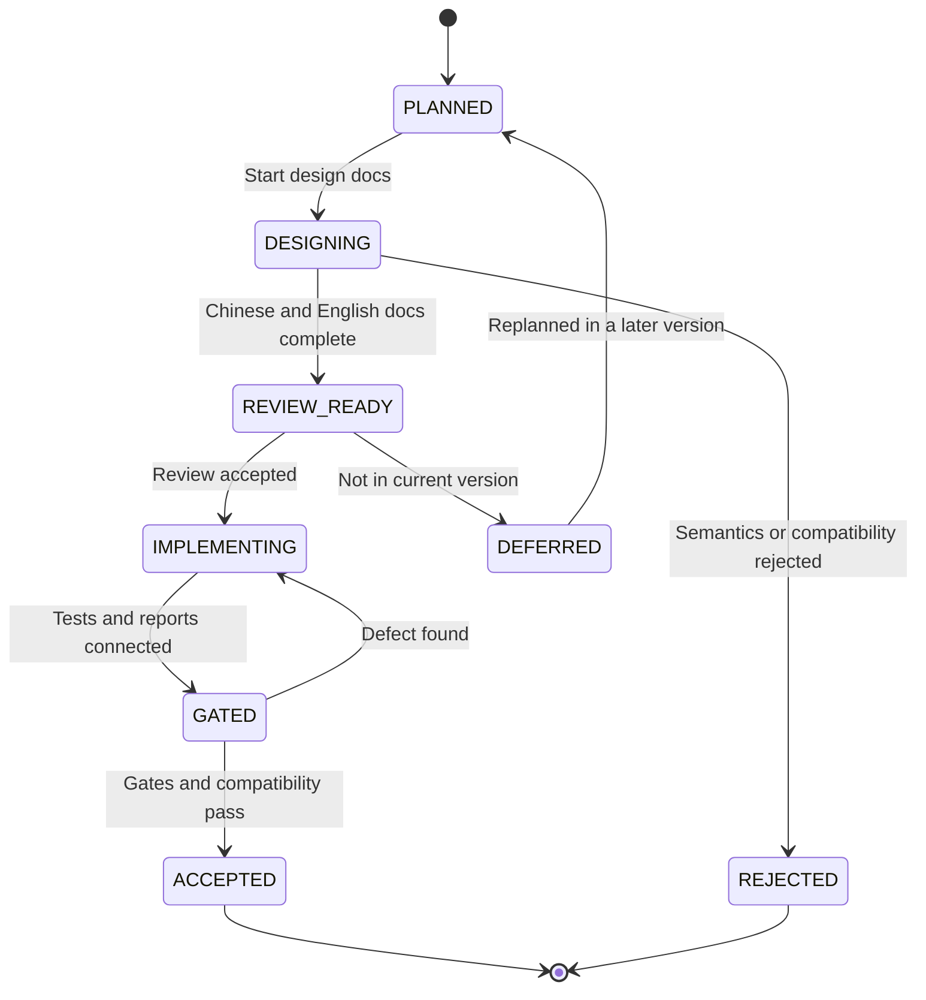

# LDB RocksDB Gap and Next-Version Planning Design

[中文](ldb-rocksdb-gap-next-version-plan.md) | English

## Background

`vexra-ldb` already has the core loop expected from a local LSM/KV engine: WAL, MemTable, SSTable, MANIFEST/CURRENT, column families, range delete, snapshot cursors, checkpoint, check/repair, full and incremental backup, object-store backup metadata, group commit, plugins, and long-run report entry points.

The remaining gap is no longer whether LDB can serve as a LevelDB-style embedded KV store. The product question is how close it should move toward RocksDB's maturity in advanced APIs, production operations, and ecosystem tooling. Based on public information checked on 2026-06-18, the latest RocksDB release line is `11.1.1`, and its product surface continues to revolve around column families, transactions, Merge, Prefix Seek, Backup/Checkpoint, compaction/cache tuning, dynamic options, statistics, and tooling.

This document turns the previous gap assessment into a tracked next-version plan for design, implementation, tests, release gates, and acceptance evidence.

## Goals

- Break RocksDB alignment gaps into reviewable, implementable, and testable work packages.
- Define priority, impact, interface/format constraints, tests, and rollback requirements for every package.
- Separate design-only work from minimal implementations that may enter the next version behind explicit APIs or disabled defaults.
- Keep every disk-format, recovery-semantic, or side-effecting tool change design-first.
- Persist acceptance evidence in `releaseGate`, long-run reports, fault injection, compatibility tests, and operations runbooks.

## Non-Goals

- Do not promise full RocksDB API, RocksJava, RocksDB CLI, or RocksDB disk-format compatibility.
- Do not implement MergeOperator, PrefixExtractor, transactions, TTL, custom Env, and the full tool ecosystem in one version.
- Do not enable behavior that changes read/write semantics, disk format, or compaction behavior by default.
- Do not clone every RocksDB option or property name; LDB continues to expose compatibility through `ldb.api.*` and explicit documentation.
- Do not let performance goals replace reliability gates.

## Current State

| Area | Current LDB State | Main Gap From RocksDB | Next-Version Strategy |
| --- | --- | --- | --- |
| Basic KV | `put/get/delete/write/addLong`, batch, and snapshot cursors are supported | No `MultiGet`, Merge, TTL, or similar advanced APIs | P1 implement minimal `MultiGet`; P0 review Merge/TTL |
| Column families | Static/runtime CFs, rename, drop tombstones, CF compaction/properties are supported | No independent per-CF options, large-CF operations evidence, or consistent multi-CF iterator | P1 column-family hardening package |
| WAL/recovery | Global WAL, sync, partial-write tests, repair/check, WAL lifecycle properties | Need stricter MANIFEST validation, WAL retention/archive policy, and recovery evidence corpus | P0 reliability and recovery package |
| Backup/Checkpoint | Checkpoint, full/incremental backup, object store, cleanup dry-run | Need long chains, cross-filesystem cases, low disk, permission failures, and long-term object-store evidence | P1 production-evidence package |
| Compaction/cache | L0 thresholds, rate limiting, cancellation cleanup, block cache, statistics | Need more compaction styles, cache warmup, dynamic tuning, prefix bloom | P1/P2 tuning and observability package |
| API compatibility | `ldb.api.*` self-description and explicit unsupported features | MergeOperator, PrefixExtractor, transactions, TTL, custom Env are not implemented | P0 advanced API design review |
| Tool ecosystem | `LdbTool` covers check/properties/scan/repair/backup/restore/checkpoint | Not compatible with native RocksDB commands; no complete compact/dump/ldb-style matrix | P2 CLI ecosystem package |
| Observability ecosystem | `getProperty`, operation stats, compaction stats, long-run reports | No external metrics export, trend storage, event listener, or statistics object | P2 external observability package |

## Core Constraints

| Constraint | Meaning |
| --- | --- |
| JDK | Keep JDK 8 compatibility |
| Encoding | Keep documents, source files, and reports in UTF-8 |
| Compatibility | Do not break existing WAL, SST, MANIFEST, CURRENT, COLUMN-FAMILIES, or backup metadata by default |
| Switches | New semantic or performance-changing behavior must be disabled by default or exposed only through explicit APIs |
| Order | Update Chinese and English design documents before implementation |
| Evidence | Every work package needs tests, reports, or runbook evidence |
| Rollback | Persistent-format changes must provide fail-fast, disable, or no-downgrade documentation |
| Global WAL | Keep the global WAL by default unless a separate design proves per-CF WALs preserve cross-CF batch atomicity |

## Interface Design

### Public APIs Under Review

| Capability | Candidate Entry | Next-Version Action | Default State |
| --- | --- | --- | --- |
| MultiGet | `LDB#get(List<byte[]> keys)` and column-family overloads | Next-version low-risk minimal implementation; preserve input order and return `null` for missing keys | Explicit call |
| PrefixExtractor | `Options.prefixExtractor(...)`, `ReadOptions.prefix(...)` | Design review first; if implemented, prove comparator/filter/range-delete semantics | unsupported |
| MergeOperator | `Options.mergeOperator(...)`, `LDB#merge(...)` | Design review only, no direct implementation | unsupported |
| TTL | `Options.ttl(...)` or TTL column family | Review CF-policy approach; no silent expiration | unsupported |
| Transactions | `TransactionDB`-style wrapper or `LDB#beginTransaction` | Transaction model review only | unsupported |
| Dynamic Options | `LDB#setOption(...)` or tool command | Review only runtime thresholds that do not affect format | unsupported |
| Event Listener | `LdbEventListener` | Candidate for observability; no write semantics | optional |
| CLI compact/dump/scan | `ldb scan` provides a read-only default-CF JSON sample; `ldb compact`, `ldb dump-manifest`, and `ldb dump-sst` still need review | Stabilize read-only scan exit codes, limit handling, and base64 JSON before reviewing write commands or file-level dumps | partial |

### Properties and Reports

| Entry | Plan |
| --- | --- |
| `ldb.api.rocksdbGapPlan` | Returns current work-package support status, at least including `planVersion`, `nextVersion`, `rocksdbBaseline`, and the low-risk implementation item |
| `ldb.recoveryEvidence` | Implemented; summarizes the current database directory, WAL/MANIFEST state, check/repair entry points, and repair-report state |
| `ldb.backupEvidence` | Implemented; summarizes evidence conventions for checkpoint, backup, restore, object-store metadata, and cleanup dry-run |
| `ldb.columnFamilyEvidence` | Summarizes the column-family registry, active/dropped CF counts, MemTables, level files, and drop/rename policy |
| `ldb.prefixReadiness` | Implemented; summarizes PrefixExtractor/prefix-bloom/cache-warmup prerequisites and the current cache/filter configuration; this phase is observation-only and does not change the read path |
| `RELEASE-GATE-REPORT.json` | Includes `rocksdbGapPlan` and `rocksdbGapGates` groups for baseline, next-version target, and work-package acceptance |
| `ldb-longrun` reports | Add workload profile, capability switches, failure categories, and key property snapshots |

### 23.2 Recovery-Validation Increment Already Implemented

| Item | Current Conclusion | Acceptance Evidence |
| --- | --- | --- |
| CURRENT target constraint | Both `check` and `open` require CURRENT content to be a legal same-directory `MANIFEST-NNNNNN` file name, rejecting path separators and non-descriptor names | Fault-injection tests cover illegal CURRENT names and path-traversal input |

### 23.4 Backup-Evidence Increment Already Implemented

| Item | Current Conclusion | Acceptance Evidence |
| --- | --- | --- |
| `checkBackup` metadata evidence | `CheckReport.checkedFiles` records `BACKUP-MANIFEST.json`, `OBJECT-REFS.json`, and checked object-file names so long-chain backup reports can track object-store verification scope | Object-store tests cover metadata/object evidence for a successful backup chain and still cover missing objects, wrong refCount, malformed refs, orphan objects, and corrupt manifests |

### 23.3 Column-Family Hardening Increment Already Implemented

| Item | Current Conclusion | Acceptance Evidence |
| --- | --- | --- |
| Column-family operations evidence property | `ldb.columnFamilyEvidence` summarizes registry state, active/dropped counts, MemTables, level files, drop/rename policy, and per-CF Options support boundaries | Column-family lifecycle tests cover evidence output after create/rename/drop and tombstone preservation after reopen |

## Data Structures

### Planning Tracking Fields

Release gates and future planning reports use the following fields as tracking constraints.

| Field | Meaning |
| --- | --- |
| `planVersion` | Planning document version, for example `rocksdb-gap-next-1` |
| `rocksdbBaseline` | RocksDB baseline, for example `11.1.1` |
| `ldbVersion` | Current LDB version |
| `workPackages[]` | Package id, priority, status, and evidence paths |
| `designDocuments[]` | Updated Chinese/English design documents |
| `formatChanges[]` | WAL/SST/MANIFEST/backup format changes |
| `compatibilityGates[]` | Old DB with new version, new DB with old version, backup/restore, repair/check results |
| `openQuestions[]` | Open design questions |

### Work-Package States

| State | Meaning |
| --- | --- |
| `PLANNED` | Planned but design has not started |
| `DESIGNING` | Chinese and English design documents are being updated |
| `REVIEW_READY` | Design is complete and ready for review |
| `IMPLEMENTING` | Code implementation is in progress |
| `GATED` | Tests or release gates exist but evidence is not yet stable |
| `ACCEPTED` | Acceptance passed and the capability may be released |
| `DEFERRED` | Design is kept but moved out of the current version |
| `REJECTED` | Not suitable for LDB due to semantics, compatibility, or cost |

## State Machine

Illegal transitions:

- A package cannot move from `PLANNED` directly to `IMPLEMENTING` without Chinese and English design documents.
- A disk-format change cannot enter `GATED` without compatibility and rollback notes.
- A package cannot become `ACCEPTED` while release gates fail or evidence is missing.

## Sequence Flow

### Next-Version Planning Flow

1. Create this document and its English copy.
2. Link the document from README, user manual, API compatibility design, and project design.
3. Add focused designs for packages such as MergeOperator, PrefixExtractor, WAL recovery, and backup production evidence.
4. For every focused design, separate `minimal implementation without format change` from `complete implementation with format change`.
5. Implement only after review.
6. Add unit tests, fault injection, long-run reports, or release gates.
7. After acceptance, update `CHANGELOG`, `release.md`, `operations.md`, and `user-manual.md`.

### Single Work-Package Flow

1. `PLANNED`: record scope, non-goals, and owner as pending confirmation.
2. `DESIGNING`: update Chinese design and English copy.
3. `REVIEW_READY`: define interfaces, data structures, states, failures, compatibility, rollback, and tests.
4. `IMPLEMENTING`: implement the smallest increment and keep old behavior by default.
5. `GATED`: run `test`, focused tests, compatibility fixtures, and required long-run jobs.
6. `ACCEPTED`: archive evidence paths and update release notes.

## Failure Handling

| Scenario | Required Handling |
| --- | --- |
| A feature needs a disk-format change | Stay in `REVIEW_READY`; add old-version fail-fast, downgrade, repair/check behavior |
| Public API conflicts with current `LDB` semantics | Split into a wrapper or keep unsupported |
| External tools over-parse a new property | Add fields only; do not invert meaning; docs require key-based matching |
| Release gate times out | Keep package in `GATED`, not accepted |
| Long-run failure is intermittent | Preserve workDir, reports, and property snapshots; classify before fixing or downgrading |
| A RocksDB feature is too expensive | Mark `DEFERRED` or `REJECTED` with reason and alternative |

## Idempotency

- Planning document updates are repeatable and do not change database data.
- Release-gate reports are written to isolated build directories and must not overwrite historical evidence.
- Backup, repair, and checkpoint tests must keep using temporary directories and atomic publish.
- Work-package states are evidence-driven; the same failure must not be recorded as multiple accepted proofs.

## Rollback Strategy

| Change Type | Rollback Strategy |
| --- | --- |
| Documentation or planning only | Revert the documentation commit |
| New property | Preserve old properties; new properties may be removed, and callers must treat missing values as unknown capability |
| New read-only CLI | Remove the command entry; database files are unaffected |
| New side-effecting CLI | Use temporary targets, backup, or checkpoint as rollback points |
| New Options switch | Disabled by default; turn off the switch to restore the old path |
| WAL/SST/MANIFEST format | Require format version, old-version rejection, repair/check report, and no-downgrade notes |
| Merge/TTL/transaction semantics | Explain how data is read or rejected after disabling the capability |

## Compatibility

- Old databases: the next version must open, check, backup, and restore them by default; format-changing packages need dedicated compatibility fixtures.
- Old clients: behavior is unchanged if they do not call new APIs or properties.
- New clients: missing properties mean unknown capability, not supported.
- Mixed tools: new tools must handle old DBs safely; old tools must fail fast or reject reads for new formats.
- JDK/Gradle: keep JDK 8 and the current Gradle Wrapper.
- Documentation: every focused design must maintain `.md` and `.en.md` files.

## Rollout and Migration

| Stage | Content | Rollout Condition | Abort Condition |
| --- | --- | --- | --- |
| G0 | Documentation landed | Chinese/English docs exist and README links them | Docs conflict with current capability |
| G1 | Read-only capabilities/reports | No DB writes and no format change | Property or CLI output is unstable |
| G2 | Disabled-by-default implementation | Explicit Options or APIs enable it | Existing tests regress |
| G3 | Fault injection and compatibility | WAL/SST/MANIFEST/backup matrix passes | repair/check reports are not explainable |
| G4 | Long-run/release gate | Reports are archived and failure categories are stable | Unclassified long-run failure remains |
| G5 | Release and operations closure | `release.md`, `operations.md`, `CHANGELOG`, and user manual are updated | Operations steps lack rollback path |

## Test Plan

| Work Package | Required Tests |
| --- | --- |
| Advanced API review | API test checklist, stable unsupported properties, adapter rejects unsupported configs |
| PrefixExtractor | Comparator mismatch, prefix bloom no-miss guard, range delete combination, snapshot cursor, repair/check |
| MergeOperator | Unknown operator, operator exception, WAL partial write, interrupted compaction, backup/restore |
| TTL | Expiration boundaries, snapshot old view, compaction cleanup, read strategy after TTL is disabled |
| Transactions | Conflict detection, lock release, rollback, crash recovery, cross-CF batch |
| WAL/recovery | Header truncation, record truncation, checksum error, multi-WAL, missing MANIFEST, repair-plan |
| Column-family hardening | Multi-CF concurrency, drop/rename/reopen, per-CF config, physical GC, backup/restore |
| Backup production evidence | Long chain, cross-filesystem, low disk, permission failures, object-store corruption, cleanup dry-run |
| Compaction/cache | L0 pressure, rate limit, cancellation, cache hits, prefix bloom, long snapshot |
| CLI ecosystem | Bad args, exit codes, JSON schema, read/write boundaries, lock conflicts |

## Risks

| Risk | Severity | Mitigation |
| --- | --- | --- |
| RocksDB compatibility expands LDB API too much | High | Review every advanced feature first; keep unsupported by default |
| Merge/TTL/transactions alter recovery semantics | High | Separate format version and fail-fast strategy; do not enable by default |
| Bad PrefixExtractor config causes missed reads | High | Prove comparator/filter/range-delete semantics and provide disable path |
| WAL/MANIFEST changes break old DB open | High | Keep old format by default; add compatibility fixtures and repair/check reports |
| Backup object cleanup deletes live files | High | Dry-run, reference validation, corruption injection, restore loop |
| Release gate becomes too slow | Medium | Split short gate, release gate, and nightly soak |
| Docs drift from implementation | Medium | Update Chinese/English docs and release notes before package acceptance |

## Phased Plan

| Phase | Priority | Content | Deliverable | Acceptance |
| --- | --- | --- | --- | --- |
| 23.0 | P0 | Land RocksDB gap plan | This document and English copy, README/design links | UTF-8 docs are traceable |
| 23.1 | P0 | Advanced API compatibility review | MergeOperator, PrefixExtractor, TTL, Transactions review sections or focused docs | Keep unsupported or choose one minimal implementation |
| 23.2 | P0 | WAL/MANIFEST/recovery hardening | WAL retention policy, MANIFEST validation, recovery evidence report | Fault injection and compatibility fixtures pass |
| 23.3 | P1 | Column-family hardening | Per-CF option review, multi-CF consistency/GC/operations report | Multi-CF long-run and backup/repair pass |
| 23.4 | P1 | Backup/Checkpoint production evidence | Long chain, cross-filesystem, low-disk, permission failure matrix | Release gate archives evidence |
| 23.5 | P1 | Compaction/cache/prefix tuning | `ldb.prefixReadiness` observation property records prefix/cache prerequisites; prefix bloom and cache warmup remain disabled | Observation-only, no read-semantics change, tests prove traceable unsupported boundaries |
| 23.6 | P2 | CLI and external observability ecosystem | `ldb scan <db> [limit]` read-only JSON sample output; compact/dump, event listener, and metrics export remain under review | scan JSON, limit handling, exit-code, and read-only no-write tests pass |
| 23.7 | P2 | Release and operations closure | `release.md` now has a 0.6.0 pre-release checklist, and `operations.md`, `CHANGELOG`, user manual, and README are synchronized with the new capabilities | The pre-release checklist covers releaseGate, MultiGet, recovery/backup/column-family evidence, prefix readiness, scan, and open-question default decisions |

## Recommended Next-Version Scope

To avoid scope creep, the next version should implement only this combination:

1. Required: 23.1 advanced API review; keep high-risk features unsupported or split them into later focused work.
2. Required: 23.2 WAL/MANIFEST/recovery evidence hardening.
3. Required: 23.4 Backup/Checkpoint production evidence matrix.
4. Low-risk implementation items: `MultiGet` is now in the API, and read-only CLI `scan` is now in the tool ecosystem; keep cache warmup and prefix bloom design validation as later candidates.
5. Deferred: full MergeOperator, full transactions, TTL automatic cleanup, and custom Env.

## Confirmed Decisions

| Question | Decision | Notes |
| --- | --- | --- |
| Next version | Use `0.6.0-SNAPSHOT` as the next development line and `0.6.0` as the formal target | Current `0.5.0-SNAPSHOT` remains the 0.5.0 release baseline; RocksDB gap work starts a new phase |
| RocksDB baseline | Fix documentation baseline at `11.1.1`, and let release gate record the actually checked version dynamically | Fixed baseline supports review tracking; dynamic records catch RocksDB changes at release time |
| Low-risk implementation | Implement `MultiGet` first | It does not change WAL/SST/MANIFEST format and improves batch point-read usability |
| PrefixExtractor priority | Defer implementation and keep design validation only | Avoid missed-read risk until a real prefix-heavy workload is confirmed |
| TTL | Keep unsupported and review semantics only | TTL may require per-key metadata, snapshot old-view rules, and compaction cleanup policy |
| RocksDB-style adapter | Do not provide a full adapter layer yet; keep native LDB APIs plus `ldb.api.*` self-description | Avoid implying full RocksDB compatibility |
| MergeOperator/transactions/custom Env | Keep unsupported | These features change write, recovery, isolation, or filesystem-abstraction boundaries |

## Open Questions And Pending Decisions

This section tracks the points that are still unclear and must be closed before the next-version scope is frozen. The default recommendation is to prioritize stability evidence and keep API semantics conservative; if the business side has a strong need, the corresponding capability should be promoted into a focused design item.

| ID | Priority | Open Question | Why It Is Unclear | Recommended Default Decision | Information Needed | Blocks | Status |
| --- | --- | --- | --- | --- | --- | --- | --- |
| OQ-01 | P0 | Must the next version be source- or configuration-compatible with RocksDB callers? | A full RocksDB-style adapter has been rejected, but it is still unknown whether migration customers, compatibility wrappers, or startup validation are required | Do not provide an adapter; maintain native LDB APIs and `ldb.api.*` self-description; migration configs must explicitly validate and reject unsupported items | Existing RocksDB Java callers, config files, command scripts, migration window, and compatibility-failure tolerance | 23.1 advanced API review, user manual, API compatibility statement | Default decision executable; business migration details pending |
| OQ-02 | P0 | Is TTL a concrete business requirement? | TTL affects write metadata, old snapshot views, compaction cleanup, and backup/restore semantics; it cannot be added as just an expiration field | Keep unsupported in the next version; document semantics review and alternatives | Whether TTL is per column family or per key; read-time filtering, background cleanup, and retention of expired data in backups | 23.1 advanced API review, 23.2/23.4 compatibility and recovery evidence | Default decision executable; TTL scenarios pending |
| OQ-03 | P0 | Should nightly/24h soak be a hard release gate? | Long runs improve confidence but raise release and CI cost; current gates are better suited for short automated checks | Use short gates as hard gates; archive nightly/24h soak evidence before release candidates | Release cadence, CI resources, rerun cost, and whether patch releases may ship without long-run evidence | 23.2 recovery reliability, 23.4 backup evidence, release gate | Default decision executable; CI cost pending |
| OQ-04 | P0 | Can fault-injection infrastructure provide stable low-disk, cross-filesystem, and permission-failure cases? | These cases decide whether backup/checkpoint/repair acceptance can be automated; unstable infrastructure means manual evidence only | Split into automated baseline cases plus manually archived extreme-environment evidence | CI runner permissions, mountable disks/temp volumes, Windows/Linux coverage, and permission-failure simulation options | 23.4 Backup/Checkpoint production evidence matrix | Default decision executable; environment capability pending |
| OQ-05 | P1 | Are real reads dominated by prefix range scans? | PrefixExtractor/prefix bloom is valuable for prefix-heavy workloads, but a wrong design can miss reads | In 23.5 implement only the `ldb.prefixReadiness` observation property; defer PrefixExtractor/prefix bloom/cache-warmup read-path implementation | Query samples, key encoding rules, prefix boundaries, range-scan ratio, and misconfiguration tolerance | 23.5 Compaction/Cache/Prefix tuning | Default decision executable; real workload evidence pending |
| OQ-06 | P1 | Do column families need independent Options and large-scale operations capabilities? | RocksDB has a more mature CF surface; LDB supports core CF operations, but per-CF options expand config, recovery, and compatibility surface | First add CF operations evidence and reports; do not introduce full per-CF Options in the next version | Expected CF count, CF lifecycle, and whether CF-level block cache/write buffer/compaction settings are required | 23.3 column-family hardening | Default decision executable; scale target pending |
| OQ-07 | P1 | Should backup retention have productized defaults? | Backup and cleanup dry-run already exist, but default retention days/chain length have not been confirmed | Keep explicit parameters and reports; do not choose a default deletion policy for the business | Compliance retention period, maximum backup space, maximum incremental-chain length, and object-store cleanup approval flow | 23.4 Backup/Checkpoint production evidence | Default decision executable; compliance policy pending |
| OQ-08 | P2 | Should the CLI follow RocksDB `ldb` tool conventions more closely? | `LdbTool` already covers check/properties/repair/backup/restore/checkpoint, but RocksDB users may expect compact/dump/scan-style commands | First review JSON schemas, exit codes, and read-only dump/scan; do not promise full command compatibility | Operations workflow, script integration needs, output stability, and whether both human-readable and machine-readable formats are required | 23.6 CLI ecosystem package | Default decision executable; script needs pending |
| OQ-09 | P1 | Should performance gates use fixed thresholds? | There is not enough stable trend history; hard thresholds can be dominated by hardware and CI variance | In 0.6.0 record baselines and trends without blocking release on performance variance; add hard thresholds after historical samples exist | Target hardware, representative data size, read/write ratio, acceptable regression percentage | Release gate, long-run benchmark | Default decision executable; performance SLO pending |
| OQ-10 | P1 | Should `ldb.*` property output become a stable contract? | Operations and migration tools will depend on properties, but freezing fields too early limits evolution | Treat key properties as semi-stable diagnostic contracts: adding fields is allowed; deleting fields or reversing meanings requires docs and changelog updates | External parser behavior and field compatibility window | API compatibility, CLI properties | Default decision executable; external parser owners pending |
| OQ-11 | P1 | May older versions open data written by the new version? | MultiGet and current properties do not change format, but later features may introduce format versions | Do not promise old versions can open new data; guarantee new versions open old data, and fail fast on incompatible formats | Downgrade deployment requirements and mixed-version windows | Upgrade compatibility tests, rollback strategy | Default decision executable; downgrade policy pending |
| OQ-12 | P2 | Should external observability prioritize Prometheus or JSON/CLI? | A Prometheus exporter adds runtime components and dependency boundaries; JSON/CLI is lighter | Stabilize JSON/CLI/report outputs in the next version; keep Prometheus exporter out of the core library | Operations platform, pull/push metric model | 23.6 CLI and observability ecosystem | Default decision executable; observability platform pending |
| OQ-13 | P2 | Should backup storage backends be productized? | Direct cloud-object-store support expands auth, retry, permission, and consistency boundaries | Keep local/object-directory conventions and validation evidence; do not abstract cloud-provider backends yet | Target object store, auth model, cross-region behavior, and deletion-approval requirements | 23.4/23.7 operations closure | Default decision executable; storage platform pending |

### Decisions To Close First

| Decision Item | Suggested Conclusion | Follow-Up Action After Closure |
| --- | --- | --- |
| RocksDB adapter | Do not build one in the next version; keep `ldb.api.*` self-description and startup capability-validation guidance | State clearly in the API compatibility document that RocksDB source/config compatibility is not guaranteed |
| TTL | Do not implement in the next version; record only the semantics review | Expand unsupported-feature notes with rationale and alternatives |
| Release gate | Short gates are hard gates; long runs are release-candidate evidence | Emit long-run evidence paths from release gate, but do not require every local run to execute long runs |
| Fault injection | Automate stable cases; allow low-disk/cross-filesystem/permission-failure evidence to be archived manually | Add an evidence matrix and manual-evidence template in 23.4 |
| PrefixExtractor | Implement only after real prefix-heavy workload evidence exists | In 23.5, review key/prefix conventions before changing the read path |
