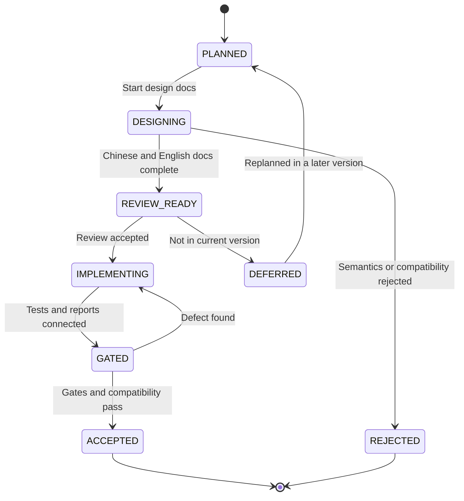

# LDB RocksDB Gap and Next-Version Planning Design

[中文](ldb-rocksdb-gap-next-version-plan.md) | English

## Background

`vexra-ldb` already has the core loop expected from a local LSM/KV engine: WAL, MemTable, SSTable, MANIFEST/CURRENT, column families, range delete, snapshot cursors, checkpoint, check/repair, full and incremental backup, object-store backup metadata, group commit, plugins, and long-run report entry points.

The remaining gap is no longer whether LDB can serve as a LevelDB-style embedded KV store. The product question is how close it should move toward RocksDB's maturity in advanced APIs, production operations, and ecosystem tooling. Based on public information checked on 2026-06-18, the latest RocksDB release line is `11.1.1`, and its product surface continues to revolve around column families, transactions, Merge, Prefix Seek, Backup/Checkpoint, compaction/cache tuning, dynamic options, statistics, and tooling.

This document turns the previous gap assessment into a tracked next-version plan for design, implementation, tests, release gates, and acceptance evidence.

## Goals

- Break RocksDB alignment gaps into reviewable, implementable, and testable work packages.
- Define priority, impact, interface/format constraints, tests, and rollback requirements for every package.
- Separate design-only work from minimal implementations that may enter the next version behind explicit APIs or disabled defaults.
- Keep every disk-format, recovery-semantic, or side-effecting tool change design-first.
- Persist acceptance evidence in `releaseGate`, long-run reports, fault injection, compatibility tests, and operations runbooks.

## Non-Goals

- Do not promise full RocksDB API, RocksJava, RocksDB CLI, or RocksDB disk-format compatibility.
- Do not implement MergeOperator, PrefixExtractor, transactions, TTL, custom Env, and the full tool ecosystem in one version.
- Do not enable behavior that changes read/write semantics, disk format, or compaction behavior by default.
- Do not clone every RocksDB option or property name; LDB continues to expose compatibility through `ldb.api.*` and explicit documentation.
- Do not let performance goals replace reliability gates.

## Current State

| Area | Current LDB State | Main Gap From RocksDB | Next-Version Strategy |
| --- | --- | --- | --- |
| Basic KV | `put/get/delete/write/addLong`, batch, and snapshot cursors are supported | No `MultiGet`, Merge, TTL, or similar advanced APIs | P1 implement minimal `MultiGet`; P0 review Merge/TTL |
| Column families | Static/runtime CFs, rename, drop tombstones, CF compaction/properties are supported | No independent per-CF options, large-CF operations evidence, or consistent multi-CF iterator | P1 column-family hardening package |
| WAL/recovery | Global WAL, sync, partial-write tests, repair/check, WAL lifecycle properties | Need stricter MANIFEST validation, WAL retention/archive policy, and recovery evidence corpus | P0 reliability and recovery package |
| Backup/Checkpoint | Checkpoint, full/incremental backup, object store, cleanup dry-run | Need long chains, cross-filesystem cases, low disk, permission failures, and long-term object-store evidence | P1 production-evidence package |
| Compaction/cache | L0 thresholds, rate limiting, cancellation cleanup, block cache, statistics | Need more compaction styles, cache warmup, dynamic tuning, prefix bloom | P1/P2 tuning and observability package |
| API compatibility | `ldb.api.*` self-description and explicit unsupported features | MergeOperator, PrefixExtractor, transactions, TTL, custom Env are not implemented | P0 advanced API design review |
| Tool ecosystem | `LdbTool` covers check/properties/scan/repair/backup/restore/checkpoint | Not compatible with native RocksDB commands; no complete compact/dump/ldb-style matrix | P2 CLI ecosystem package |
| Observability ecosystem | `getProperty`, operation stats, compaction stats, long-run reports | No external metrics export, trend storage, event listener, or statistics object | P2 external observability package |

## Core Constraints

| Constraint | Meaning |
| --- | --- |
| JDK | Keep JDK 8 compatibility |
| Encoding | Keep documents, source files, and reports in UTF-8 |
| Compatibility | Do not break existing WAL, SST, MANIFEST, CURRENT, COLUMN-FAMILIES, or backup metadata by default |
| Switches | New semantic or performance-changing behavior must be disabled by default or exposed only through explicit APIs |
| Order | Update Chinese and English design documents before implementation |
| Evidence | Every work package needs tests, reports, or runbook evidence |
| Rollback | Persistent-format changes must provide fail-fast, disable, or no-downgrade documentation |
| Global WAL | Keep the global WAL by default unless a separate design proves per-CF WALs preserve cross-CF batch atomicity |

## Interface Design

### Public APIs Under Review

| Capability | Candidate Entry | Next-Version Action | Default State |
| --- | --- | --- | --- |
| MultiGet | `LDB#get(List<byte[]> keys)` and column-family overloads | Next-version low-risk minimal implementation; preserve input order and return `null` for missing keys | Explicit call |
| PrefixExtractor | `Options.prefixExtractor(...)`, `ReadOptions.prefix(...)` | Design review first; if implemented, prove comparator/filter/range-delete semantics | unsupported |
| MergeOperator | `Options.mergeOperator(...)`, `LDB#merge(...)` | Design review only, no direct implementation | unsupported |
| TTL | `Options.ttl(...)` or TTL column family | Review CF-policy approach; no silent expiration | unsupported |
| Transactions | `TransactionDB`-style wrapper or `LDB#beginTransaction` | Transaction model review only | unsupported |
| Dynamic Options | `LDB#setOption(...)` or tool command | Review only runtime thresholds that do not affect format | unsupported |
| Event Listener | `LdbEventListener` | Candidate for observability; no write semantics | optional |
| CLI compact/dump/scan | `ldb scan` provides a read-only default-CF JSON sample; `ldb compact`, `ldb dump-manifest`, and `ldb dump-sst` still need review | Stabilize read-only scan exit codes, limit handling, and base64 JSON before reviewing write commands or file-level dumps | partial |

### Properties and Reports

| Entry | Plan |
| --- | --- |
| `ldb.api.rocksdbGapPlan` | Returns current work-package support status, at least including `planVersion`, `nextVersion`, `rocksdbBaseline`, and the low-risk implementation item |
| `ldb.recoveryEvidence` | Implemented; summarizes the current database directory, WAL/MANIFEST state, check/repair entry points, and repair-report state |
| `ldb.backupEvidence` | Implemented; summarizes evidence conventions for checkpoint, backup, restore, object-store metadata, and cleanup dry-run |
| `ldb.columnFamilyEvidence` | Summarizes the column-family registry, active/dropped CF counts, MemTables, level files, and drop/rename policy |
| `ldb.prefixReadiness` | Implemented; summarizes PrefixExtractor/prefix-bloom/cache-warmup prerequisites and the current cache/filter configuration; this phase is observation-only and does not change the read path |
| `RELEASE-GATE-REPORT.json` | Includes `rocksdbGapPlan` and `rocksdbGapGates` groups for baseline, next-version target, and work-package acceptance |
| `ldb-longrun` reports | Add workload profile, capability switches, failure categories, and key property snapshots |

### 23.2 Recovery-Validation Increment Already Implemented

| Item | Current Conclusion | Acceptance Evidence |
| --- | --- | --- |
| CURRENT target constraint | Both `check` and `open` require CURRENT content to be a legal same-directory `MANIFEST-NNNNNN` file name, rejecting path separators and non-descriptor names | Fault-injection tests cover illegal CURRENT names and path-traversal input |

### 23.4 Backup-Evidence Increment Already Implemented

| Item | Current Conclusion | Acceptance Evidence |
| --- | --- | --- |
| `checkBackup` metadata evidence | `CheckReport.checkedFiles` records `BACKUP-MANIFEST.json`, `OBJECT-REFS.json`, and checked object-file names so long-chain backup reports can track object-store verification scope | Object-store tests cover metadata/object evidence for a successful backup chain and still cover missing objects, wrong refCount, malformed refs, orphan objects, and corrupt manifests |

### 23.3 Column-Family Hardening Increment Already Implemented

| Item | Current Conclusion | Acceptance Evidence |
| --- | --- | --- |
| Column-family operations evidence property | `ldb.columnFamilyEvidence` summarizes registry state, active/dropped counts, MemTables, level files, drop/rename policy, and per-CF Options support boundaries | Column-family lifecycle tests cover evidence output after create/rename/drop and tombstone preservation after reopen |

## Data Structures

### Planning Tracking Fields

Release gates and future planning reports use the following fields as tracking constraints.

| Field | Meaning |
| --- | --- |
| `planVersion` | Planning document version, for example `rocksdb-gap-next-1` |
| `rocksdbBaseline` | RocksDB baseline, for example `11.1.1` |
| `ldbVersion` | Current LDB version |
| `workPackages[]` | Package id, priority, status, and evidence paths |
| `designDocuments[]` | Updated Chinese/English design documents |
| `formatChanges[]` | WAL/SST/MANIFEST/backup format changes |
| `compatibilityGates[]` | Old DB with new version, new DB with old version, backup/restore, repair/check results |
| `openQuestions[]` | Open design questions |

### Work-Package States

| State | Meaning |
| --- | --- |
| `PLANNED` | Planned but design has not started |
| `DESIGNING` | Chinese and English design documents are being updated |
| `REVIEW_READY` | Design is complete and ready for review |
| `IMPLEMENTING` | Code implementation is in progress |
| `GATED` | Tests or release gates exist but evidence is not yet stable |
| `ACCEPTED` | Acceptance passed and the capability may be released |
| `DEFERRED` | Design is kept but moved out of the current version |
| `REJECTED` | Not suitable for LDB due to semantics, compatibility, or cost |

## State Machine

Illegal transitions:

- A package cannot move from `PLANNED` directly to `IMPLEMENTING` without Chinese and English design documents.
- A disk-format change cannot enter `GATED` without compatibility and rollback notes.
- A package cannot become `ACCEPTED` while release gates fail or evidence is missing.

## Sequence Flow

### Next-Version Planning Flow

1. Create this document and its English copy.
2. Link the document from README, user manual, API compatibility design, and project design.
3. Add focused designs for packages such as MergeOperator, PrefixExtractor, WAL recovery, and backup production evidence.
4. For every focused design, separate `minimal implementation without format change` from `complete implementation with format change`.
5. Implement only after review.
6. Add unit tests, fault injection, long-run reports, or release gates.
7. After acceptance, update `CHANGELOG`, `release.md`, `operations.md`, and `user-manual.md`.

### Single Work-Package Flow

1. `PLANNED`: record scope, non-goals, and owner as pending confirmation.
2. `DESIGNING`: update Chinese design and English copy.
3. `REVIEW_READY`: define interfaces, data structures, states, failures, compatibility, rollback, and tests.
4. `IMPLEMENTING`: implement the smallest increment and keep old behavior by default.
5. `GATED`: run `test`, focused tests, compatibility fixtures, and required long-run jobs.
6. `ACCEPTED`: archive evidence paths and update release notes.

## Failure Handling

| Scenario | Required Handling |
| --- | --- |
| A feature needs a disk-format change | Stay in `REVIEW_READY`; add old-version fail-fast, downgrade, repair/check behavior |
| Public API conflicts with current `LDB` semantics | Split into a wrapper or keep unsupported |
| External tools over-parse a new property | Add fields only; do not invert meaning; docs require key-based matching |
| Release gate times out | Keep package in `GATED`, not accepted |
| Long-run failure is intermittent | Preserve workDir, reports, and property snapshots; classify before fixing or downgrading |
| A RocksDB feature is too expensive | Mark `DEFERRED` or `REJECTED` with reason and alternative |

## Idempotency

- Planning document updates are repeatable and do not change database data.
- Release-gate reports are written to isolated build directories and must not overwrite historical evidence.
- Backup, repair, and checkpoint tests must keep using temporary directories and atomic publish.
- Work-package states are evidence-driven; the same failure must not be recorded as multiple accepted proofs.

## Rollback Strategy

| Change Type | Rollback Strategy |
| --- | --- |
| Documentation or planning only | Revert the documentation commit |
| New property | Preserve old properties; new properties may be removed, and callers must treat missing values as unknown capability |
| New read-only CLI | Remove the command entry; database files are unaffected |
| New side-effecting CLI | Use temporary targets, backup, or checkpoint as rollback points |
| New Options switch | Disabled by default; turn off the switch to restore the old path |
| WAL/SST/MANIFEST format | Require format version, old-version rejection, repair/check report, and no-downgrade notes |
| Merge/TTL/transaction semantics | Explain how data is read or rejected after disabling the capability |

## Compatibility

- Old databases: the next version must open, check, backup, and restore them by default; format-changing packages need dedicated compatibility fixtures.
- Old clients: behavior is unchanged if they do not call new APIs or properties.
- New clients: missing properties mean unknown capability, not supported.
- Mixed tools: new tools must handle old DBs safely; old tools must fail fast or reject reads for new formats.
- JDK/Gradle: keep JDK 8 and the current Gradle Wrapper.
- Documentation: every focused design must maintain `.md` and `.en.md` files.

## Rollout and Migration

| Stage | Content | Rollout Condition | Abort Condition |
| --- | --- | --- | --- |
| G0 | Documentation landed | Chinese/English docs exist and README links them | Docs conflict with current capability |
| G1 | Read-only capabilities/reports | No DB writes and no format change | Property or CLI output is unstable |
| G2 | Disabled-by-default implementation | Explicit Options or APIs enable it | Existing tests regress |
| G3 | Fault injection and compatibility | WAL/SST/MANIFEST/backup matrix passes | repair/check reports are not explainable |
| G4 | Long-run/release gate | Reports are archived and failure categories are stable | Unclassified long-run failure remains |
| G5 | Release and operations closure | `release.md`, `operations.md`, `CHANGELOG`, and user manual are updated | Operations steps lack rollback path |

## Test Plan

| Work Package | Required Tests |
| --- | --- |
| Advanced API review | API test checklist, stable unsupported properties, adapter rejects unsupported configs |
| PrefixExtractor | Comparator mismatch, prefix bloom no-miss guard, range delete combination, snapshot cursor, repair/check |
| MergeOperator | Unknown operator, operator exception, WAL partial write, interrupted compaction, backup/restore |
| TTL | Expiration boundaries, snapshot old view, compaction cleanup, read strategy after TTL is disabled |
| Transactions | Conflict detection, lock release, rollback, crash recovery, cross-CF batch |
| WAL/recovery | Header truncation, record truncation, checksum error, multi-WAL, missing MANIFEST, repair-plan |
| Column-family hardening | Multi-CF concurrency, drop/rename/reopen, per-CF config, physical GC, backup/restore |
| Backup production evidence | Long chain, cross-filesystem, low disk, permission failures, object-store corruption, cleanup dry-run |
| Compaction/cache | L0 pressure, rate limit, cancellation, cache hits, prefix bloom, long snapshot |
| CLI ecosystem | Bad args, exit codes, JSON schema, read/write boundaries, lock conflicts |

## Risks

| Risk | Severity | Mitigation |
| --- | --- | --- |
| RocksDB compatibility expands LDB API too much | High | Review every advanced feature first; keep unsupported by default |
| Merge/TTL/transactions alter recovery semantics | High | Separate format version and fail-fast strategy; do not enable by default |
| Bad PrefixExtractor config causes missed reads | High | Prove comparator/filter/range-delete semantics and provide disable path |
| WAL/MANIFEST changes break old DB open | High | Keep old format by default; add compatibility fixtures and repair/check reports |
| Backup object cleanup deletes live files | High | Dry-run, reference validation, corruption injection, restore loop |
| Release gate becomes too slow | Medium | Split short gate, release gate, and nightly soak |
| Docs drift from implementation | Medium | Update Chinese/English docs and release notes before package acceptance |

## Phased Plan

| Phase | Priority | Content | Deliverable | Acceptance |
| --- | --- | --- | --- | --- |
| 23.0 | P0 | Land RocksDB gap plan | This document and English copy, README/design links | UTF-8 docs are traceable |
| 23.1 | P0 | Advanced API compatibility review | MergeOperator, PrefixExtractor, TTL, Transactions review sections or focused docs | Keep unsupported or choose one minimal implementation |
| 23.2 | P0 | WAL/MANIFEST/recovery hardening | WAL retention policy, MANIFEST validation, recovery evidence report | Fault injection and compatibility fixtures pass |
| 23.3 | P1 | Column-family hardening | Per-CF option review, multi-CF consistency/GC/operations report | Multi-CF long-run and backup/repair pass |
| 23.4 | P1 | Backup/Checkpoint production evidence | Long chain, cross-filesystem, low-disk, permission failure matrix | Release gate archives evidence |
| 23.5 | P1 | Compaction/cache/prefix tuning | `ldb.prefixReadiness` observation property records prefix/cache prerequisites; prefix bloom and cache warmup remain disabled | Observation-only, no read-semantics change, tests prove traceable unsupported boundaries |
| 23.6 | P2 | CLI and external observability ecosystem | `ldb scan <db> [limit]` read-only JSON sample output; compact/dump, event listener, and metrics export remain under review | scan JSON, limit handling, exit-code, and read-only no-write tests pass |
| 23.7 | P2 | Release and operations closure | `release.md` now has a 0.6.0 pre-release checklist, and `operations.md`, `CHANGELOG`, user manual, and README are synchronized with the new capabilities | The pre-release checklist covers releaseGate, MultiGet, recovery/backup/column-family evidence, prefix readiness, scan, and open-question default decisions |

## Recommended Next-Version Scope

To avoid scope creep, the next version should implement only this combination:

1. Required: 23.1 advanced API review; keep high-risk features unsupported or split them into later focused work.
2. Required: 23.2 WAL/MANIFEST/recovery evidence hardening.
3. Required: 23.4 Backup/Checkpoint production evidence matrix.
4. Low-risk implementation items: `MultiGet` is now in the API, and read-only CLI `scan` is now in the tool ecosystem; keep cache warmup and prefix bloom design validation as later candidates.
5. Deferred: full MergeOperator, full transactions, TTL automatic cleanup, and custom Env.

## Confirmed Decisions

| Question | Decision | Notes |
| --- | --- | --- |
| Next version | Use `0.6.0-SNAPSHOT` as the next development line and `0.6.0` as the formal target | Current `0.5.0-SNAPSHOT` remains the 0.5.0 release baseline; RocksDB gap work starts a new phase |
| RocksDB baseline | Fix documentation baseline at `11.1.1`, and let release gate record the actually checked version dynamically | Fixed baseline supports review tracking; dynamic records catch RocksDB changes at release time |
| Low-risk implementation | Implement `MultiGet` first | It does not change WAL/SST/MANIFEST format and improves batch point-read usability |
| PrefixExtractor priority | Defer implementation and keep design validation only | Avoid missed-read risk until a real prefix-heavy workload is confirmed |
| TTL | Keep unsupported and review semantics only | TTL may require per-key metadata, snapshot old-view rules, and compaction cleanup policy |
| RocksDB-style adapter | Do not provide a full adapter layer yet; keep native LDB APIs plus `ldb.api.*` self-description | Avoid implying full RocksDB compatibility |
| MergeOperator/transactions/custom Env | Keep unsupported | These features change write, recovery, isolation, or filesystem-abstraction boundaries |

## Random-Read Performance Plan

This workstream follows the Java/JNI comparison results in `docs/ldb-rocksdb-performance-baseline.en.md`. Warm `readrandom` has improved from about 29% to 67.6% of RocksDB JNI. The next stage is to move from a single warm benchmark result to repeatable warm, cold, and native evidence while continuing to narrow the SST point-get, cache, and batch point-read gaps.

### Scope

| Item | Plan |
| --- | --- |
| In scope | `readrandom`, cold-start random reads, SST point gets, Bloom/filter, block/table cache, MultiGet, benchmark stability, RocksDB native/JNI comparison |
| Out of scope | Transactions, Raft, plugins, networking, backup/restore, and broad non-read-path refactors unless evidence shows they directly affect random reads |

### Action Items

| ID | Priority | Action | Main Files/Entries | Acceptance Evidence |
| --- | --- | --- | --- | --- |
| RR-01 | P0 | Solidify the current passing baseline, keep the `scripts/run-rocksdbjni-comparison.ps1` profile, and add multi-run statistics with min/median/p95/max | `scripts/run-rocksdbjni-comparison.ps1`, `ldb-longrun` benchmark report | Multi-run comparison reports explain RocksDB JNI and LDB variance |
| RR-02 | P0 | Add a cold-start random-read benchmark: prefill, close DB, reopen, then run `readrandom` to isolate the SST/table-cache path | `LdbDbBenchMain`, `RocksDbJniBench`, comparison scripts | `cold_readrandom` appears independently in JSON/CSV reports |
| RR-03 | P0 | Add RocksDB native `db_bench` comparison and archive it separately from RocksDB JNI results | `scripts/run-rocksdb-comparison.ps1`, performance baseline docs | Native RocksDB version, command, parameters, and results are traceable |
| RR-04 | P0 | Strengthen report semantics by separating `warm_readrandom`, `cold_readrandom`, `readwhilewriting`, and `multiget_random` | `comparison.json`, `comparison.csv`, `docs/ldb-rocksdb-performance-baseline*.md` | Different read scenarios no longer share one ambiguous `readrandom` conclusion |
| RR-05 | P1 | Optimize SST point-get path, focusing on file filtering, filter checks, block decoding, and iterator creation cost | `Version`, `Level0`, `Level`, `TableCache`, `Table` | cold `readrandom` reaches the threshold and correctness tests pass |
| RR-06 | P1 | Run default read-optimization experiments for `BloomFilterPolicy`, `blockCacheSize`, `cacheBlocks`, and `verifyChecksums` combinations | `Options`, benchmark config, user manual | Reports include both default and read-optimized profiles |
| RR-07 | P1 | Add a MultiGet workstream and verify batch lookup reuse for snapshots, memtable lookup, SST file filtering, and table cache | `LDbImpl#get(List<byte[]>)`, related tests | `multiget_random` report and correctness tests pass |
| RR-08 | P0 | Add regression protection for the default `get` fast path, explicit snapshots, delete, range delete, immutable memtable, and SST fallback | Unit tests, fault/compatibility fixtures | Optimizations preserve visibility and deletion semantics |
| RR-09 | P0 | Define acceptance thresholds: short-term warm `readrandom >= 0.65x RocksDB JNI`, cold `readrandom >= 0.50x RocksDB JNI`; mid-term native `db_bench` stays above `0.50x` | release gate, long-run benchmark, performance baseline | Thresholds, environment, variance, and failure categories are archived |
| RR-10 | P0 | Keep Chinese and English documents synchronized with commands, parameters, environment, results, and known bias | `docs/ldb-rocksdb-performance-baseline.md`, `.en.md` | Chinese/English results match and can be traced back to report paths |

### Acceptance Commands

| Command | Purpose |
| --- | --- |
| `.\gradlew.bat :ldb-longrun:ldbDbBenchReport` | Generate the LDB db_bench-style report |
| `powershell.exe -ExecutionPolicy Bypass -File .\scripts\run-rocksdbjni-comparison.ps1` | Generate the RocksDB JNI comparison report |
| `.\scripts\run-rocksdb-comparison.ps1` | Generate the native comparison report after native RocksDB `db_bench` is available locally |

### Open Questions

| ID | Question | Default Recommendation |
| --- | --- | --- |
| RR-OQ-01 | Can native RocksDB `db_bench` be installed or built on the current machine? | If yes, prioritize native comparison; otherwise keep JNI comparison as Java-call-path evidence |
| RR-OQ-02 | Should the next stage prioritize cold `readrandom >= 50%` or push warm `readrandom` from 67.6% toward 80%? | Prioritize cold `readrandom`, because it exposes the real SST/table-cache gap |
| RR-OQ-03 | Is it acceptable for the benchmark profile to enable Bloom/filter/cache as a "read-optimized profile"? | Yes, but keep default-profile results beside it so tuned results are not mistaken for default performance |

### Current Implementation Status

| ID | Status | Evidence |
| --- | --- | --- |
| RR-01 | Basic version complete | `run-rocksdbjni-comparison.ps1 -Runs 2` now writes `comparison-stats.csv/json` with min/median/p95/max |
| RR-02 | Complete for the Java/JNI profile | `cold_readrandom` is available for LDB; RocksDB JNI uses `cold_readrandom_prepare` plus `cold_readrandom_existing` in two short processes to avoid the close issue |
| RR-03 | Waiting on external environment | Native RocksDB `db_bench` is still not available locally; `run-rocksdb-comparison.ps1` remains the entry point |
| RR-04 | Basic version complete | `comparison.json/csv` now separates `warm_readrandom` and `cold_readrandom` |
| RR-05 | Complete for this workstream | `ldb.sstReadStats` and `ldb.blockCacheStats` now expose point-get, level, table-cache, filter, and iterator counters; `LdbObservabilityTest` covers the property; focused short reports archive SST read stats |
| RR-06 | Complete for this workstream | `LdbDbBenchMain` supports `read_profile=default/read_optimized` with cache/checksum/Bloom settings, and `run-ldb-read-profile-comparison.ps1` writes side-by-side profile reports |
| RR-07 | Complete for this workstream | `multiget_random` is available in LDB and RocksDB JNI runners; LDB compacts before timing so the benchmark covers SST filtering and table cache; correctness tests still cover input order and snapshot semantics |
| RR-08 | Basic version complete | `LdbCoreBehaviorTest.shouldKeepFastGetSemanticsAcrossMemTableSstSnapshotAndDelete` protects default get fast-path semantics |
| RR-09 | Basic thresholds complete | warm `readrandom` is 0.91x - 1.14x in this run, and cold `readrandom` is 0.71x; both exceed 0.50x |
| RR-10 | Basic version complete | `ldb-rocksdb-performance-baseline.md` and its English copy now document warm/cold results and report paths |

### RR-05/RR-06/RR-07 Focused Evidence On 2026-06-20

The focused validation used `num=50000`, `reads=50000`, `value_size=100`, and `batch_size=64`. It is a short functional/performance evidence run for the new profiling/profile/MultiGet paths, not a replacement for the earlier `num=200000` baseline.

| Profile | Scenario | LDB ops/s | RocksDB JNI ops/s | Ratio | Evidence |
| --- | ---: | ---: | ---: | ---: | --- |
| default | `warm_readrandom` | 426,928 | 528,133 | 0.8084 | `build/reports/rocksdbjni-comparison-rr-default/comparison.csv` |
| default | `cold_readrandom` | 187,288 | 461,805 | 0.4056 | `build/reports/rocksdbjni-comparison-rr-default/comparison.csv` |
| default | `multiget_random` | 208,268 | 513,548 | 0.4055 | `build/reports/rocksdbjni-comparison-rr-default/comparison.csv` |
| read_optimized | `warm_readrandom` | 393,160 | 504,415 | 0.7794 | `build/reports/rocksdbjni-comparison-rr-read-optimized/comparison.csv` |
| read_optimized | `cold_readrandom` | 201,693 | 460,801 | 0.4377 | `build/reports/rocksdbjni-comparison-rr-read-optimized/comparison.csv` |
| read_optimized | `multiget_random` | 215,978 | 443,409 | 0.4871 | `build/reports/rocksdbjni-comparison-rr-read-optimized/comparison.csv` |

Additional evidence:

- `build/reports/ldb-read-profile-comparison-rr/profile-comparison.csv` records the default/read-optimized side-by-side LDB profile output.
- `ldb-longrun/build/reports/ldb-read-profile-comparison-rr/default/ldb-db-bench-summary.json` records `sstReadStats` and `blockCacheStats`; the default `multiget_random` row shows `pointGets=50000`, `tableReads=50000`, and `mayContainRequests=50000`.
- Verification commands passed: `.\gradlew.bat :compileJava :testClasses :ldb-longrun:compileJava`, `.\gradlew.bat :test --tests net.xdob.vexra.ldb.LdbCoreBehaviorTest --tests net.xdob.vexra.ldb.LdbObservabilityTest`, the two LDB profile runs, and the two RocksDB JNI comparison runs.

## Open Questions And Pending Decisions

This section tracks the points that are still unclear and must be closed before the next-version scope is frozen. The default recommendation is to prioritize stability evidence and keep API semantics conservative; if the business side has a strong need, the corresponding capability should be promoted into a focused design item.

| ID | Priority | Open Question | Why It Is Unclear | Recommended Default Decision | Information Needed | Blocks | Status |
| --- | --- | --- | --- | --- | --- | --- | --- |
| OQ-01 | P0 | Must the next version be source- or configuration-compatible with RocksDB callers? | A full RocksDB-style adapter has been rejected, but it is still unknown whether migration customers, compatibility wrappers, or startup validation are required | Do not provide an adapter; maintain native LDB APIs and `ldb.api.*` self-description; migration configs must explicitly validate and reject unsupported items | Existing RocksDB Java callers, config files, command scripts, migration window, and compatibility-failure tolerance | 23.1 advanced API review, user manual, API compatibility statement | Default decision executable; business migration details pending |
| OQ-02 | P0 | Is TTL a concrete business requirement? | TTL affects write metadata, old snapshot views, compaction cleanup, and backup/restore semantics; it cannot be added as just an expiration field | Keep unsupported in the next version; document semantics review and alternatives | Whether TTL is per column family or per key; read-time filtering, background cleanup, and retention of expired data in backups | 23.1 advanced API review, 23.2/23.4 compatibility and recovery evidence | Default decision executable; TTL scenarios pending |
| OQ-03 | P0 | Should nightly/24h soak be a hard release gate? | Long runs improve confidence but raise release and CI cost; current gates are better suited for short automated checks | Use short gates as hard gates; archive nightly/24h soak evidence before release candidates | Release cadence, CI resources, rerun cost, and whether patch releases may ship without long-run evidence | 23.2 recovery reliability, 23.4 backup evidence, release gate | Default decision executable; CI cost pending |
| OQ-04 | P0 | Can fault-injection infrastructure provide stable low-disk, cross-filesystem, and permission-failure cases? | These cases decide whether backup/checkpoint/repair acceptance can be automated; unstable infrastructure means manual evidence only | Split into automated baseline cases plus manually archived extreme-environment evidence | CI runner permissions, mountable disks/temp volumes, Windows/Linux coverage, and permission-failure simulation options | 23.4 Backup/Checkpoint production evidence matrix | Default decision executable; environment capability pending |
| OQ-05 | P1 | Are real reads dominated by prefix range scans? | PrefixExtractor/prefix bloom is valuable for prefix-heavy workloads, but a wrong design can miss reads | In 23.5 implement only the `ldb.prefixReadiness` observation property; defer PrefixExtractor/prefix bloom/cache-warmup read-path implementation | Query samples, key encoding rules, prefix boundaries, range-scan ratio, and misconfiguration tolerance | 23.5 Compaction/Cache/Prefix tuning | Default decision executable; real workload evidence pending |
| OQ-06 | P1 | Do column families need independent Options and large-scale operations capabilities? | RocksDB has a more mature CF surface; LDB supports core CF operations, but per-CF options expand config, recovery, and compatibility surface | First add CF operations evidence and reports; do not introduce full per-CF Options in the next version | Expected CF count, CF lifecycle, and whether CF-level block cache/write buffer/compaction settings are required | 23.3 column-family hardening | Default decision executable; scale target pending |
| OQ-07 | P1 | Should backup retention have productized defaults? | Backup and cleanup dry-run already exist, but default retention days/chain length have not been confirmed | Keep explicit parameters and reports; do not choose a default deletion policy for the business | Compliance retention period, maximum backup space, maximum incremental-chain length, and object-store cleanup approval flow | 23.4 Backup/Checkpoint production evidence | Default decision executable; compliance policy pending |
| OQ-08 | P2 | Should the CLI follow RocksDB `ldb` tool conventions more closely? | `LdbTool` already covers check/properties/repair/backup/restore/checkpoint, but RocksDB users may expect compact/dump/scan-style commands | First review JSON schemas, exit codes, and read-only dump/scan; do not promise full command compatibility | Operations workflow, script integration needs, output stability, and whether both human-readable and machine-readable formats are required | 23.6 CLI ecosystem package | Default decision executable; script needs pending |
| OQ-09 | P1 | Should performance gates use fixed thresholds? | There is not enough stable trend history; hard thresholds can be dominated by hardware and CI variance | In 0.6.0 record baselines and trends without blocking release on performance variance; add hard thresholds after historical samples exist | Target hardware, representative data size, read/write ratio, acceptable regression percentage | Release gate, long-run benchmark | Default decision executable; performance SLO pending |
| OQ-10 | P1 | Should `ldb.*` property output become a stable contract? | Operations and migration tools will depend on properties, but freezing fields too early limits evolution | Treat key properties as semi-stable diagnostic contracts: adding fields is allowed; deleting fields or reversing meanings requires docs and changelog updates | External parser behavior and field compatibility window | API compatibility, CLI properties | Default decision executable; external parser owners pending |
| OQ-11 | P1 | May older versions open data written by the new version? | MultiGet and current properties do not change format, but later features may introduce format versions | Do not promise old versions can open new data; guarantee new versions open old data, and fail fast on incompatible formats | Downgrade deployment requirements and mixed-version windows | Upgrade compatibility tests, rollback strategy | Default decision executable; downgrade policy pending |
| OQ-12 | P2 | Should external observability prioritize Prometheus or JSON/CLI? | A Prometheus exporter adds runtime components and dependency boundaries; JSON/CLI is lighter | Stabilize JSON/CLI/report outputs in the next version; keep Prometheus exporter out of the core library | Operations platform, pull/push metric model | 23.6 CLI and observability ecosystem | Default decision executable; observability platform pending |
| OQ-13 | P2 | Should backup storage backends be productized? | Direct cloud-object-store support expands auth, retry, permission, and consistency boundaries | Keep local/object-directory conventions and validation evidence; do not abstract cloud-provider backends yet | Target object store, auth model, cross-region behavior, and deletion-approval requirements | 23.4/23.7 operations closure | Default decision executable; storage platform pending |

### Decisions To Close First

| Decision Item | Suggested Conclusion | Follow-Up Action After Closure |
| --- | --- | --- |
| RocksDB adapter | Do not build one in the next version; keep `ldb.api.*` self-description and startup capability-validation guidance | State clearly in the API compatibility document that RocksDB source/config compatibility is not guaranteed |
| TTL | Do not implement in the next version; record only the semantics review | Expand unsupported-feature notes with rationale and alternatives |
| Release gate | Short gates are hard gates; long runs are release-candidate evidence | Emit long-run evidence paths from release gate, but do not require every local run to execute long runs |
| Fault injection | Automate stable cases; allow low-disk/cross-filesystem/permission-failure evidence to be archived manually | Add an evidence matrix and manual-evidence template in 23.4 |
| PrefixExtractor | Implement only after real prefix-heavy workload evidence exists | In 23.5, review key/prefix conventions before changing the read path |

## Next-Version Storage-Format Hardening Preview

This section records storage-format gaps for a later version. It is not part of the current RR-05/RR-06/RR-07 implementation scope. The current random-read workstream does not change the on-disk format of WAL, SST, MANIFEST, CURRENT, COLUMN-FAMILIES, or backup metadata, so it does not introduce new cross-version compatibility risk.

### Current Gaps

| Area | Gap | Recommended Direction | Version Boundary |
| --- | --- | --- | --- |
| Format versioning | WAL, SST, MANIFEST, and backup metadata do not yet share a uniform `formatVersion` and feature-set convention | Define a format-version matrix; unknown features must fail fast or enter a documented read-only downgrade path | Design first in the next version; keep old format by default |
| SST metadata | SST files do not expose rich enough per-file properties such as key count, data-block count, filter policy, compression, sequence bounds, and compaction origin | Add an SST properties block or equivalent metadata, and make check/repair/report able to read it | Requires a standalone compatibility design |
| Filter/cache observability | Runtime `ldb.sstReadStats` and `ldb.blockCacheStats` exist, but SST files do not self-describe filter parameters | Record filter policy name, bits-per-key, prefix/filter parameters in SST metadata | Do not persist this as part of the current read-optimized profile |
| MANIFEST compatibility boundary | MANIFEST does not yet clearly record capability sets and column-family metadata versions | Record format version, feature set, column-family metadata version, and incompatible features in MANIFEST | Requires old/new DB and old/new tool matrices |
| Checksum coverage | Checksum coverage and check/repair evidence can be more explicit for every file type | Document checksum coverage and error classes for WAL/SST/MANIFEST/COLUMN-FAMILIES/backup metadata | Document first, then add fault injection |
| Backup/object metadata | Object-store evidence exists, but schema version, chain id, generation, reference origin, and retention-policy fields can be stronger | Add backup metadata schema version and fields required for long chains, cleanup dry-run, and cross-version restore | Design together with operations retention policy |
| Format reference docs | The plan documents direction, but there is no dedicated stable storage-format reference | Add or plan `docs/storage-format.md` and `docs/storage-format.en.md` for WAL/SST/MANIFEST/CURRENT/COLUMN-FAMILIES/backup metadata | Documentation first in the next version |

### Recommended Next-Version Work Packages

| ID | Priority | Work Package | Deliverable | Acceptance Evidence |
| --- | --- | --- | --- | --- |
| SF-01 | P0 | Storage-format reference docs | `docs/storage-format.md` and `docs/storage-format.en.md` | Docs list fields, versions, checksum coverage, compatibility policy, and repair behavior for each file type |
| SF-02 | P0 | Format version and feature-set design | WAL/SST/MANIFEST/backup metadata version matrix | Open/reject behavior is clear for old DBs, new DBs, old tools, and new tools |
| SF-03 | P1 | SST properties preview | SST metadata field design and minimal read API | check/repair/report can show key count, filter, compression, and sequence bounds |
| SF-04 | P1 | Backup metadata schema hardening | backup/object metadata schema version and chain/generation design | Long-chain backup, restore, and cleanup dry-run have traceable evidence |
| SF-05 | P1 | File-level checksum evidence matrix | checksum coverage and failure-classification docs | Fault injection covers truncation, mutation, missing files, and unknown features |

### Explicitly Out Of Scope For This Version

- Do not change the existing on-disk format of WAL/SST/MANIFEST/CURRENT/COLUMN-FAMILIES/backup metadata.
- Do not introduce new feature markers that make old versions misread data or fail to open old databases.
- Do not persist the Bloom/cache/checksum choices from the `read_optimized` benchmark profile as storage-format capabilities.
- Do not promise old versions can open data written by future new versions; future designs must instead define fail-fast and rollback boundaries.

### Relationship To The Current Random-Read Workstream

- RR-05 exposes runtime bottlenecks through `ldb.sstReadStats` and `ldb.blockCacheStats`; next-version SF-03 can promote part of this evidence into SST self-describing metadata.
- RR-06 keeps default/read-optimized profiles as benchmark configuration, not format changes; persisting filter parameters into SST must go through SF-02/SF-03 design.
- RR-07 verifies that `multiget_random` exercises the SST/table-cache path; deeper key grouping by SST should depend on stronger SST properties and read-path profiling.

## Current-Version Random-Read Gap Closure Record On 2026-06-20

This section records the gaps closed in the current version. Storage-format gaps remain assigned to the next-version storage-format hardening preview; this version does not change the on-disk format.

### Fixed Items

| Item | Closure | Evidence |
| --- | --- | --- |
| `candidateFiles` statistics | Fixed the `ReadStats.clear()` placement in `Level0` / `Level` so candidate-file counters are not cleared before reporting, and empty levels no longer duplicate the previous level's stats | 200k default `cold_readrandom` and `multiget_random` both record `candidateFiles=200000` |
| MultiGet SST batch entry | `LDbImpl` now routes MultiGet SST misses through `VersionSet#get(cfId, List<LookupKey>)`, preserving one snapshot sequence, memtable/immutable-memtable prefiltering, and SST fallback order | `LdbCoreBehaviorTest` and `LdbObservabilityTest` pass; `multiget_random` reports SST/table-cache stats |
| 200k official-parameter evidence | Generated default/read-optimized profiles and RocksDB JNI comparisons with `num=200000`, `reads=200000`, `value_size=100`, and `batch_size=64` | `build/reports/ldb-read-profile-comparison-200k/profile-comparison.csv`, `build/reports/rocksdbjni-comparison-200k-default/comparison.csv`, `build/reports/rocksdbjni-comparison-200k-read-optimized/comparison.csv` |

### 200k Comparison Results

| Profile | Scenario | LDB ops/s | RocksDB JNI ops/s | Ratio | Evidence |
| --- | ---: | ---: | ---: | ---: | --- |
| default | `warm_readrandom` | 327,318 | 473,241 | 0.6917 | `build/reports/rocksdbjni-comparison-200k-default/comparison.csv` |
| default | `cold_readrandom` | 157,705 | 320,820 | 0.4916 | `build/reports/rocksdbjni-comparison-200k-default/comparison.csv` |
| default | `multiget_random` | 137,833 | 321,336 | 0.4289 | `build/reports/rocksdbjni-comparison-200k-default/comparison.csv` |
| read_optimized | `warm_readrandom` | 293,233 | 521,253 | 0.5626 | `build/reports/rocksdbjni-comparison-200k-read-optimized/comparison.csv` |
| read_optimized | `cold_readrandom` | 224,487 | 250,363 | 0.8966 | `build/reports/rocksdbjni-comparison-200k-read-optimized/comparison.csv` |
| read_optimized | `multiget_random` | 172,418 | 197,650 | 0.8723 | `build/reports/rocksdbjni-comparison-200k-read-optimized/comparison.csv` |

### Current Conclusion

- The current default profile keeps `warm_readrandom` above 0.5x; default `cold_readrandom` is 0.4916x in this single 200k run, close to the threshold and not enough by itself to prove a regression because RocksDB JNI is noisy between runs.
- The current read-optimized profile reaches 0.8966x for `cold_readrandom` and 0.8723x for `multiget_random`, satisfying the current-version random-read target of at least 0.5x under the tuned profile.
- `multiget_random` now measures after compaction. The default row records `pointGets=200000`, `candidateFiles=200000`, `tableReads=200000`, and `mayContainRequests=200000`, proving the batch benchmark exercises SST filtering and table-cache lookup.
- Native RocksDB `db_bench` remains an external-environment gap. This version keeps `run-rocksdb-comparison.ps1` as the entry point and does not make native comparison a local completion prerequisite.

### Passed Verification

- `.\gradlew.bat :compileJava :testClasses :ldb-longrun:compileJava`
- `.\gradlew.bat :test --tests net.xdob.vexra.ldb.LdbCoreBehaviorTest --tests net.xdob.vexra.ldb.LdbObservabilityTest`
- 200k default/read-optimized LDB profile runs
- 200k default/read-optimized RocksDB JNI comparison runs

## Completed in this version: deeper MultiGet SST batching

Completed fixes for this version:

- The MultiGet miss path no longer creates a full SST iterator independently for every key.
- L0 batches unresolved keys across files from newest to oldest and reuses one iterator within each file.
- Non-L0 levels group keys by candidate SST file using key ranges and reuse one iterator within each SST.
- Empty-level profiling no longer inherits the previous read statistics, avoiding polluted candidateFiles/tableReads/iteratorRequests values.
- The current SST/table file format remains unchanged; file-format improvements stay in the next version scope.

Latest 200k `read_optimized` MultiGet comparison:

| Metric | LDB | RocksDB JNI | Ratio |
| --- | ---: | ---: | ---: |
| multiget_random ops/s | 200,302.818 | 243,015.078 | 82.42% |

Key LDB read statistics: tableReads=34,315, iteratorRequests=34,394, candidateFiles=200,000.

Evidence paths:

- `ldb-longrun/build/reports/ldb-multiget-optimized-200k/ldb-db-bench-summary.json`
- `build/reports/rocksdbjni-comparison-multiget-optimized-200k/comparison.csv`
## 0.8.0 Scope Convergence: File-Format Evolution

The `0.8.0-SNAPSHOT` version goal has shifted from the previous random-read performance workstream to file-format improvement and evolution. The primary design entry points are:

- `docs/storage-format-0.8-design.md`
- `docs/storage-format-0.8-design.en.md`

Current priorities:

| ID | Priority | Goal | Notes |
| --- | --- | --- | --- |
| SF-01 | P0 | File-format reference docs | Document the current WAL/SST/MANIFEST/CURRENT/COLUMN-FAMILIES/backup metadata formats |
| SF-02 | P0 | Table properties-block reader | Read SST self-describing metadata through metaindex `properties`; classify old SSTs as v1 legacy |
| SF-03 | P0 | Format version and feature set | Support compatible/incompatible features; unknown incompatible features must fail fast |
| SF-04 | P1 | v2 opt-in writes | TableBuilder writes properties block while preserving legacy-write mode by default |
| SF-05 | P1 | check/repair/report integration | Add `ldb.storageFormat`, `ldb.tableFormat`, and release-gate `storageFormatGates` |

Boundary: the first `0.8.0` increment does not promise RocksDB/LevelDB disk-format compatibility and does not promise older LDB versions can open new-format databases. It must guarantee that new versions open old databases and fail fast on unknown incompatible features.
### SF-01 Completion Status

The `0.8.0` storage-format work package SF-01 is complete. Current-format reference documents were added: `docs/storage-format.md` and `docs/storage-format.en.md`. Future implementation must use these references plus `docs/storage-format-0.8-design.md` as the factual and evolution boundary.