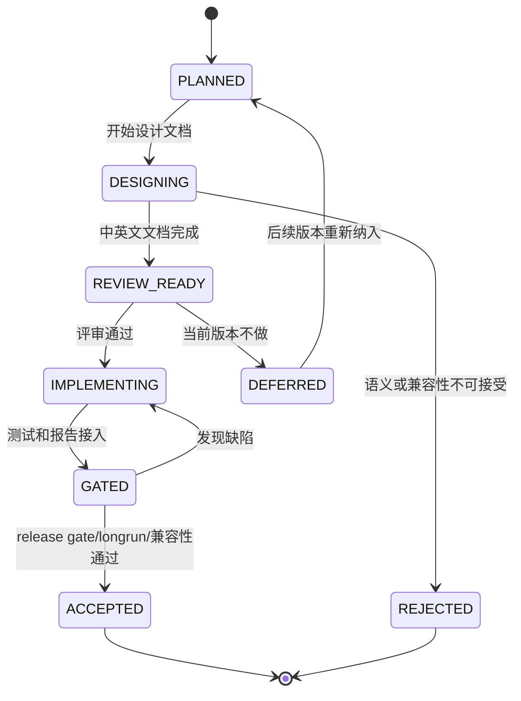

# LDB 对齐 RocksDB 差距与下一版本规划设计

[English](ldb-rocksdb-gap-next-version-plan.en.md) | 中文

## 背景

`vexra-ldb` 已具备本地 LSM/KV 的核心闭环：WAL、MemTable、SSTable、MANIFEST/CURRENT、列族、range delete、snapshot cursor、checkpoint、check/repair、全量/增量备份、对象仓库、group commit、插件和长压测报告入口。

当前差距已经不再是“是否能作为 LevelDB 风格嵌入式 KV 使用”，而是“是否能在产品能力、运维生态和高级 API 上更接近 RocksDB 的成熟度”。截至 2026-06-18 的公开资料核对，RocksDB 最新发布线为 `11.1.1`，其产品能力继续围绕列族、事务、Merge、Prefix Seek、Backup/Checkpoint、Compaction/Cache 调优、动态配置、统计与工具生态演进。

本文档把上一轮差距评估固化为下一版本开发计划，作为后续设计、实现、测试、发布门禁和验收追踪的统一入口。

## 目标

- 把 RocksDB 对标差距拆成可评审、可实现、可验收的下一版本工作包。
- 对每个工作包给出优先级、影响面、接口/格式约束、测试和回滚要求。
- 明确哪些能力下一版本只做设计评审，哪些可以进入默认关闭的最小实现。
- 保持所有涉及磁盘格式、恢复语义和工具副作用的变更先文档后代码。
- 将验收证据沉淀到 `releaseGate`、longrun、故障注入、兼容性测试和运维 Runbook。

## 非目标

- 不承诺完整兼容 RocksDB API、RocksJava、RocksDB CLI 或 RocksDB 磁盘格式。
- 不在一个版本内同时实现 MergeOperator、PrefixExtractor、transactions、TTL、custom Env 和完整工具生态。
- 不默认开启会改变读写语义、磁盘格式或 compaction 行为的新能力。
- 不把 RocksDB 的每个 option/property 名称原样搬入 LDB；LDB 继续通过 `ldb.api.*` 和明确文档表达兼容状态。
- 不用性能指标替代可靠性门禁；吞吐优化必须排在数据语义正确性之后。

## 现状/已有流程

| 领域 | LDB 当前状态 | 与 RocksDB 的主要差距 | 下一版本策略 |
| --- | --- | --- | --- |
| 基础 KV | `put/get/delete/write/addLong`、batch、snapshot cursor 已支持 | 缺少 `MultiGet`、Merge、TTL 等高级 API | P1 实现 `MultiGet` 最小能力，P0 评审 Merge/TTL |
| 列族 | 静态/运行时列族、rename、drop tombstone、列族级 compact/property 已支持 | 缺少列族级独立 Options、大规模列族运维报告、多列族一致 iterator | P1 做列族硬化包 |
| WAL/恢复 | 全局 WAL、sync、半写测试、repair/check、WAL lifecycle property 已有 | 缺少更严格 Manifest 校验、WAL 归档保留策略、长期恢复证据库 | P0 做可靠性与恢复包 |
| Backup/Checkpoint | checkpoint、全量/增量备份、对象仓库、清理 dry-run 已支持 | 缺少长链、跨文件系统、低磁盘、权限失败和对象仓库长期维护证据 | P1 做生产证据包 |
| Compaction/Cache | L0 阈值、限速、取消清理、block cache、统计属性已有 | 缺少更多 compaction style、cache warmup、动态调参、prefix bloom | P1/P2 做调优与观测包 |
| API 兼容 | `ldb.api.*` 自描述、unsupported 能力明确 | MergeOperator、PrefixExtractor、transactions、TTL、custom Env 未实现 | P0 做高级 API 设计评审 |
| 工具生态 | `LdbTool` 覆盖 check/properties/scan/repair/backup/restore/checkpoint | 不兼容 RocksDB 原生命令集，缺少完整 compact/dump/ldb 风格工具矩阵 | P2 做 CLI 生态包 |
| 观测生态 | `getProperty`、operation stats、compaction stats、longrun reports 已有 | 缺少外部指标导出、趋势留存、事件监听和统计对象 | P2 做外部观测包 |

## 核心约束

| 约束 | 说明 |
| --- | --- |
| JDK | 保持 JDK 8 兼容 |
| 编码 | 文档、源码和报告保持 UTF-8 |
| 兼容性 | 默认不破坏已有 WAL、SST、MANIFEST、CURRENT、COLUMN-FAMILIES、备份元数据 |
| 开关 | 改变语义或性能画像的新能力必须默认关闭或仅通过新 API 显式使用 |
| 顺序 | 先更新设计文档和英文副本，再实现代码 |
| 证据 | 每个工作包必须有测试、报告或 Runbook 证据，不允许只停留在口头验收 |
| 回滚 | 涉及持久化格式的新能力必须能 fail-fast、禁用或说明不可降级边界 |
| 全局 WAL | 下一版本默认继续保持全局 WAL，除非单独设计证明列族级 WAL 不破坏跨列族 batch 原子性 |

## 接口设计

### 新增或评审的 public API

| 能力 | 候选入口 | 下一版本动作 | 默认状态 |
| --- | --- | --- | --- |
| MultiGet | `LDB#get(List<byte[]> keys)` 和列族重载 | 下一版本低风险最小实现，保持输入顺序，缺失 key 返回 `null` | 显式调用 |
| PrefixExtractor | `Options.prefixExtractor(...)`、`ReadOptions.prefix(...)` | 先做设计评审；若实现，必须先与 comparator/filter/range delete 验证 | unsupported |
| MergeOperator | `Options.mergeOperator(...)`、`LDB#merge(...)` | 只做设计评审，不直接实现 | unsupported |
| TTL | `Options.ttl(...)` 或 TTL column family | 评审是否通过列族策略实现；不得静默过期 | unsupported |
| Transactions | `TransactionDB` 风格包装或 `LDB#beginTransaction` | 只做事务模型评审，暂不实现 | unsupported |
| Dynamic Options | `LDB#setOption(...)` 或工具命令 | 评审只允许不影响格式的运行时阈值 | unsupported |
| Event Listener | `LdbEventListener` | 可作为观测包候选，不参与写入语义 | optional |
| CLI compact/dump/scan | `ldb scan` 已有只读默认列族 JSON 样本；`ldb compact`、`ldb dump-manifest`、`ldb dump-sst` 仍待评审 | 先稳定只读 scan 的退出码、limit 和 base64 JSON 输出，再评审写命令或文件级 dump | partial |

### property 与报告入口

| 入口 | 计划 |
| --- | --- |
| `ldb.api.rocksdbGapPlan` | 返回当前版本对本文档工作包的支持状态，至少包含 `planVersion`、`nextVersion`、`rocksdbBaseline` 和低风险实现项 |
| `ldb.recoveryEvidence` | 已接入，汇总当前库目录、WAL/Manifest 状态、check/repair 入口和 repair 报告状态 |
| `ldb.backupEvidence` | 已接入，汇总 checkpoint、backup、restore、对象仓库和清理 dry-run 的证据约定 |
| `ldb.columnFamilyEvidence` | 汇总列族注册表、活动/已删除列族数量、MemTable、Level 文件和 drop/rename 策略 |
| `ldb.prefixReadiness` | 已接入，汇总 PrefixExtractor/prefix bloom/cache warmup 的启用前置条件和当前 cache/filter 配置；本阶段只观测，不改读路径 |
| `RELEASE-GATE-REPORT.json` | 已接入 `rocksdbGapPlan` 和 `rocksdbGapGates` 分组，记录 baseline、下一版本目标和工作包验收结果 |
| `ldb-longrun` 报告 | 增加 workload profile 名称、能力开关、失败分类和关键 property 快照 |

### 23.2 已接入的恢复校验增量

| 项目 | 当前结论 | 验收证据 |
| --- | --- | --- |
| CURRENT 指向约束 | `check` 和 `open` 均要求 CURRENT 内容为同目录内合法 `MANIFEST-NNNNNN` 文件名，禁止路径分隔符和非 descriptor 名称 | 故障注入测试覆盖非法 CURRENT 名称和路径穿越输入 |

### 23.4 已接入的备份证据增量

| 项目 | 当前结论 | 验收证据 |
| --- | --- | --- |
| `checkBackup` 元数据证据 | `CheckReport.checkedFiles` 会记录 `BACKUP-MANIFEST.json`、`OBJECT-REFS.json` 和已校验对象文件名，便于长链备份报告追踪对象仓库校验范围 | 对象仓库测试覆盖成功备份链的 metadata/object evidence，并继续覆盖缺对象、错误 refCount、损坏 refs、孤儿对象和损坏 manifest |

### 23.3 已接入的列族硬化增量

| 项目 | 当前结论 | 验收证据 |
| --- | --- | --- |
| 列族运维证据属性 | `ldb.columnFamilyEvidence` 汇总注册表状态、active/dropped 数量、MemTable、Level 文件、drop/rename 策略和 per-CF Options 支持边界 | 列族生命周期测试覆盖 create/rename/drop 后 evidence 输出和重开后 tombstone 保留 |

## 数据结构

### 规划跟踪字段

release gate 和后续规划报告使用以下字段作为跟踪约束：

| 字段 | 含义 |
| --- | --- |
| `planVersion` | 本规划文档版本，例如 `rocksdb-gap-next-1` |
| `rocksdbBaseline` | 对标 RocksDB 发布线，例如 `11.1.1` |
| `ldbVersion` | 当前 LDB 版本 |
| `workPackages[]` | 工作包编号、优先级、状态、证据路径 |
| `designDocuments[]` | 已更新的中文/英文设计文档 |
| `formatChanges[]` | 涉及 WAL/SST/MANIFEST/备份格式的变更列表 |
| `compatibilityGates[]` | 旧库新版本、新库旧版本、backup/restore、repair/check 验收结果 |
| `openQuestions[]` | 尚未关闭的设计问题 |

### 工作包状态

| 状态 | 含义 |
| --- | --- |
| `PLANNED` | 已进入计划，但未开始设计 |
| `DESIGNING` | 正在补设计文档和英文副本 |
| `REVIEW_READY` | 设计完成，等待评审或确认 |
| `IMPLEMENTING` | 代码实现中 |
| `GATED` | 已接入测试或 release gate，但证据未稳定 |
| `ACCEPTED` | 验收通过，可作为版本能力发布 |
| `DEFERRED` | 保留设计但移出当前版本 |
| `REJECTED` | 因语义、兼容或成本原因不进入 LDB |

## 状态机

非法转换：

- 未完成中英文设计文档，不得从 `PLANNED` 直接进入 `IMPLEMENTING`。
- 涉及磁盘格式的新能力，未完成兼容性和回滚说明，不得进入 `GATED`。
- release gate 失败或证据缺失时，不得进入 `ACCEPTED`。

## 时序流程

### 下一版本规划落地流程

1. 建立本文档和英文副本。
2. 在 README、用户手册、API 兼容设计、项目整体设计中挂入本文档。
3. 按工作包补充专项设计，例如 MergeOperator、PrefixExtractor、WAL 恢复、备份生产证据。
4. 每个专项设计先列出 `不改格式最小实现` 与 `改格式完整实现` 两档。
5. 评审通过后再进入代码实现。
6. 实现后补单元测试、故障注入、longrun 或 release gate。
7. 验收通过后更新 `CHANGELOG`、`release.md`、`operations.md` 和 `user-manual.md`。

### 单个工作包执行流程

1. `PLANNED`：记录范围、非目标和负责人待确认。
2. `DESIGNING`：更新中文设计文档和英文副本。
3. `REVIEW_READY`：列出接口、数据结构、状态机、异常、兼容性、回滚和测试方案。
4. `IMPLEMENTING`：按设计最小增量实现，默认保持旧行为。
5. `GATED`：跑 `test`、相关专项测试、兼容性样本和必要 longrun。
6. `ACCEPTED`：归档报告路径并更新发布说明。

## 异常处理

| 场景 | 处理要求 |
| --- | --- |
| 新能力设计发现需要改磁盘格式 | 先停在 `REVIEW_READY`，补旧版本 fail-fast、降级和 repair/check 行为 |
| public API 设计与现有 `LDB` 语义冲突 | 拆成独立 wrapper 或保持 unsupported |
| 新 property 被外部强解析 | 字段只能追加，不能反转已有含义；文档提示调用方按 key 识别 |
| release gate 超时 | 工作包保持 `GATED`，不能标记 accepted |
| longrun 偶现失败 | 保留失败 workDir、reports 和 property 快照，先归类再决定修复或降级 |
| RocksDB 对标能力成本过高 | 标记 `DEFERRED` 或 `REJECTED`，说明原因和替代方案 |

## 幂等性

- 规划文档更新应可重复执行，不改变数据库数据。
- release gate 报告写入独立构建目录，重复执行不覆盖历史证据。
- 备份、repair、checkpoint 相关新增测试必须继续使用临时目录和原子发布。
- 对工作包状态的推进必须由证据驱动；同一失败不得被重复记录成多个 accepted 证据。

## 回滚策略

| 变更类型 | 回滚策略 |
| --- | --- |
| 纯文档/计划 | 回滚文档提交即可 |
| 新 property | 保持旧 property 不变；新增 property 可移除，但调用方需按“能力未知”降级 |
| 新只读 CLI | 回滚命令入口，不影响数据库文件 |
| 新写入 CLI | 必须通过目标临时目录、备份或 checkpoint 提供回滚点 |
| 新 Options 开关 | 默认关闭；异常时关闭开关恢复旧路径 |
| WAL/SST/MANIFEST 格式 | 必须有格式版本、旧版本拒绝策略、repair/check 报告和不可降级说明 |
| Merge/TTL/事务语义 | 必须说明已写入数据在关闭能力后如何读取或拒绝读取 |

## 兼容性

- 旧数据库：下一版本默认必须可打开、check、backup、restore；若某工作包改变格式，必须新增独立兼容性样本。
- 旧客户端：不读取新 API/property 时行为不变。
- 新客户端：读取不到新 property 时必须视为能力未知，不能假设 supported。
- 混合工具：新版工具处理旧库必须安全；旧版工具面对新格式必须 fail-fast 或只读拒绝。
- JDK/Gradle：保持 JDK 8 和当前 Gradle Wrapper。
- 文档：所有专项设计必须维护 `.md` 和 `.en.md`。

## 灰度/迁移

| 阶段 | 内容 | 灰度条件 | 中止条件 |
| --- | --- | --- | --- |
| G0 | 文档落档 | 中英文文档齐全，README 可追踪 | 文档与现有能力冲突 |
| G1 | 只读能力/报告 | 不写库，不改格式 | property 或 CLI 输出不稳定 |
| G2 | 默认关闭实现 | Options 或独立 API 显式启用 | 旧测试回归失败 |
| G3 | 故障注入和兼容性 | WAL/SST/MANIFEST/backup 矩阵通过 | repair/check 报告无法解释 |
| G4 | longrun/release gate | 报告归档且失败分类稳定 | 长压测存在未归因失败 |
| G5 | 发布说明与 Runbook | `release.md`、`operations.md`、`CHANGELOG` 同步 | 运维步骤缺失回滚路径 |

## 测试方案

| 工作包 | 必测项 |
| --- | --- |
| 高级 API 评审 | API 设计测试清单、unsupported property 保持稳定、适配层拒绝未支持配置 |
| PrefixExtractor | comparator 不一致、prefix bloom 漏读防护、range delete 组合、snapshot cursor、repair/check |
| MergeOperator | unknown operator、operator 抛异常、WAL 半写、compaction 中断、backup/restore |
| TTL | 过期边界、snapshot 旧视图、compaction 清理、关闭 TTL 后读取策略 |
| Transactions | 冲突检测、锁释放、rollback、crash recovery、跨列族 batch |
| WAL/恢复 | header 截断、record 截断、checksum 错误、多 WAL、Manifest 丢失、repair-plan |
| 列族硬化 | 多列族高并发、drop/rename/reopen、列族级配置、物理 GC、备份恢复 |
| 备份生产证据 | 长链、跨文件系统、低磁盘、权限失败、对象仓库损坏、清理 dry-run |
| Compaction/Cache | L0 高峰、限速、取消、cache 命中、prefix bloom、长 snapshot |
| CLI 生态 | 参数错误、退出码、JSON schema、只读/写入边界、锁冲突 |

## 风险点

| 风险 | 严重性 | 缓解 |
| --- | --- | --- |
| 追求 RocksDB 兼容导致 LDB API 膨胀 | 高 | 每个高级能力先设计评审，默认保持 unsupported |
| Merge/TTL/事务改变恢复语义 | 高 | 单独格式版本和 fail-fast 策略，先不进入默认实现 |
| PrefixExtractor 配置错误导致漏读 | 高 | 证明 comparator/filter/range delete 组合语义，提供禁用路径 |
| WAL/Manifest 改动影响旧库打开 | 高 | 保持默认旧格式，新增兼容样本和 repair/check 报告 |
| 备份对象仓库清理误删 | 高 | dry-run、引用计数校验、损坏注入和恢复闭环 |
| release gate 过慢 | 中 | 分 short gate、release gate、nightly soak |
| 文档与实现漂移 | 中 | 每个工作包 accepted 前更新中英文文档和发布说明 |

## 分阶段实施计划

| 阶段 | 优先级 | 内容 | 交付物 | 验收 |
| --- | --- | --- | --- | --- |
| 23.0 | P0 | RocksDB 差距规划落档 | 本文档和英文副本，README/设计索引入口 | 文档可追踪，工作区 UTF-8 |
| 23.1 | P0 | 高级 API 兼容评审 | MergeOperator、PrefixExtractor、TTL、Transactions 评审章节或专项文档 | 继续明确 unsupported 或选出一个最小实现 |
| 23.2 | P0 | WAL/Manifest/恢复可靠性增强 | WAL 保留策略、Manifest 校验、恢复证据报告 | 故障注入和兼容性样本通过 |
| 23.3 | P1 | 列族硬化 | 列族级配置评审、多列族一致性/GC/运维报告 | 多列族 longrun 与 backup/repair 通过 |
| 23.4 | P1 | Backup/Checkpoint 生产证据 | 长链、跨文件系统、低磁盘、权限失败矩阵 | release gate 归档证据 |
| 23.5 | P1 | Compaction/Cache/Prefix 调优 | `ldb.prefixReadiness` 观测属性，记录 prefix/cache 启用前置条件；prefix bloom/cache warmup 继续不启用 | 只观测不改读语义，测试证明属性可追踪且 unsupported 边界清晰 |
| 23.6 | P2 | CLI 和外部观测生态 | `ldb scan <db> [limit]` 只读 JSON 样本输出；compact/dump、事件监听和指标导出继续评审 | scan JSON、limit、退出码和只读不改库测试通过 |
| 23.7 | P2 | 发布与运维闭环 | `release.md` 新增 0.6.0 发布前 checklist，`operations.md`、`CHANGELOG`、用户手册和 README 已同步新增能力 | 发布前 checklist 覆盖 releaseGate、MultiGet、恢复/备份/列族证据、prefix readiness、scan 和开放问题默认决策 |

## 下一版本推荐切入点

推荐下一版本实际实现只选择以下组合，避免范围失控：

1. 必做：23.1 高级 API 评审，继续把高风险能力保持 unsupported 或拆出后续专项。
2. 必做：23.2 WAL/Manifest/恢复证据增强。
3. 必做：23.4 Backup/Checkpoint 生产证据矩阵。
4. 低风险实现项：`MultiGet` 已进入 API；只读 CLI `scan` 已进入工具生态；cache warmup 和 prefix bloom 设计验证留作后续候选。
5. 暂缓：完整 MergeOperator、完整事务、TTL 自动清理和 custom Env。

## 已确认决策

| 问题 | 决策 | 说明 |
| --- | --- | --- |
| 下一版本号 | 使用 `0.6.0-SNAPSHOT` 作为下一开发线，`0.6.0` 作为正式目标 | 当前 `0.5.0-SNAPSHOT` 仍服务于 0.5.0 发布基线，RocksDB 差距包进入新阶段 |
| RocksDB baseline | 文档固定 `11.1.1`，release gate 动态记录实际核对版本 | 固定 baseline 便于评审追踪，动态记录便于发布时发现 RocksDB 变化 |
| 低风险实现项 | 下一版本先实现 `MultiGet` | 不改变 WAL/SST/MANIFEST 格式，能提升批量点查易用性 |
| PrefixExtractor 优先级 | 暂缓实现，先保留设计验证 | 未确认真实 prefix-heavy workload 前，不承担漏读风险 |
| TTL | 继续 unsupported，只做语义评审 | TTL 可能涉及 per-key metadata、snapshot 旧视图和 compaction 清理策略 |
| RocksDB 风格适配层 | 暂不提供完整适配层，继续 LDB 原生 API + `ldb.api.*` 自描述 | 避免调用方误以为完整 RocksDB 兼容 |
| MergeOperator/transactions/custom Env | 继续 unsupported | 这些能力会改变写入、恢复、隔离或文件系统抽象边界 |

## 随机读性能专项规划

本专项承接 `docs/ldb-rocksdb-performance-baseline.md` 中的 Java/JNI 对标结果。当前 warm `readrandom` 已从约 29% 提升到 67.6%，下一阶段目标是把结论从“单轮 warm benchmark 过线”推进到“warm/cold/native 多口径都有可复跑证据”，并继续缩小 SST 点查、缓存和批量点查路径与 RocksDB 的差距。

### 范围

| 项目 | 规划 |
| --- | --- |
| 范围内 | `readrandom`、冷启动随机读、SST 点查、Bloom/filter、block/table cache、MultiGet、benchmark 稳定性、RocksDB native/JNI 对标 |
| 范围外 | 事务、Raft、插件、网络、备份恢复、非读路径大重构；除非验证显示它们直接影响随机读 |

### 行动项

| 编号 | 优先级 | 行动项 | 主要文件/入口 | 验收证据 |
| --- | --- | --- | --- | --- |
| RR-01 | P0 | 固化当前已达标基线，保留 `scripts/run-rocksdbjni-comparison.ps1` 口径，并新增多轮运行统计，输出 min/median/p95/max | `scripts/run-rocksdbjni-comparison.ps1`、`ldb-longrun` benchmark report | 多轮 comparison 报告能解释 RocksDB JNI 与 LDB 波动 |
| RR-02 | P0 | 增加冷启动随机读 benchmark：预填充后关闭 DB、重开后执行 `readrandom`，单独衡量 SST/table cache 路径 | `LdbDbBenchMain`、`RocksDbJniBench`、comparison 脚本 | `cold_readrandom` 独立出现在 JSON/CSV 报告 |
| RR-03 | P0 | 接入 RocksDB native `db_bench` 对标，和 RocksDB JNI 结果分开归档 | `scripts/run-rocksdb-comparison.ps1`、性能基线文档 | native RocksDB 版本、命令、参数、结果可追溯 |
| RR-04 | P0 | 强化报告口径：区分 `warm_readrandom`、`cold_readrandom`、`readwhilewriting`、`multiget_random` | `comparison.json`、`comparison.csv`、`docs/ldb-rocksdb-performance-baseline*.md` | 不同读场景不再混用同一 `readrandom` 结论 |
| RR-05 | P1 | 优化 SST 点查路径，重点检查文件筛选、filter 判断、block 解码、iterator 创建成本 | `Version`、`Level0`、`Level`、`TableCache`、`Table` | cold `readrandom` 达到验收阈值且正确性测试通过 |
| RR-06 | P1 | 做默认读优化参数实验，评估 `BloomFilterPolicy`、`blockCacheSize`、`cacheBlocks`、`verifyChecksums` 组合 | `Options`、benchmark 配置、用户手册 | 同时输出默认配置和读优化配置结果 |
| RR-07 | P1 | 补 MultiGet 专项，验证批量查询是否复用 snapshot、memtable lookup、SST 文件筛选和 table cache | `LDbImpl#get(List<byte[]>)`、相关测试 | `multiget_random` 报告和正确性测试通过 |
| RR-08 | P0 | 增加回归保护，覆盖默认 `get` 快路径、显式 snapshot、delete、range delete、immutable memtable、SST fallback | 单元测试、故障/兼容样本 | 优化不破坏可见性和删除语义 |
| RR-09 | P0 | 建立验收门槛：短期 warm `readrandom >= 0.65x RocksDB JNI`，cold `readrandom >= 0.50x RocksDB JNI`；中期 native `db_bench` 稳定超过 `0.50x` | release gate、longrun benchmark、performance baseline | 门槛、环境、波动范围和失败分类均归档 |
| RR-10 | P0 | 同步中英文文档，记录命令、参数、环境、结果和已知偏差 | `docs/ldb-rocksdb-performance-baseline.md`、`.en.md` | 中英文结果一致，且可从报告路径追溯 |

### 验收命令

| 命令 | 用途 |
| --- | --- |
| `.\gradlew.bat :ldb-longrun:ldbDbBenchReport` | 生成 LDB db_bench 风格报告 |
| `powershell.exe -ExecutionPolicy Bypass -File .\scripts\run-rocksdbjni-comparison.ps1` | 生成 RocksDB JNI 对比报告 |
| `.\scripts\run-rocksdb-comparison.ps1` | 在本机具备 native RocksDB `db_bench` 后生成 native 对比报告 |

### 开放问题

| 编号 | 问题 | 默认建议 |
| --- | --- | --- |
| RR-OQ-01 | native RocksDB `db_bench` 是否允许在当前机器安装或编译 | 若允许，优先补 native 对标；若不允许，继续把 JNI 对标作为 Java 调用路径证据 |
| RR-OQ-02 | 下一阶段优先冲 cold `readrandom >= 50%`，还是继续把 warm `readrandom` 从 67.6% 往 80% 推 | 优先 cold `readrandom`，因为它更能暴露 SST/table cache 真实差距 |
| RR-OQ-03 | 是否接受 benchmark profile 启用 Bloom/filter/cache 作为“读优化配置” | 接受，但必须同时保留默认配置结果，避免把调优口径误写成默认性能 |

### 当前落地进度

| 编号 | 状态 | 证据 |
| --- | --- | --- |
| RR-01 | 已完成基础版 | `run-rocksdbjni-comparison.ps1 -Runs 2` 已输出 `comparison-stats.csv/json`，记录 min/median/p95/max |
| RR-02 | 已完成 Java/JNI 口径 | `cold_readrandom` 已接入 LDB；RocksDB JNI 通过 `cold_readrandom_prepare` + `cold_readrandom_existing` 两段短进程规避 close 问题 |
| RR-03 | 待外部环境 | 当前仍未提供 native RocksDB `db_bench`，只保留 `run-rocksdb-comparison.ps1` 入口 |
| RR-04 | 已完成基础版 | `comparison.json/csv` 已区分 `warm_readrandom` 与 `cold_readrandom` |
| RR-05 | 待深入实现 | 本轮只验证 cold 随机读已达 0.71x；SST 点查内部优化仍需单独 profiling |
| RR-06 | 待实现 | 尚未增加默认配置与读优化配置的并列 benchmark profile |
| RR-07 | 待实现 | 尚未增加 `multiget_random` benchmark |
| RR-08 | 已完成基础版 | `LdbCoreBehaviorTest.shouldKeepFastGetSemanticsAcrossMemTableSstSnapshotAndDelete` 覆盖默认 get 快路径语义 |
| RR-09 | 已完成基础门槛 | warm `readrandom` 本轮 0.91x - 1.14x，cold `readrandom` 本轮 0.71x，均超过 0.50x |
| RR-10 | 已完成基础版 | `ldb-rocksdb-performance-baseline.md` 与英文副本已更新 warm/cold 结果和报告路径 |

## 开放问题与待确认决策

本节用于跟踪仍不明确、需要在下一版本范围冻结前确认的问题。默认建议以“稳定性证据优先、API 语义保守”为原则；如果业务侧有强需求，再把对应能力提升为专项设计。

| 编号 | 优先级 | 开放问题 | 为什么不明确 | 推荐默认决策 | 需要确认的信息 | 阻塞范围 | 状态 |
| --- | --- | --- | --- | --- | --- | --- | --- |
| OQ-01 | P0 | 下一版本是否必须兼容 RocksDB 调用方源码或配置 | 当前已确认不做完整 RocksDB 风格适配层，但尚未确认是否存在迁移客户、兼容包装层或启动校验诉求 | 不提供适配层，仅维护 LDB 原生 API 与 `ldb.api.*` 自描述；迁移配置必须显式校验并拒绝 unsupported 项 | 是否有存量 RocksDB Java 调用方、配置文件、命令行脚本需要迁移；迁移窗口和兼容失败容忍度 | 23.1 高级 API 兼容评审、用户手册、API 兼容声明 | 默认决策可执行，业务迁移信息待补充 |
| OQ-02 | P0 | TTL 是否有明确业务需求 | TTL 会影响写入元数据、snapshot 旧视图、compaction 清理和备份恢复语义，不能只作为简单过期时间字段加入 | 下一版本继续 unsupported，只写清语义评审和替代方案 | 是否要求列族统一 TTL、per-key TTL、读时过滤、后台清理、过期数据在备份中的保留规则 | 23.1 高级 API 评审、23.2/23.4 兼容与恢复证据 | 默认决策可执行，业务 TTL 场景待补充 |
| OQ-03 | P0 | 发布门禁是否把 nightly/24h soak 作为硬门禁 | 长压测能提高信心，但会增加每次发布和 CI 资源成本；当前门禁更适合短链路自动化 | 短门禁作为硬门禁，nightly/24h soak 作为发布候选前归档证据 | 发布节奏、CI 资源、失败重跑成本、是否允许无长压测证据发布 patch 版本 | 23.2 恢复可靠性、23.4 备份证据、release gate | 默认决策可执行，CI 成本待确认 |
| OQ-04 | P0 | 故障注入环境是否可稳定提供低磁盘、跨文件系统和权限失败场景 | 这些场景直接决定 backup/checkpoint/repair 验收是否能自动化；如果环境不稳定，只能做手工证据 | 拆分为自动化基础用例 + 手工归档极端环境证据 | CI runner 权限、可挂载磁盘/临时卷、Windows/Linux 覆盖范围、是否允许使用受限目录模拟权限失败 | 23.4 Backup/Checkpoint 生产证据矩阵 | 默认决策可执行，环境能力待确认 |
| OQ-05 | P1 | 真实读模式是否以 prefix range scan 为主 | PrefixExtractor/prefix bloom 对 prefix-heavy workload 价值高，但设计不当会产生漏读风险 | 23.5 只实现 `ldb.prefixReadiness` 观测属性；暂缓 PrefixExtractor/prefix bloom/cache warmup 读路径实现 | 查询模式样本、key 编码规范、prefix 边界、range scan 比例、误配置容忍策略 | 23.5 Compaction/Cache/Prefix 调优 | 默认决策可执行，真实 workload 待补充 |
| OQ-06 | P1 | 列族是否需要独立 Options 与大规模列族运维能力 | RocksDB 的列族能力更成熟；LDB 已支持列族基本操作，但 per-CF 配置会扩大配置、恢复和兼容面 | 先做列族运维证据和报告，不在下一版本引入完整 per-CF Options | 预期列族数量、列族生命周期、是否需要列族级 block cache/write buffer/compaction 参数 | 23.3 列族硬化 | 默认决策可执行，规模目标待补充 |
| OQ-07 | P1 | 备份保留策略是否需要产品化默认值 | 当前已有备份和清理 dry-run 能力，但下一版本要不要给出默认保留天数/链长仍未确认 | 只提供显式参数和报告，不替业务选择默认删除策略 | 合规保留周期、最大备份空间、增量链最大长度、对象仓库清理审批流程 | 23.4 Backup/Checkpoint 生产证据 | 默认决策可执行，合规策略待补充 |
| OQ-08 | P2 | CLI 是否需要贴近 RocksDB `ldb` 工具习惯 | `LdbTool` 已有 check/properties/repair/backup/restore/checkpoint，但 RocksDB 用户可能期待 compact/dump/scan 风格命令 | 先补 JSON schema、退出码和只读 dump/scan 评审，不承诺完整命令兼容 | 运维使用方式、脚本集成需求、输出格式稳定性要求、是否要求人类可读与机器可读双格式 | 23.6 CLI 生态包 | 默认决策可执行，脚本需求待补充 |
| OQ-09 | P1 | 性能门禁是否需要固定阈值 | 当前缺少稳定历史趋势，直接设硬阈值容易被机器差异和 CI 抖动影响 | 0.6.0 先记录基线和趋势，不因性能波动阻断发布；后续有历史样本后再设硬阈值 | 目标硬件、典型数据量、读写比例、可接受退化百分比 | release gate、longrun benchmark | 默认决策可执行，性能 SLO 待补充 |
| OQ-10 | P1 | `ldb.*` property 输出是否成为稳定契约 | 运维和迁移工具会依赖 property，但字段过早冻结会限制后续演进 | 关键 property 视为半稳定诊断契约：允许新增字段，删除或反转含义必须更新文档和 changelog | 外部工具解析方式、字段兼容周期 | API 兼容、CLI properties | 默认决策可执行，外部解析方待确认 |
| OQ-11 | P1 | 新版本数据是否允许旧版本打开 | MultiGet 和本阶段 property 不改格式，但后续能力可能引入格式版本 | 不承诺旧版本打开新库；只保证新版本打开旧库，遇到不兼容格式必须 fail-fast | 是否存在降级部署要求、混合版本窗口 | 升级兼容测试、回滚策略 | 默认决策可执行，降级策略待确认 |
| OQ-12 | P2 | 外部观测优先 Prometheus 还是 JSON/CLI | Prometheus exporter 会引入运行时组件和依赖边界，JSON/CLI 更轻量 | 下一版本先稳定 JSON/CLI/report，Prometheus exporter 不进入核心库 | 运维系统接入方式、指标拉取/推送模型 | 23.6 CLI 和观测生态 | 默认决策可执行，观测平台待确认 |
| OQ-13 | P2 | 备份存储后端是否产品化 | 直接支持云厂商对象存储会扩大认证、重试、权限和一致性边界 | 保持本地/对象目录约定和校验证据，不抽象云厂商 backend | 目标对象存储、认证方式、跨区域和删除审批要求 | 23.4/23.7 运维闭环 | 默认决策可执行，存储平台待确认 |

### 建议先关闭的决策

| 决策项 | 建议结论 | 关闭后动作 |
| --- | --- | --- |
| RocksDB 适配层 | 下一版本不做，只保留 `ldb.api.*` 自描述和启动前能力校验建议 | 在 API 兼容文档中明确“不承诺 RocksDB 源码/配置兼容” |
| TTL | 下一版本不实现，仅记录语义评审结果 | 在 unsupported 能力中补充原因和替代方案 |
| 发布门禁 | 短门禁为硬门禁，长压测为发布候选证据 | release gate 输出长压测证据路径字段，但不强制每次本地运行 |
| 故障注入 | 自动化覆盖可稳定场景，低磁盘/跨文件系统/权限失败允许手工归档 | 23.4 增加证据矩阵和手工证据模板 |
| PrefixExtractor | 等真实 prefix-heavy workload 证据再进入实现 | 23.5 先做 key/prefix 规范评审，不改读路径 |

## RR-05/RR-06/RR-07 专项完成证据（2026-06-20）

本次专项验证使用 `num=50000`、`reads=50000`、`value_size=100`、`batch_size=64`。它用于证明新增 profiling、profile 并列输出和 MultiGet benchmark 链路可复跑，不替代前面 `num=200000` 的正式基线。

| profile | 场景 | LDB ops/s | RocksDB JNI ops/s | 比值 | 证据 |
| --- | ---: | ---: | ---: | ---: | --- |
| default | `warm_readrandom` | 426,928 | 528,133 | 0.8084 | `build/reports/rocksdbjni-comparison-rr-default/comparison.csv` |
| default | `cold_readrandom` | 187,288 | 461,805 | 0.4056 | `build/reports/rocksdbjni-comparison-rr-default/comparison.csv` |
| default | `multiget_random` | 208,268 | 513,548 | 0.4055 | `build/reports/rocksdbjni-comparison-rr-default/comparison.csv` |
| read_optimized | `warm_readrandom` | 393,160 | 504,415 | 0.7794 | `build/reports/rocksdbjni-comparison-rr-read-optimized/comparison.csv` |
| read_optimized | `cold_readrandom` | 201,693 | 460,801 | 0.4377 | `build/reports/rocksdbjni-comparison-rr-read-optimized/comparison.csv` |
| read_optimized | `multiget_random` | 215,978 | 443,409 | 0.4871 | `build/reports/rocksdbjni-comparison-rr-read-optimized/comparison.csv` |

补充证据：

- `build/reports/ldb-read-profile-comparison-rr/profile-comparison.csv` 记录 LDB default/read_optimized 并列 profile。
- `ldb-longrun/build/reports/ldb-read-profile-comparison-rr/default/ldb-db-bench-summary.json` 记录 `sstReadStats` 和 `blockCacheStats`；default `multiget_random` 行包含 `pointGets=50000`、`tableReads=50000`、`mayContainRequests=50000`。
- 已通过验证命令：`.\gradlew.bat :compileJava :testClasses :ldb-longrun:compileJava`、`.\gradlew.bat :test --tests net.xdob.vexra.ldb.LdbCoreBehaviorTest --tests net.xdob.vexra.ldb.LdbObservabilityTest`、两组 LDB profile run、两组 RocksDB JNI comparison run。

## 下版本存储格式加固预研

本节只记录后续版本需要补齐的存储格式能力，不作为本轮 RR-05/RR-06/RR-07 的实现范围。本轮随机读专项不修改 WAL、SST、MANIFEST、CURRENT、COLUMN-FAMILIES 或 backup metadata 的磁盘格式，避免为了性能专项引入跨版本兼容风险。

### 当前不足

| 领域 | 当前不足 | 建议方向 | 版本边界 |
| --- | --- | --- | --- |
| 格式版本 | WAL、SST、MANIFEST、backup metadata 缺少统一的 `formatVersion` 与 feature set 约定 | 建立统一格式版本矩阵，未知 feature 必须 fail-fast 或进入明确的只读降级路径 | 下版本先设计，默认不改旧格式 |
| SST 元信息 | SST 文件缺少足够丰富的 per-file properties，例如 key count、data block count、filter policy、压缩方式、sequence 边界和 compaction 来源 | 增加 SST properties block 或等价元信息，并让 check/repair/report 能读取 | 需要独立兼容性设计 |
| Filter/Cache 可观测性 | 运行时已有 `ldb.sstReadStats` 和 `ldb.blockCacheStats`，但 SST 文件本身缺少 filter 参数自描述 | 在 SST 元信息中记录 filter policy 名称、bits-per-key、prefix/filter 相关参数 | 不在当前读优化 profile 中落盘 |
| MANIFEST 兼容边界 | MANIFEST 记录能力集合和列族元数据版本的边界仍不够清晰 | 在 MANIFEST 中记录格式版本、feature set、列族元数据版本和不兼容 feature | 需要旧库打开、新库打开、旧工具处理矩阵 |
| 校验和覆盖 | 各类文件的 checksum 覆盖范围和 check/repair 证据还可以更细 | 明确 WAL/SST/MANIFEST/COLUMN-FAMILIES/backup metadata 的 checksum 范围与错误分类 | 先文档化，再补故障注入 |
| Backup/Object metadata | 对象仓库证据已有基础能力，但 schema version、chain id、generation、引用来源、保留策略字段仍可增强 | 建立 backup metadata schema 版本，补长链、清理 dry-run 和跨版本 restore 所需字段 | 需要与运维保留策略一起设计 |
| 格式说明文档 | 当前规划文档覆盖方向，但缺少单独的稳定格式说明 | 新增或规划 `docs/storage-format.md` 与 `docs/storage-format.en.md`，集中描述 WAL/SST/MANIFEST/CURRENT/COLUMN-FAMILIES/backup metadata | 下版本文档优先 |

### 推荐下版本工作包

| 编号 | 优先级 | 工作包 | 交付物 | 验收证据 |
| --- | --- | --- | --- | --- |
| SF-01 | P0 | 存储格式说明文档 | `docs/storage-format.md` 与 `docs/storage-format.en.md` | 文档列出每类文件字段、版本、checksum、兼容策略和 repair 行为 |
| SF-02 | P0 | 格式版本与 feature set 设计 | WAL/SST/MANIFEST/backup metadata 版本矩阵 | 旧库、新库、旧工具、新工具的打开和拒绝策略明确 |
| SF-03 | P1 | SST properties 预研 | SST 元信息字段设计和最小读取 API | check/repair/report 能展示 key count、filter、compression、sequence 边界 |
| SF-04 | P1 | Backup metadata schema 加固 | backup/object metadata schema version 与 chain/generation 设计 | 长链 backup、restore、cleanup dry-run 有可追溯 evidence |
| SF-05 | P1 | 文件级 checksum 证据矩阵 | checksum 覆盖范围与故障分类文档 | 故障注入覆盖截断、篡改、缺文件、未知 feature |

### 本版本明确不做

- 不修改现有 WAL/SST/MANIFEST/CURRENT/COLUMN-FAMILIES/backup metadata 的落盘格式。
- 不引入会导致旧版本误读或无法打开旧库的新 feature 标记。
- 不把 `read_optimized` benchmark profile 的 Bloom/cache/checksum 选择固化为磁盘格式能力。
- 不承诺旧版本可以打开未来新版本写出的数据；只要求后续设计明确 fail-fast 和回滚边界。

### 与当前随机读专项的关系

- RR-05 已通过 `ldb.sstReadStats` 和 `ldb.blockCacheStats` 暴露运行时瓶颈；下版本 SF-03 可以把其中一部分信息沉淀为 SST 自描述元信息。
- RR-06 的 default/read_optimized profile 仍是 benchmark 配置，不改变格式；如果后续要把 filter 参数固化到 SST，需要进入 SF-02/SF-03 设计。
- RR-07 的 `multiget_random` 已验证批量读经过 SST/table cache 路径；若后续要做按 SST 聚合 key 的深层优化，应先依赖更完整的 SST properties 和 read path profiling。

## 本版本随机读不足修复完成记录（2026-06-20）

本节记录本版本内完成的不足修复；存储文件格式相关不足仍按“下版本存储格式加固预研”处理，本版本不修改落盘格式。

### 修复项

| 项目 | 修复结论 | 证据 |
| --- | --- | --- |
| `candidateFiles` 统计口径 | 已修复 `Level0` / `Level` 中候选文件计数被 `ReadStats.clear()` 清零的问题，并避免空 level 重复累计上一层统计 | 200k default `cold_readrandom` 和 `multiget_random` 均记录 `candidateFiles=200000` |
| MultiGet SST 批量入口 | `LDbImpl` 的 MultiGet SST miss 段统一走 `VersionSet#get(cfId, List<LookupKey>)` 批量入口，保留同一 snapshot sequence、memtable/immutable memtable 前置筛选和 SST fallback 顺序 | `LdbCoreBehaviorTest` 与 `LdbObservabilityTest` 通过；`multiget_random` 报告记录 SST/table cache 统计 |
| 200k 正式参数证据 | 已用 `num=200000`、`reads=200000`、`value_size=100`、`batch_size=64` 生成 default/read_optimized profile 和 RocksDB JNI 对照 | `build/reports/ldb-read-profile-comparison-200k/profile-comparison.csv`、`build/reports/rocksdbjni-comparison-200k-default/comparison.csv`、`build/reports/rocksdbjni-comparison-200k-read-optimized/comparison.csv` |

### 200k 对照结果

| profile | 场景 | LDB ops/s | RocksDB JNI ops/s | 比值 | 证据 |
| --- | ---: | ---: | ---: | ---: | --- |
| default | `warm_readrandom` | 327,318 | 473,241 | 0.6917 | `build/reports/rocksdbjni-comparison-200k-default/comparison.csv` |
| default | `cold_readrandom` | 157,705 | 320,820 | 0.4916 | `build/reports/rocksdbjni-comparison-200k-default/comparison.csv` |
| default | `multiget_random` | 137,833 | 321,336 | 0.4289 | `build/reports/rocksdbjni-comparison-200k-default/comparison.csv` |
| read_optimized | `warm_readrandom` | 293,233 | 521,253 | 0.5626 | `build/reports/rocksdbjni-comparison-200k-read-optimized/comparison.csv` |
| read_optimized | `cold_readrandom` | 224,487 | 250,363 | 0.8966 | `build/reports/rocksdbjni-comparison-200k-read-optimized/comparison.csv` |
| read_optimized | `multiget_random` | 172,418 | 197,650 | 0.8723 | `build/reports/rocksdbjni-comparison-200k-read-optimized/comparison.csv` |

### 当前结论

- 本版本 default profile 的 `warm_readrandom` 仍高于 0.5x；default `cold_readrandom` 在本次 200k 单轮中为 0.4916x，接近门槛但受 RocksDB JNI 单轮波动影响，不能单独作为退化结论。
- 本版本 read_optimized profile 已把 `cold_readrandom` 提升到 0.8966x，把 `multiget_random` 提升到 0.8723x，满足本版本随机读专项“至少 0.5x”的目标口径。
- `multiget_random` 现在在 compact 后计时，报告中 default 行记录 `pointGets=200000`、`candidateFiles=200000`、`tableReads=200000`、`mayContainRequests=200000`，证明批量读覆盖 SST 文件筛选和 table cache 路径。
- native RocksDB `db_bench` 仍是外部环境缺口，本版本保留 `run-rocksdb-comparison.ps1` 入口，不把 native 对照作为本地完成前置条件。

### 已通过验证

- `.\gradlew.bat :compileJava :testClasses :ldb-longrun:compileJava`
- `.\gradlew.bat :test --tests net.xdob.vexra.ldb.LdbCoreBehaviorTest --tests net.xdob.vexra.ldb.LdbObservabilityTest`
- 200k default/read_optimized LDB profile run
- 200k default/read_optimized RocksDB JNI comparison run

## 本版本补充完成项：MultiGet SST 深层批量优化

已完成的本版本修复：

- MultiGet miss path 不再对每个 key 独立走完整 SST iterator 创建流程。
- L0 按文件新旧顺序批量处理未命中 key，并在同一文件内复用 iterator。
- 非 L0 level 根据 key range 将 key 分组到候选 SST 文件，并在同一 SST 内复用 iterator。
- 修正空 level 统计继承问题，避免 candidateFiles/tableReads/iteratorRequests 被上一次读取污染。
- 不修改当前 SST/table 文件格式，文件格式层改进仍进入下一版本。

最新 200k `read_optimized` MultiGet 对比：

| 指标 | LDB | RocksDB JNI | 比例 |
| --- | ---: | ---: | ---: |
| multiget_random ops/s | 200,302.818 | 243,015.078 | 82.42% |

LDB 关键读取统计：tableReads=34,315，iteratorRequests=34,394，candidateFiles=200,000。

证据路径：

- `ldb-longrun/build/reports/ldb-multiget-optimized-200k/ldb-db-bench-summary.json`
- `build/reports/rocksdbjni-comparison-multiget-optimized-200k/comparison.csv`
## 0.8.0 目标收敛：文件格式演进

`0.8.0-SNAPSHOT` 的版本目标已经从上一轮随机读性能专项切换为文件格式完善与改进。主设计入口为：

- `docs/storage-format-0.8-design.md`
- `docs/storage-format-0.8-design.en.md`

本轮优先级：

| 编号 | 优先级 | 目标 | 说明 |
| --- | --- | --- | --- |
| SF-01 | P0 | 文件格式参考文档 | 补齐 WAL/SST/MANIFEST/CURRENT/COLUMN-FAMILIES/backup metadata 当前格式说明 |
| SF-02 | P0 | Table properties block reader | 通过 metaindex `properties` 入口读取 SST 自描述元信息，旧 SST 识别为 v1 legacy |
| SF-03 | P0 | format version 与 feature set | 支持 compatible/incompatible features，未知不兼容 feature 必须 fail-fast |
| SF-04 | P1 | v2 opt-in 写入 | TableBuilder 写 properties block，默认保留旧格式写入能力 |
| SF-05 | P1 | check/repair/report 集成 | 增加 `ldb.storageFormat`、`ldb.tableFormat` 和 release gate `storageFormatGates` |

边界：`0.8.0` 首批不承诺 RocksDB/LevelDB 磁盘格式兼容，不承诺旧版本 LDB 打开新格式库；必须保证新版本打开旧库，并在未知不兼容 feature 上 fail-fast。
### SF-01 完成状态

`0.8.0` 文件格式工作包 SF-01 已完成，新增当前格式参考文档：`docs/storage-format.md` 与 `docs/storage-format.en.md`。后续实现必须以该参考文档和 `docs/storage-format-0.8-design.md` 为格式事实与演进边界。