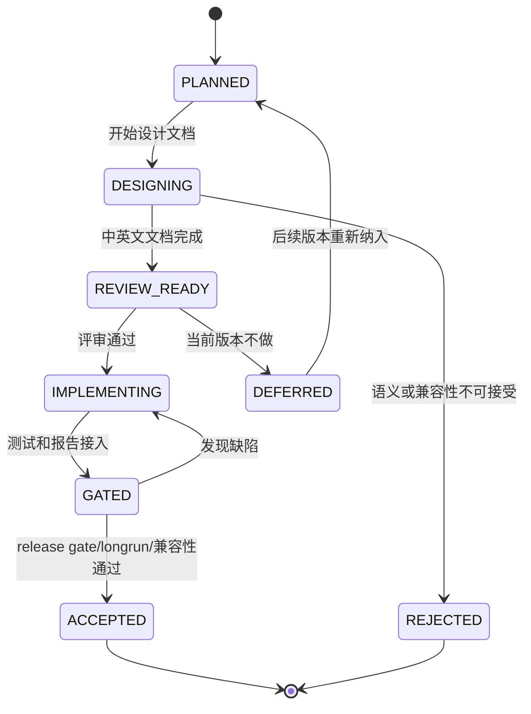

# LDB 对齐 RocksDB 差距与下一版本规划设计

[English](ldb-rocksdb-gap-next-version-plan.en.md) | 中文

## 背景

`vexra-ldb` 已具备本地 LSM/KV 的核心闭环：WAL、MemTable、SSTable、MANIFEST/CURRENT、列族、range delete、snapshot cursor、checkpoint、check/repair、全量/增量备份、对象仓库、group commit、插件和长压测报告入口。

当前差距已经不再是“是否能作为 LevelDB 风格嵌入式 KV 使用”，而是“是否能在产品能力、运维生态和高级 API 上更接近 RocksDB 的成熟度”。截至 2026-06-18 的公开资料核对，RocksDB 最新发布线为 `11.1.1`，其产品能力继续围绕列族、事务、Merge、Prefix Seek、Backup/Checkpoint、Compaction/Cache 调优、动态配置、统计与工具生态演进。

本文档把上一轮差距评估固化为下一版本开发计划，作为后续设计、实现、测试、发布门禁和验收追踪的统一入口。

## 目标

- 把 RocksDB 对标差距拆成可评审、可实现、可验收的下一版本工作包。
- 对每个工作包给出优先级、影响面、接口/格式约束、测试和回滚要求。
- 明确哪些能力下一版本只做设计评审，哪些可以进入默认关闭的最小实现。
- 保持所有涉及磁盘格式、恢复语义和工具副作用的变更先文档后代码。
- 将验收证据沉淀到 `releaseGate`、longrun、故障注入、兼容性测试和运维 Runbook。

## 非目标

- 不承诺完整兼容 RocksDB API、RocksJava、RocksDB CLI 或 RocksDB 磁盘格式。
- 不在一个版本内同时实现 MergeOperator、PrefixExtractor、transactions、TTL、custom Env 和完整工具生态。
- 不默认开启会改变读写语义、磁盘格式或 compaction 行为的新能力。
- 不把 RocksDB 的每个 option/property 名称原样搬入 LDB；LDB 继续通过 `ldb.api.*` 和明确文档表达兼容状态。
- 不用性能指标替代可靠性门禁；吞吐优化必须排在数据语义正确性之后。

## 现状/已有流程

| 领域 | LDB 当前状态 | 与 RocksDB 的主要差距 | 下一版本策略 |
| --- | --- | --- | --- |
| 基础 KV | `put/get/delete/write/addLong`、batch、snapshot cursor 已支持 | 缺少 `MultiGet`、Merge、TTL 等高级 API | P1 实现 `MultiGet` 最小能力，P0 评审 Merge/TTL |
| 列族 | 静态/运行时列族、rename、drop tombstone、列族级 compact/property 已支持 | 缺少列族级独立 Options、大规模列族运维报告、多列族一致 iterator | P1 做列族硬化包 |
| WAL/恢复 | 全局 WAL、sync、半写测试、repair/check、WAL lifecycle property 已有 | 缺少更严格 Manifest 校验、WAL 归档保留策略、长期恢复证据库 | P0 做可靠性与恢复包 |
| Backup/Checkpoint | checkpoint、全量/增量备份、对象仓库、清理 dry-run 已支持 | 缺少长链、跨文件系统、低磁盘、权限失败和对象仓库长期维护证据 | P1 做生产证据包 |
| Compaction/Cache | L0 阈值、限速、取消清理、block cache、统计属性已有 | 缺少更多 compaction style、cache warmup、动态调参、prefix bloom | P1/P2 做调优与观测包 |
| API 兼容 | `ldb.api.*` 自描述、unsupported 能力明确 | MergeOperator、PrefixExtractor、transactions、TTL、custom Env 未实现 | P0 做高级 API 设计评审 |
| 工具生态 | `LdbTool` 覆盖 check/properties/scan/repair/backup/restore/checkpoint | 不兼容 RocksDB 原生命令集，缺少完整 compact/dump/ldb 风格工具矩阵 | P2 做 CLI 生态包 |
| 观测生态 | `getProperty`、operation stats、compaction stats、longrun reports 已有 | 缺少外部指标导出、趋势留存、事件监听和统计对象 | P2 做外部观测包 |

## 核心约束

| 约束 | 说明 |
| --- | --- |
| JDK | 保持 JDK 8 兼容 |
| 编码 | 文档、源码和报告保持 UTF-8 |
| 兼容性 | 默认不破坏已有 WAL、SST、MANIFEST、CURRENT、COLUMN-FAMILIES、备份元数据 |
| 开关 | 改变语义或性能画像的新能力必须默认关闭或仅通过新 API 显式使用 |
| 顺序 | 先更新设计文档和英文副本，再实现代码 |
| 证据 | 每个工作包必须有测试、报告或 Runbook 证据，不允许只停留在口头验收 |
| 回滚 | 涉及持久化格式的新能力必须能 fail-fast、禁用或说明不可降级边界 |
| 全局 WAL | 下一版本默认继续保持全局 WAL，除非单独设计证明列族级 WAL 不破坏跨列族 batch 原子性 |

## 接口设计

### 新增或评审的 public API

| 能力 | 候选入口 | 下一版本动作 | 默认状态 |
| --- | --- | --- | --- |
| MultiGet | `LDB#get(List<byte[]> keys)` 和列族重载 | 下一版本低风险最小实现，保持输入顺序，缺失 key 返回 `null` | 显式调用 |
| PrefixExtractor | `Options.prefixExtractor(...)`、`ReadOptions.prefix(...)` | 先做设计评审；若实现，必须先与 comparator/filter/range delete 验证 | unsupported |
| MergeOperator | `Options.mergeOperator(...)`、`LDB#merge(...)` | 只做设计评审，不直接实现 | unsupported |
| TTL | `Options.ttl(...)` 或 TTL column family | 评审是否通过列族策略实现；不得静默过期 | unsupported |
| Transactions | `TransactionDB` 风格包装或 `LDB#beginTransaction` | 只做事务模型评审，暂不实现 | unsupported |
| Dynamic Options | `LDB#setOption(...)` 或工具命令 | 评审只允许不影响格式的运行时阈值 | unsupported |
| Event Listener | `LdbEventListener` | 可作为观测包候选，不参与写入语义 | optional |
| CLI compact/dump/scan | `ldb scan` 已有只读默认列族 JSON 样本；`ldb compact`、`ldb dump-manifest`、`ldb dump-sst` 仍待评审 | 先稳定只读 scan 的退出码、limit 和 base64 JSON 输出，再评审写命令或文件级 dump | partial |

### property 与报告入口

| 入口 | 计划 |
| --- | --- |
| `ldb.api.rocksdbGapPlan` | 返回当前版本对本文档工作包的支持状态，至少包含 `planVersion`、`nextVersion`、`rocksdbBaseline` 和低风险实现项 |
| `ldb.recoveryEvidence` | 已接入，汇总当前库目录、WAL/Manifest 状态、check/repair 入口和 repair 报告状态 |
| `ldb.backupEvidence` | 已接入，汇总 checkpoint、backup、restore、对象仓库和清理 dry-run 的证据约定 |
| `ldb.columnFamilyEvidence` | 汇总列族注册表、活动/已删除列族数量、MemTable、Level 文件和 drop/rename 策略 |
| `ldb.prefixReadiness` | 已接入，汇总 PrefixExtractor/prefix bloom/cache warmup 的启用前置条件和当前 cache/filter 配置；本阶段只观测，不改读路径 |
| `RELEASE-GATE-REPORT.json` | 已接入 `rocksdbGapPlan` 和 `rocksdbGapGates` 分组，记录 baseline、下一版本目标和工作包验收结果 |
| `ldb-longrun` 报告 | 增加 workload profile 名称、能力开关、失败分类和关键 property 快照 |

### 23.2 已接入的恢复校验增量

| 项目 | 当前结论 | 验收证据 |
| --- | --- | --- |
| CURRENT 指向约束 | `check` 和 `open` 均要求 CURRENT 内容为同目录内合法 `MANIFEST-NNNNNN` 文件名，禁止路径分隔符和非 descriptor 名称 | 故障注入测试覆盖非法 CURRENT 名称和路径穿越输入 |

### 23.4 已接入的备份证据增量

| 项目 | 当前结论 | 验收证据 |
| --- | --- | --- |
| `checkBackup` 元数据证据 | `CheckReport.checkedFiles` 会记录 `BACKUP-MANIFEST.json`、`OBJECT-REFS.json` 和已校验对象文件名，便于长链备份报告追踪对象仓库校验范围 | 对象仓库测试覆盖成功备份链的 metadata/object evidence，并继续覆盖缺对象、错误 refCount、损坏 refs、孤儿对象和损坏 manifest |

### 23.3 已接入的列族硬化增量

| 项目 | 当前结论 | 验收证据 |
| --- | --- | --- |
| 列族运维证据属性 | `ldb.columnFamilyEvidence` 汇总注册表状态、active/dropped 数量、MemTable、Level 文件、drop/rename 策略和 per-CF Options 支持边界 | 列族生命周期测试覆盖 create/rename/drop 后 evidence 输出和重开后 tombstone 保留 |

## 数据结构

### 规划跟踪字段

release gate 和后续规划报告使用以下字段作为跟踪约束：

| 字段 | 含义 |
| --- | --- |
| `planVersion` | 本规划文档版本，例如 `rocksdb-gap-next-1` |
| `rocksdbBaseline` | 对标 RocksDB 发布线，例如 `11.1.1` |
| `ldbVersion` | 当前 LDB 版本 |
| `workPackages[]` | 工作包编号、优先级、状态、证据路径 |
| `designDocuments[]` | 已更新的中文/英文设计文档 |
| `formatChanges[]` | 涉及 WAL/SST/MANIFEST/备份格式的变更列表 |
| `compatibilityGates[]` | 旧库新版本、新库旧版本、backup/restore、repair/check 验收结果 |
| `openQuestions[]` | 尚未关闭的设计问题 |

### 工作包状态

| 状态 | 含义 |
| --- | --- |
| `PLANNED` | 已进入计划，但未开始设计 |
| `DESIGNING` | 正在补设计文档和英文副本 |
| `REVIEW_READY` | 设计完成，等待评审或确认 |
| `IMPLEMENTING` | 代码实现中 |
| `GATED` | 已接入测试或 release gate，但证据未稳定 |
| `ACCEPTED` | 验收通过，可作为版本能力发布 |
| `DEFERRED` | 保留设计但移出当前版本 |
| `REJECTED` | 因语义、兼容或成本原因不进入 LDB |

## 状态机

非法转换：

- 未完成中英文设计文档，不得从 `PLANNED` 直接进入 `IMPLEMENTING`。
- 涉及磁盘格式的新能力，未完成兼容性和回滚说明，不得进入 `GATED`。
- release gate 失败或证据缺失时，不得进入 `ACCEPTED`。

## 时序流程

### 下一版本规划落地流程

1. 建立本文档和英文副本。
2. 在 README、用户手册、API 兼容设计、项目整体设计中挂入本文档。
3. 按工作包补充专项设计，例如 MergeOperator、PrefixExtractor、WAL 恢复、备份生产证据。
4. 每个专项设计先列出 `不改格式最小实现` 与 `改格式完整实现` 两档。
5. 评审通过后再进入代码实现。
6. 实现后补单元测试、故障注入、longrun 或 release gate。
7. 验收通过后更新 `CHANGELOG`、`release.md`、`operations.md` 和 `user-manual.md`。

### 单个工作包执行流程

1. `PLANNED`：记录范围、非目标和负责人待确认。
2. `DESIGNING`：更新中文设计文档和英文副本。
3. `REVIEW_READY`：列出接口、数据结构、状态机、异常、兼容性、回滚和测试方案。
4. `IMPLEMENTING`：按设计最小增量实现，默认保持旧行为。
5. `GATED`：跑 `test`、相关专项测试、兼容性样本和必要 longrun。
6. `ACCEPTED`：归档报告路径并更新发布说明。

## 异常处理

| 场景 | 处理要求 |
| --- | --- |
| 新能力设计发现需要改磁盘格式 | 先停在 `REVIEW_READY`，补旧版本 fail-fast、降级和 repair/check 行为 |
| public API 设计与现有 `LDB` 语义冲突 | 拆成独立 wrapper 或保持 unsupported |
| 新 property 被外部强解析 | 字段只能追加，不能反转已有含义；文档提示调用方按 key 识别 |
| release gate 超时 | 工作包保持 `GATED`，不能标记 accepted |
| longrun 偶现失败 | 保留失败 workDir、reports 和 property 快照，先归类再决定修复或降级 |
| RocksDB 对标能力成本过高 | 标记 `DEFERRED` 或 `REJECTED`，说明原因和替代方案 |

## 幂等性

- 规划文档更新应可重复执行，不改变数据库数据。
- release gate 报告写入独立构建目录，重复执行不覆盖历史证据。
- 备份、repair、checkpoint 相关新增测试必须继续使用临时目录和原子发布。
- 对工作包状态的推进必须由证据驱动；同一失败不得被重复记录成多个 accepted 证据。

## 回滚策略

| 变更类型 | 回滚策略 |
| --- | --- |
| 纯文档/计划 | 回滚文档提交即可 |
| 新 property | 保持旧 property 不变；新增 property 可移除，但调用方需按“能力未知”降级 |
| 新只读 CLI | 回滚命令入口，不影响数据库文件 |
| 新写入 CLI | 必须通过目标临时目录、备份或 checkpoint 提供回滚点 |
| 新 Options 开关 | 默认关闭；异常时关闭开关恢复旧路径 |
| WAL/SST/MANIFEST 格式 | 必须有格式版本、旧版本拒绝策略、repair/check 报告和不可降级说明 |
| Merge/TTL/事务语义 | 必须说明已写入数据在关闭能力后如何读取或拒绝读取 |

## 兼容性

- 旧数据库：下一版本默认必须可打开、check、backup、restore；若某工作包改变格式，必须新增独立兼容性样本。
- 旧客户端：不读取新 API/property 时行为不变。
- 新客户端：读取不到新 property 时必须视为能力未知，不能假设 supported。
- 混合工具：新版工具处理旧库必须安全；旧版工具面对新格式必须 fail-fast 或只读拒绝。
- JDK/Gradle：保持 JDK 8 和当前 Gradle Wrapper。
- 文档：所有专项设计必须维护 `.md` 和 `.en.md`。

## 灰度/迁移

| 阶段 | 内容 | 灰度条件 | 中止条件 |
| --- | --- | --- | --- |
| G0 | 文档落档 | 中英文文档齐全，README 可追踪 | 文档与现有能力冲突 |
| G1 | 只读能力/报告 | 不写库，不改格式 | property 或 CLI 输出不稳定 |
| G2 | 默认关闭实现 | Options 或独立 API 显式启用 | 旧测试回归失败 |
| G3 | 故障注入和兼容性 | WAL/SST/MANIFEST/backup 矩阵通过 | repair/check 报告无法解释 |
| G4 | longrun/release gate | 报告归档且失败分类稳定 | 长压测存在未归因失败 |
| G5 | 发布说明与 Runbook | `release.md`、`operations.md`、`CHANGELOG` 同步 | 运维步骤缺失回滚路径 |

## 测试方案

| 工作包 | 必测项 |
| --- | --- |
| 高级 API 评审 | API 设计测试清单、unsupported property 保持稳定、适配层拒绝未支持配置 |
| PrefixExtractor | comparator 不一致、prefix bloom 漏读防护、range delete 组合、snapshot cursor、repair/check |
| MergeOperator | unknown operator、operator 抛异常、WAL 半写、compaction 中断、backup/restore |
| TTL | 过期边界、snapshot 旧视图、compaction 清理、关闭 TTL 后读取策略 |
| Transactions | 冲突检测、锁释放、rollback、crash recovery、跨列族 batch |
| WAL/恢复 | header 截断、record 截断、checksum 错误、多 WAL、Manifest 丢失、repair-plan |
| 列族硬化 | 多列族高并发、drop/rename/reopen、列族级配置、物理 GC、备份恢复 |
| 备份生产证据 | 长链、跨文件系统、低磁盘、权限失败、对象仓库损坏、清理 dry-run |
| Compaction/Cache | L0 高峰、限速、取消、cache 命中、prefix bloom、长 snapshot |
| CLI 生态 | 参数错误、退出码、JSON schema、只读/写入边界、锁冲突 |

## 风险点

| 风险 | 严重性 | 缓解 |
| --- | --- | --- |
| 追求 RocksDB 兼容导致 LDB API 膨胀 | 高 | 每个高级能力先设计评审，默认保持 unsupported |
| Merge/TTL/事务改变恢复语义 | 高 | 单独格式版本和 fail-fast 策略，先不进入默认实现 |
| PrefixExtractor 配置错误导致漏读 | 高 | 证明 comparator/filter/range delete 组合语义，提供禁用路径 |
| WAL/Manifest 改动影响旧库打开 | 高 | 保持默认旧格式，新增兼容样本和 repair/check 报告 |
| 备份对象仓库清理误删 | 高 | dry-run、引用计数校验、损坏注入和恢复闭环 |
| release gate 过慢 | 中 | 分 short gate、release gate、nightly soak |
| 文档与实现漂移 | 中 | 每个工作包 accepted 前更新中英文文档和发布说明 |

## 分阶段实施计划

| 阶段 | 优先级 | 内容 | 交付物 | 验收 |
| --- | --- | --- | --- | --- |
| 23.0 | P0 | RocksDB 差距规划落档 | 本文档和英文副本，README/设计索引入口 | 文档可追踪，工作区 UTF-8 |
| 23.1 | P0 | 高级 API 兼容评审 | MergeOperator、PrefixExtractor、TTL、Transactions 评审章节或专项文档 | 继续明确 unsupported 或选出一个最小实现 |
| 23.2 | P0 | WAL/Manifest/恢复可靠性增强 | WAL 保留策略、Manifest 校验、恢复证据报告 | 故障注入和兼容性样本通过 |
| 23.3 | P1 | 列族硬化 | 列族级配置评审、多列族一致性/GC/运维报告 | 多列族 longrun 与 backup/repair 通过 |
| 23.4 | P1 | Backup/Checkpoint 生产证据 | 长链、跨文件系统、低磁盘、权限失败矩阵 | release gate 归档证据 |
| 23.5 | P1 | Compaction/Cache/Prefix 调优 | `ldb.prefixReadiness` 观测属性，记录 prefix/cache 启用前置条件；prefix bloom/cache warmup 继续不启用 | 只观测不改读语义，测试证明属性可追踪且 unsupported 边界清晰 |
| 23.6 | P2 | CLI 和外部观测生态 | `ldb scan <db> [limit]` 只读 JSON 样本输出；compact/dump、事件监听和指标导出继续评审 | scan JSON、limit、退出码和只读不改库测试通过 |
| 23.7 | P2 | 发布与运维闭环 | `release.md` 新增 0.6.0 发布前 checklist，`operations.md`、`CHANGELOG`、用户手册和 README 已同步新增能力 | 发布前 checklist 覆盖 releaseGate、MultiGet、恢复/备份/列族证据、prefix readiness、scan 和开放问题默认决策 |

## 下一版本推荐切入点

推荐下一版本实际实现只选择以下组合，避免范围失控：

1. 必做：23.1 高级 API 评审，继续把高风险能力保持 unsupported 或拆出后续专项。
2. 必做：23.2 WAL/Manifest/恢复证据增强。
3. 必做：23.4 Backup/Checkpoint 生产证据矩阵。
4. 低风险实现项：`MultiGet` 已进入 API；只读 CLI `scan` 已进入工具生态；cache warmup 和 prefix bloom 设计验证留作后续候选。
5. 暂缓：完整 MergeOperator、完整事务、TTL 自动清理和 custom Env。

## 已确认决策

| 问题 | 决策 | 说明 |
| --- | --- | --- |
| 下一版本号 | 使用 `0.6.0-SNAPSHOT` 作为下一开发线，`0.6.0` 作为正式目标 | 当前 `0.5.0-SNAPSHOT` 仍服务于 0.5.0 发布基线，RocksDB 差距包进入新阶段 |
| RocksDB baseline | 文档固定 `11.1.1`，release gate 动态记录实际核对版本 | 固定 baseline 便于评审追踪，动态记录便于发布时发现 RocksDB 变化 |
| 低风险实现项 | 下一版本先实现 `MultiGet` | 不改变 WAL/SST/MANIFEST 格式，能提升批量点查易用性 |
| PrefixExtractor 优先级 | 暂缓实现，先保留设计验证 | 未确认真实 prefix-heavy workload 前，不承担漏读风险 |
| TTL | 继续 unsupported，只做语义评审 | TTL 可能涉及 per-key metadata、snapshot 旧视图和 compaction 清理策略 |
| RocksDB 风格适配层 | 暂不提供完整适配层，继续 LDB 原生 API + `ldb.api.*` 自描述 | 避免调用方误以为完整 RocksDB 兼容 |
| MergeOperator/transactions/custom Env | 继续 unsupported | 这些能力会改变写入、恢复、隔离或文件系统抽象边界 |

## 开放问题与待确认决策

本节用于跟踪仍不明确、需要在下一版本范围冻结前确认的问题。默认建议以“稳定性证据优先、API 语义保守”为原则；如果业务侧有强需求，再把对应能力提升为专项设计。

| 编号 | 优先级 | 开放问题 | 为什么不明确 | 推荐默认决策 | 需要确认的信息 | 阻塞范围 | 状态 |
| --- | --- | --- | --- | --- | --- | --- | --- |
| OQ-01 | P0 | 下一版本是否必须兼容 RocksDB 调用方源码或配置 | 当前已确认不做完整 RocksDB 风格适配层，但尚未确认是否存在迁移客户、兼容包装层或启动校验诉求 | 不提供适配层，仅维护 LDB 原生 API 与 `ldb.api.*` 自描述；迁移配置必须显式校验并拒绝 unsupported 项 | 是否有存量 RocksDB Java 调用方、配置文件、命令行脚本需要迁移；迁移窗口和兼容失败容忍度 | 23.1 高级 API 兼容评审、用户手册、API 兼容声明 | 默认决策可执行，业务迁移信息待补充 |
| OQ-02 | P0 | TTL 是否有明确业务需求 | TTL 会影响写入元数据、snapshot 旧视图、compaction 清理和备份恢复语义，不能只作为简单过期时间字段加入 | 下一版本继续 unsupported，只写清语义评审和替代方案 | 是否要求列族统一 TTL、per-key TTL、读时过滤、后台清理、过期数据在备份中的保留规则 | 23.1 高级 API 评审、23.2/23.4 兼容与恢复证据 | 默认决策可执行，业务 TTL 场景待补充 |
| OQ-03 | P0 | 发布门禁是否把 nightly/24h soak 作为硬门禁 | 长压测能提高信心，但会增加每次发布和 CI 资源成本；当前门禁更适合短链路自动化 | 短门禁作为硬门禁，nightly/24h soak 作为发布候选前归档证据 | 发布节奏、CI 资源、失败重跑成本、是否允许无长压测证据发布 patch 版本 | 23.2 恢复可靠性、23.4 备份证据、release gate | 默认决策可执行，CI 成本待确认 |
| OQ-04 | P0 | 故障注入环境是否可稳定提供低磁盘、跨文件系统和权限失败场景 | 这些场景直接决定 backup/checkpoint/repair 验收是否能自动化；如果环境不稳定，只能做手工证据 | 拆分为自动化基础用例 + 手工归档极端环境证据 | CI runner 权限、可挂载磁盘/临时卷、Windows/Linux 覆盖范围、是否允许使用受限目录模拟权限失败 | 23.4 Backup/Checkpoint 生产证据矩阵 | 默认决策可执行，环境能力待确认 |
| OQ-05 | P1 | 真实读模式是否以 prefix range scan 为主 | PrefixExtractor/prefix bloom 对 prefix-heavy workload 价值高，但设计不当会产生漏读风险 | 23.5 只实现 `ldb.prefixReadiness` 观测属性；暂缓 PrefixExtractor/prefix bloom/cache warmup 读路径实现 | 查询模式样本、key 编码规范、prefix 边界、range scan 比例、误配置容忍策略 | 23.5 Compaction/Cache/Prefix 调优 | 默认决策可执行，真实 workload 待补充 |
| OQ-06 | P1 | 列族是否需要独立 Options 与大规模列族运维能力 | RocksDB 的列族能力更成熟；LDB 已支持列族基本操作，但 per-CF 配置会扩大配置、恢复和兼容面 | 先做列族运维证据和报告，不在下一版本引入完整 per-CF Options | 预期列族数量、列族生命周期、是否需要列族级 block cache/write buffer/compaction 参数 | 23.3 列族硬化 | 默认决策可执行，规模目标待补充 |
| OQ-07 | P1 | 备份保留策略是否需要产品化默认值 | 当前已有备份和清理 dry-run 能力，但下一版本要不要给出默认保留天数/链长仍未确认 | 只提供显式参数和报告，不替业务选择默认删除策略 | 合规保留周期、最大备份空间、增量链最大长度、对象仓库清理审批流程 | 23.4 Backup/Checkpoint 生产证据 | 默认决策可执行，合规策略待补充 |
| OQ-08 | P2 | CLI 是否需要贴近 RocksDB `ldb` 工具习惯 | `LdbTool` 已有 check/properties/repair/backup/restore/checkpoint，但 RocksDB 用户可能期待 compact/dump/scan 风格命令 | 先补 JSON schema、退出码和只读 dump/scan 评审，不承诺完整命令兼容 | 运维使用方式、脚本集成需求、输出格式稳定性要求、是否要求人类可读与机器可读双格式 | 23.6 CLI 生态包 | 默认决策可执行，脚本需求待补充 |
| OQ-09 | P1 | 性能门禁是否需要固定阈值 | 当前缺少稳定历史趋势，直接设硬阈值容易被机器差异和 CI 抖动影响 | 0.6.0 先记录基线和趋势，不因性能波动阻断发布；后续有历史样本后再设硬阈值 | 目标硬件、典型数据量、读写比例、可接受退化百分比 | release gate、longrun benchmark | 默认决策可执行，性能 SLO 待补充 |
| OQ-10 | P1 | `ldb.*` property 输出是否成为稳定契约 | 运维和迁移工具会依赖 property，但字段过早冻结会限制后续演进 | 关键 property 视为半稳定诊断契约：允许新增字段，删除或反转含义必须更新文档和 changelog | 外部工具解析方式、字段兼容周期 | API 兼容、CLI properties | 默认决策可执行，外部解析方待确认 |
| OQ-11 | P1 | 新版本数据是否允许旧版本打开 | MultiGet 和本阶段 property 不改格式，但后续能力可能引入格式版本 | 不承诺旧版本打开新库；只保证新版本打开旧库，遇到不兼容格式必须 fail-fast | 是否存在降级部署要求、混合版本窗口 | 升级兼容测试、回滚策略 | 默认决策可执行，降级策略待确认 |
| OQ-12 | P2 | 外部观测优先 Prometheus 还是 JSON/CLI | Prometheus exporter 会引入运行时组件和依赖边界，JSON/CLI 更轻量 | 下一版本先稳定 JSON/CLI/report，Prometheus exporter 不进入核心库 | 运维系统接入方式、指标拉取/推送模型 | 23.6 CLI 和观测生态 | 默认决策可执行，观测平台待确认 |
| OQ-13 | P2 | 备份存储后端是否产品化 | 直接支持云厂商对象存储会扩大认证、重试、权限和一致性边界 | 保持本地/对象目录约定和校验证据，不抽象云厂商 backend | 目标对象存储、认证方式、跨区域和删除审批要求 | 23.4/23.7 运维闭环 | 默认决策可执行，存储平台待确认 |

### 建议先关闭的决策

| 决策项 | 建议结论 | 关闭后动作 |
| --- | --- | --- |
| RocksDB 适配层 | 下一版本不做，只保留 `ldb.api.*` 自描述和启动前能力校验建议 | 在 API 兼容文档中明确“不承诺 RocksDB 源码/配置兼容” |
| TTL | 下一版本不实现，仅记录语义评审结果 | 在 unsupported 能力中补充原因和替代方案 |
| 发布门禁 | 短门禁为硬门禁，长压测为发布候选证据 | release gate 输出长压测证据路径字段，但不强制每次本地运行 |
| 故障注入 | 自动化覆盖可稳定场景，低磁盘/跨文件系统/权限失败允许手工归档 | 23.4 增加证据矩阵和手工证据模板 |
| PrefixExtractor | 等真实 prefix-heavy workload 证据再进入实现 | 23.5 先做 key/prefix 规范评审，不改读路径 |
