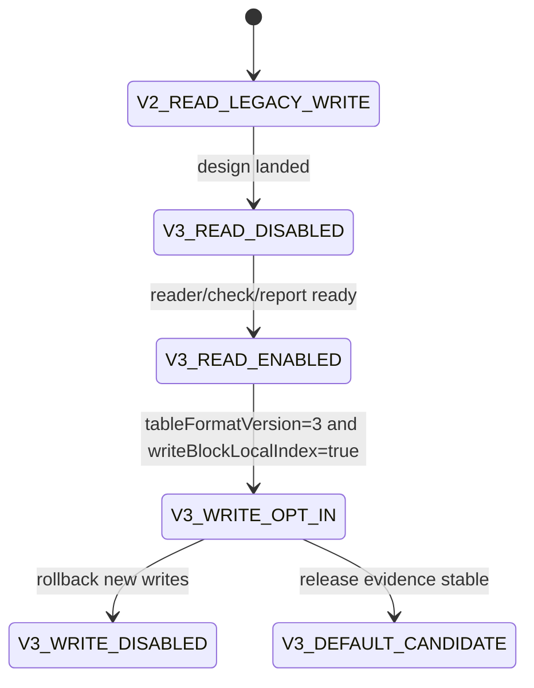

# LDB 0.11.0 SST Block-Local Index Format Design

[中文](storage-format-0.11-block-index-design.md) | English

## Background

The 0.10.0 readrandom workstream introduced direct point lookup, the MemTable latest point-value index, MultiGet batch direct get, same-data-block open reuse, restart-key caching, and explicit opt-in `blockCacheWarmOnOpen`. These changes keep the SST file format unchanged while removing the generic iterator chain and part of the repeated restart-entry decoding cost from the point-read path.

The remaining bottleneck is inside the data block. Direct get can already locate the target data block, but `Block.seek` still decodes entries linearly from a restart point until it reaches the first internal key greater than or equal to the target key. Two no-format-change approaches were evaluated in 0.10.0 and rejected: full-entry in-memory block indexing regressed by moving complete-entry decoding too early, and same-SST batch index-block positioning regressed sparse random MultiGet due to sorting and scan overhead.

The next stage should introduce a compact, on-disk, on-demand, verifiable, rollback-safe block-local index instead of building temporary full-entry indexes in memory.

## Goals

| Goal | Meaning |
| --- | --- |
| Reduce in-block linear decoding | Provide a shorter lookup path for point get and MultiGet than scanning from a restart point. |
| Avoid full-entry predecode | Store only lightweight positioning anchors, not values and not every entry. |
| Keep old formats readable | New readers keep reading v1/v2 SSTs; v3 writes remain explicit opt-in. |
| Support rollout and rollback | Options control writes; existing v3 SSTs require the current reader, while future writes can be rolled back. |
| Make evidence observable | check/repair/report/releaseGate explain index presence, coverage, corruption classes, and benchmark evidence. |

## Non Goals

- Do not become compatible with native RocksDB/LevelDB tools.
- Do not change InternalKey ordering, sequence numbers, value types, range delete, or snapshot visibility semantics.
- Do not introduce partitioned index/filter in this phase.
- Do not make `blockCacheWarmOnOpen` enabled by default.
- Do not persist full key/value arrays in the first v3 design.

## Current State

| Path | Current Fact | Gap | v3 Direction |
| --- | --- | --- | --- |
| `Table.get(internalKey)` | Index block locates data block; `Block.seek` scans inside the data block. | Still linearly decodes inside the restart region. | Use a block-local index to reduce the decode window. |
| `Table.get(List<Slice>)` | Keys in the same SST are grouped by data block handle. | Same-block keys still perform per-key seek. | Let same-block MultiGet share block-local index lookups. |
| `Block.seek` | Restart-key cache removes repeated restart-entry decoding during binary search. | Decoding from restart to target remains linear. | Add secondary anchors. |
| `warmDataBlocks` | Can explicitly pre-read data blocks into cache. | Full-entry pre-indexing hurts cold benchmarks. | Pre-read only lightweight index data or handles. |
| v2 properties | Records table format, feature set, entry/block/filter/checksum metadata. | No per-block index metadata. | Extend properties and metaindex for block-local index features. |

## Core Constraints

| Constraint | Requirement |
| --- | --- |
| JDK | Keep JDK 8 compatibility. |
| Encoding | Keep documents, source files, and reports in UTF-8. |
| Compatibility | New versions must read old v1/v2 SSTs by default. |
| Fail-fast | Unsupported readers must not silently misread v3 block-local indexes. |
| Performance | Index reads must not slow scans, iterators, or ordinary opens by default. |
| Space | Index space amplification must be observable; the first target is low single-digit percent of raw data-block bytes. |
| Design first | Implementation must update this design and its Chinese copy before persistent format code changes. |

## Interface Design

### Options

| API | Default | Meaning |
| --- | --- | --- |
| `Options.tableFormatVersion()` | `1` | v3 writes remain opt-in, likely through `tableFormatVersion=3`. |
| `Options.writeTableProperties()` | `true` for v2/v3 | v3 must write properties so features and rollback boundaries are visible. |
| `Options.writeBlockLocalIndex()` | `false` | Candidate new API; only valid when `tableFormatVersion>=3`. |
| `Options.blockLocalIndexInterval()` | TBD | Number of restart regions or entries per anchor; default requires benchmark calibration. |

### Diagnostic Properties

| Property | Content |
| --- | --- |
| `ldb.tableFormat` | Adds v3 table count and block-local-index table count. |
| `ldb.sstReadStats` | Candidate counters: blockLocalIndexRequests/hits/misses/fallbacks. |
| `ldb.blockLocalIndex` | Optional debug summary for coverage, anchors, bytes, and fallback reasons. |

## Data Structures

### Feature Set

| Feature | Type | Meaning |
| --- | --- | --- |
| `block.local_index.v1` | incompatible | New block-local index layout exists; readers that do not understand it must fail. |
| `table.properties` | compatible | Reuses v2 properties. |
| `index.single level` | compatible | Keeps the current index block type. |

### Properties Fields

| Key | Example | Meaning |
| --- | --- | --- |
| `ldb.table.block_local_index` | `true` | Whether the SST contains block-local indexes. |
| `ldb.table.block_local_index.version` | `1` | Sub-format version. |
| `ldb.table.block_local_index.policy` | `restart-anchor` | Indexing policy. |
| `ldb.table.block_local_index.interval` | `4` | Anchor interval. |
| `ldb.table.block_local_index.bytes` | `12345` | Total index bytes. |
| `ldb.table.block_local_index.covered_blocks` | `128` | Number of indexed data blocks. |

### Metaindex Layout

| Metaindex Key | Points To | Meaning |
| --- | --- | --- |
| `properties` | properties block | Existing v2 entry. |
| `block_local_index` | block-local index directory block | New v3 entry mapping data blocks to local index blocks. |

### Block-Local Index Directory

The first version can reuse regular block key/value encoding. The key is a canonical data block handle string or offset varint, and the value is the block-local index block handle. The first version should favor diagnosability; a denser binary directory can be introduced later behind a new feature/version.

### Block-Local Index Block

| Field | Encoding | Meaning |
| --- | --- | --- |
| magic/version | varint/text | Sub-format version for diagnostics. |
| entryCount | varint | Number of anchors. |
| anchor entries | repeated | Complete key or key suffix, data-block offset, restart index. |
| checksum | block trailer | Reuse the block trailer checksum. |

Anchor policy: do not store values, do not store every entry, and store at least the first key plus data offset for every N restart regions. Reads binary-search anchors, then decode from the selected anchor offset to the target key. Missing/corrupt indexes either fail fast or safely fall back depending on configuration; production default should fail fast for corruption and allow fallback only for absence where explicitly declared.

## State Machine

Illegal transitions: do not allow v3 writes before reader/check/report are ready; do not allow default v3 writes before releaseGate covers mixed v2/v3 databases; do not publish v3 opt-in before documenting the no-downgrade boundary.

## Sequence Flow

### Writing a v3 SST

1. TableBuilder writes data blocks through the current flow.
2. After each data block, collect lightweight anchors: key, restart index, and block offset.
3. Write the filter block.
4. Write block-local index blocks.
5. Write the block-local index directory block.
6. Write properties with `block.local_index.v1` and statistics.
7. Write metaindex with `properties` and `block_local_index`.
8. Write index block and footer.

### Reading a v3 SST

1. Table opens footer, index, and metaindex.
2. Read properties and detect `block.local_index.v1`.
3. If the reader supports it, load the block-local index directory; otherwise fail fast.
4. `Block.seek` first checks for a local index handle for the current data block.
5. If an index is present, decode from the selected anchor offset; if missing and fallback is allowed, use existing restart seek.
6. Record hit/miss/fallback/corruption counters.

## Failure Handling

| Scenario | Handling |
| --- | --- |
| Feature is declared but directory is missing | Open fails; check reports `BLOCK_LOCAL_INDEX_DIRECTORY_MISSING`. |
| Directory handle is out of range | Open fails or check reports `BLOCK_LOCAL_INDEX_HANDLE_OUT_OF_RANGE`. |
| Index block checksum error | Open fails; check records block offset and size. |
| One data block has no index | If full coverage is declared, fail fast; if partial coverage is declared, safely fall back. First version should require full coverage. |
| Runtime disables index reads | Allow diagnostic fallback only; production rollback should stop writing v3 while keeping the current reader. |

## Idempotency

Reading block-local indexes never modifies database files. check/repair should produce stable index statistics and corruption classes across repeated runs. Compaction may migrate to v3 by creating new SSTs, never by editing old SSTs in place. Rolling back new writes affects future flush/compaction only; existing v3 SSTs remain readable only by capable readers.

## Rollback Strategy

| Stage | Rollback |
| --- | --- |
| Reader only | Disable diagnostic entry points; old data is unaffected. |
| v3 opt-in writes | Restore `tableFormatVersion=1/2` or `writeBlockLocalIndex=false`; existing v3 SSTs still require the current reader. |
| v3 default candidate | Return to opt-in; keep no-downgrade notes in release docs. |
| Index corruption discovered | Stop v3 flush/compaction, run check, and restore from checkpoint/backup if needed. |

## Compatibility

| Scenario | Requirement |
| --- | --- |
| New reader opens v1/v2 | Required. |
| New reader opens v3 | Required only when `block.local_index.v1` is supported. |
| Old reader opens v3 | Not promised; incompatible feature markers prevent silent misreads. |
| Mixed v2/v3 DB | New reader must support it. |
| backup/restore | Must preserve index blocks, directory, and properties. |
| repair | Does not rebuild indexes by default; only plans or explicit rebuild mode may rewrite SSTs. |

## Rollout And Migration

| Stage | Content | Acceptance | Abort Condition |
| --- | --- | --- | --- |
| BI G0 | This design and Chinese copy | Complete design and clear boundaries | Conflicts with current format facts |
| BI G1 | Reader skeleton | Feature, missing directory, and corruption are recognized | Old SST open fails |
| BI G2 | Writer opt-in | v3 SST can be written/read; mixed v2/v3 works | check/repair cannot explain v3 |
| BI G3 | Read path integration | Point get/MultiGet results match existing semantics | Any behavior regression |
| BI G4 | Benchmark gate | cold_readrandom/MultiGet do not fall below the 0.10 stable baseline and prove target-scenario benefit | Sparse random regression is unexplained |
| BI G5 | Release gate | storageFormatGates include block-local index evidence | Any gate is missing |

## Test Plan

| Type | Cases |
| --- | --- |
| Unit | Index block encode/decode, directory encode/decode, anchor lower-bound, corruption parsing. |
| Behavior | v1/v2/v3 get, iterator, snapshot cursor, range delete, and MultiGet return identical results. |
| Compatibility | Mixed v2/v3 DB, old fixture opened by new reader, v3 no-downgrade documentation. |
| Corruption | Missing directory, out-of-range handle, checksum error, unsorted anchors. |
| Performance | warm_readrandom, cold_readrandom, multiget_random, dense same-block MultiGet, scan regressions. |
| Release gate | Add `blockLocalIndexFormatCoverage` and `blockLocalIndexBenchmarkEvidence`. |

## Risks

| Risk | Severity | Mitigation |
| --- | --- | --- |
| Excessive index space amplification | Medium | Record bytes in properties; gate upper bounds. |
| Sparse random workload regresses again | High | Keep opt-in; benchmark both sparse and dense MultiGet. |
| Old reader silently misreads | High | Use incompatible features and future-version fail-fast. |
| check/repair cannot explain new blocks | High | Complete report fields and corruption classes before writer work. |
| Scans slow down due to index loading | Medium | Iterators do not load block-local indexes by default. |

## Phased Implementation Plan

| Phase | Priority | Deliverable | Acceptance |
| --- | --- | --- | --- |
| BI 01 | P0 | This design and Chinese copy | Docs landed and linked from the 0.10 plan/CHANGELOG. |
| BI 02 | P0 | feature/properties/check skeleton | v3 feature recognized; old SSTs unaffected. |
| BI 03 | P1 | block-local index writer opt-in | v3 SST generated; index directory readable. |
| BI 04 | P1 | point get/MultiGet read path | Behavior tests pass; stats are visible. |
| BI 05 | P1 | benchmark and release gate | Stable gain or explicit rejection; do not default-enable without evidence. |

## BI 02 Current Implementation Boundary

The current implementation lands the v3 properties skeleton and public configuration entry points first: `Options.tableFormatVersion(3)`, `Options.writeBlockLocalIndex(false)`, and `Options.blockLocalIndexInterval(...)`. With `writeBlockLocalIndex=false`, v3 SSTs only record disabled block-local-index diagnostic fields, do not declare the `block.local_index.v1` incompatible feature, and do not write the `block_local_index` metaindex directory.

BI 03 now owns the `writeBlockLocalIndex(true)` path; the option writes real index blocks and the directory. The BI 02 disabled skeleton boundary remains as historical phase documentation only.

## BI 03 Current Implementation Boundary

The implementation now also lands the block-local index writer opt-in path: when `tableFormatVersion(3)` and `writeBlockLocalIndex(true)` are set, TableBuilder writes a lightweight restart-anchor index block for each data block and writes the `block_local_index` directory. Properties declare the `block.local_index.v1` incompatible feature and record version, policy, interval, bytes, and covered_blocks. The reader recognizes the feature and loads the directory; if the feature is declared but the directory is missing, opening the SST fails fast. BI 04 now lets point get and MultiGet use the local-index floor anchor to choose the starting offset inside the data block.

## BI 04 Current Implementation Boundary

The implementation now wires block-local indexes into point get and MultiGet. After Table locates a data block, if that block has a local-index handle in the `block_local_index` directory, the reader finds the floor anchor not greater than the target internal key and then decodes from the anchor's data-block offset. If no local index exists, if the target key is before the first anchor, or if the SST uses an older format, the reader falls back to the existing `Block.seek` path.

Iterator/scan paths still do not load block-local indexes, preventing scan regressions from extra index reads. Table-level `getBlockLocalIndexStats()` exposes directoryEntries, seekCount, hitCount, and fallbackCount for behavior tests and later release-gate evidence. Benchmark gating and default enablement remain BI 05 work.

## BI 05 Current Implementation Boundary

The implementation now wires block-local indexes into repeatable dbBench evidence: `:ldb-longrun:ldbDbBenchReport` supports `-Pldb.dbBench.tableFormatVersion=3`, `-Pldb.dbBench.writeTableProperties=true`, `-Pldb.dbBench.writeBlockLocalIndex=true`, and `-Pldb.dbBench.blockLocalIndexInterval=N`. The generated JSON/CSV reports record tableFormatVersion, writeBlockLocalIndex, and blockLocalIndexInterval so v3 opt-in results are not confused with default v1/v2 paths.

Formal performance conclusions still require 200k-scale `cold_readrandom`, `multiget_random`, dense same-block MultiGet, and scan-regression comparisons. Until those runs prove stable gains, block-local indexes remain opt-in and are not enabled by default.
## Open Questions

| ID | Question | Default Recommendation |
| --- | --- | --- |
| BI OQ 01 | Anchor by entry interval or restart interval? | Start with restart interval to avoid depending on full entry ordinals. |
| BI OQ 02 | Directory text keys or binary offsets? | Prefer diagnostic-friendly text first; binary can follow after performance evidence. |
| BI OQ 03 | Can a missing per-block index fall back? | First version should require full coverage and fail fast on missing indexes. |
| BI OQ 04 | Should index blocks share block cache lifecycle? | Yes in principle, but exact cache/stat ownership must be decided during implementation. |