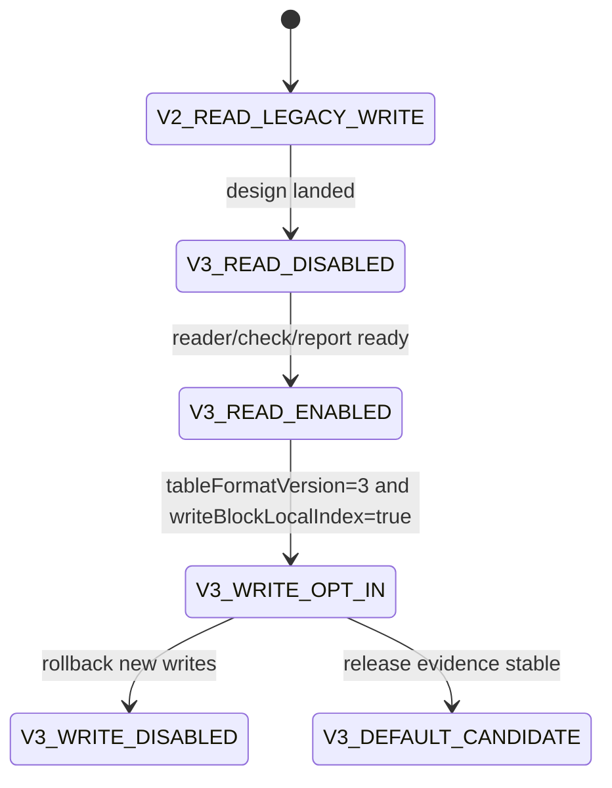

# LDB 0.11.0 SST Block-Local Index Format Design

[中文](storage-format-0.11-block-index-design.md) | English

## Background

The 0.10.0 readrandom workstream introduced direct point lookup, the MemTable latest point-value index, MultiGet batch direct get, same-data-block open reuse, restart-key caching, and explicit opt-in `blockCacheWarmOnOpen`. These changes keep the SST file format unchanged while removing the generic iterator chain and part of the repeated restart-entry decoding cost from the point-read path.

The remaining bottleneck is inside the data block. Direct get can already locate the target data block, but `Block.seek` still decodes entries linearly from a restart point until it reaches the first internal key greater than or equal to the target key. Two no-format-change approaches were evaluated in 0.10.0 and rejected: full-entry in-memory block indexing regressed by moving complete-entry decoding too early, and same-SST batch index-block positioning regressed sparse random MultiGet due to sorting and scan overhead.

The next stage should introduce a compact, on-disk, on-demand, verifiable, rollback-safe block-local index instead of building temporary full-entry indexes in memory.

## Goals

| Goal | Meaning |
| --- | --- |
| Reduce in-block linear decoding | Provide a shorter lookup path for point get and MultiGet than scanning from a restart point. |
| Avoid full-entry predecode | Store only lightweight positioning anchors, not values and not every entry. |
| Keep old formats readable | New readers keep reading v1/v2 SSTs; v3 writes remain explicit opt-in. |
| Support rollout and rollback | Options control writes; existing v3 SSTs require the current reader, while future writes can be rolled back. |
| Make evidence observable | check/repair/report/releaseGate explain index presence, coverage, corruption classes, and benchmark evidence. |

## Non Goals

- Do not become compatible with native RocksDB/LevelDB tools.
- Do not change InternalKey ordering, sequence numbers, value types, range delete, or snapshot visibility semantics.
- Do not introduce partitioned index/filter in this phase.
- Do not make `blockCacheWarmOnOpen` enabled by default.
- Do not persist full key/value arrays in the first v3 design.

## Current State

| Path | Current Fact | Gap | v3 Direction |
| --- | --- | --- | --- |
| `Table.get(internalKey)` | Index block locates data block; `Block.seek` scans inside the data block. | Still linearly decodes inside the restart region. | Use a block-local index to reduce the decode window. |
| `Table.get(List<Slice>)` | Keys in the same SST are grouped by data block handle. | Same-block keys still perform per-key seek. | Let same-block MultiGet share block-local index lookups. |
| `Block.seek` | Restart-key cache removes repeated restart-entry decoding during binary search. | Decoding from restart to target remains linear. | Add secondary anchors. |
| `warmDataBlocks` | Can explicitly pre-read data blocks into cache. | Full-entry pre-indexing hurts cold benchmarks. | Pre-read only lightweight index data or handles. |
| v2 properties | Records table format, feature set, entry/block/filter/checksum metadata. | No per-block index metadata. | Extend properties and metaindex for block-local index features. |

## Core Constraints

| Constraint | Requirement |
| --- | --- |
| JDK | Keep JDK 8 compatibility. |
| Encoding | Keep documents, source files, and reports in UTF-8. |
| Compatibility | New versions must read old v1/v2 SSTs by default. |
| Fail-fast | Unsupported readers must not silently misread v3 block-local indexes. |
| Performance | Index reads must not slow scans, iterators, or ordinary opens by default. |
| Space | Index space amplification must be observable; the first target is low single-digit percent of raw data-block bytes. |
| Design first | Implementation must update this design and its Chinese copy before persistent format code changes. |

## Interface Design

### Options

| API | Default | Meaning |
| --- | --- | --- |
| `Options.tableFormatVersion()` | `1` | v3 writes remain opt-in, likely through `tableFormatVersion=3`. |
| `Options.writeTableProperties()` | `true` for v2/v3 | v3 must write properties so features and rollback boundaries are visible. |
| `Options.writeBlockLocalIndex()` | `false` | Candidate new API; only valid when `tableFormatVersion>=3`. |
| `Options.blockLocalIndexInterval()` | TBD | Number of restart regions or entries per anchor; default requires benchmark calibration. |

### Diagnostic Properties

| Property | Content |
| --- | --- |
| `ldb.tableFormat` | Adds v3 table count and block-local-index table count. |
| `ldb.sstReadStats` | Candidate counters: blockLocalIndexRequests/hits/misses/fallbacks. |
| `ldb.blockLocalIndex` | Optional debug summary for coverage, anchors, bytes, and fallback reasons. |

## Data Structures

### Feature Set

| Feature | Type | Meaning |
| --- | --- | --- |
| `block.local_index.v1` | incompatible | New block-local index layout exists; readers that do not understand it must fail. |
| `table.properties` | compatible | Reuses v2 properties. |
| `index.single level` | compatible | Keeps the current index block type. |

### Properties Fields

| Key | Example | Meaning |
| --- | --- | --- |
| `ldb.table.block_local_index` | `true` | Whether the SST contains block-local indexes. |
| `ldb.table.block_local_index.version` | `1` | Sub-format version. |
| `ldb.table.block_local_index.policy` | `restart-anchor` | Indexing policy. |
| `ldb.table.block_local_index.interval` | `4` | Anchor interval. |
| `ldb.table.block_local_index.bytes` | `12345` | Total index bytes. |
| `ldb.table.block_local_index.covered_blocks` | `128` | Number of indexed data blocks. |

### Metaindex Layout

| Metaindex Key | Points To | Meaning |
| --- | --- | --- |
| `properties` | properties block | Existing v2 entry. |
| `block_local_index` | block-local index directory block | New v3 entry mapping data blocks to local index blocks. |

### Block-Local Index Directory

The first version can reuse regular block key/value encoding. The key is a canonical data block handle string or offset varint, and the value is the block-local index block handle. The first version should favor diagnosability; a denser binary directory can be introduced later behind a new feature/version.

### Block-Local Index Block

| Field | Encoding | Meaning |
| --- | --- | --- |
| magic/version | varint/text | Sub-format version for diagnostics. |
| entryCount | varint | Number of anchors. |
| anchor entries | repeated | Complete key or key suffix, data-block offset, restart index. |
| checksum | block trailer | Reuse the block trailer checksum. |

Anchor policy: do not store values, do not store every entry, and store at least the first key plus data offset for every N restart regions. Reads binary-search anchors, then decode from the selected anchor offset to the target key. Missing/corrupt indexes either fail fast or safely fall back depending on configuration; production default should fail fast for corruption and allow fallback only for absence where explicitly declared.

## State Machine

Illegal transitions: do not allow v3 writes before reader/check/report are ready; do not allow default v3 writes before releaseGate covers mixed v2/v3 databases; do not publish v3 opt-in before documenting the no-downgrade boundary.

## Sequence Flow

### Writing a v3 SST

1. TableBuilder writes data blocks through the current flow.
2. After each data block, collect lightweight anchors: key, restart index, and block offset.
3. Write the filter block.
4. Write block-local index blocks.
5. Write the block-local index directory block.
6. Write properties with `block.local_index.v1` and statistics.
7. Write metaindex with `properties` and `block_local_index`.
8. Write index block and footer.

### Reading a v3 SST

1. Table opens footer, index, and metaindex.
2. Read properties and detect `block.local_index.v1`.
3. If the reader supports it, load the block-local index directory; otherwise fail fast.
4. `Block.seek` first checks for a local index handle for the current data block.
5. If an index is present, decode from the selected anchor offset; if missing and fallback is allowed, use existing restart seek.
6. Record hit/miss/fallback/corruption counters.

## Failure Handling

| Scenario | Handling |
| --- | --- |
| Feature is declared but directory is missing | Open fails; check reports `BLOCK_LOCAL_INDEX_DIRECTORY_MISSING`. |
| Directory handle is out of range | Open fails or check reports `BLOCK_LOCAL_INDEX_HANDLE_OUT_OF_RANGE`. |
| Index block checksum error | Open fails; check records block offset and size. |
| One data block has no index | If full coverage is declared, fail fast; if partial coverage is declared, safely fall back. First version should require full coverage. |
| Runtime disables index reads | Allow diagnostic fallback only; production rollback should stop writing v3 while keeping the current reader. |

## Idempotency

Reading block-local indexes never modifies database files. check/repair should produce stable index statistics and corruption classes across repeated runs. Compaction may migrate to v3 by creating new SSTs, never by editing old SSTs in place. Rolling back new writes affects future flush/compaction only; existing v3 SSTs remain readable only by capable readers.

## Rollback Strategy

| Stage | Rollback |
| --- | --- |
| Reader only | Disable diagnostic entry points; old data is unaffected. |
| v3 opt-in writes | Restore `tableFormatVersion=1/2` or `writeBlockLocalIndex=false`; existing v3 SSTs still require the current reader. |
| v3 default candidate | Return to opt-in; keep no-downgrade notes in release docs. |
| Index corruption discovered | Stop v3 flush/compaction, run check, and restore from checkpoint/backup if needed. |

## Compatibility

| Scenario | Requirement |
| --- | --- |
| New reader opens v1/v2 | Required. |
| New reader opens v3 | Required only when `block.local_index.v1` is supported. |
| Old reader opens v3 | Not promised; incompatible feature markers prevent silent misreads. |
| Mixed v2/v3 DB | New reader must support it. |
| backup/restore | Must preserve index blocks, directory, and properties. |
| repair | Does not rebuild indexes by default; only plans or explicit rebuild mode may rewrite SSTs. |

## Rollout And Migration

| Stage | Content | Acceptance | Abort Condition |
| --- | --- | --- | --- |
| BI G0 | This design and Chinese copy | Complete design and clear boundaries | Conflicts with current format facts |
| BI G1 | Reader skeleton | Feature, missing directory, and corruption are recognized | Old SST open fails |
| BI G2 | Writer opt-in | v3 SST can be written/read; mixed v2/v3 works | check/repair cannot explain v3 |
| BI G3 | Read path integration | Point get/MultiGet results match existing semantics | Any behavior regression |
| BI G4 | Benchmark gate | cold_readrandom/MultiGet do not fall below the 0.10 stable baseline and prove target-scenario benefit | Sparse random regression is unexplained |
| BI G5 | Release gate | storageFormatGates include block-local index evidence | Any gate is missing |

## Test Plan

| Type | Cases |
| --- | --- |
| Unit | Index block encode/decode, directory encode/decode, anchor lower-bound, corruption parsing. |
| Behavior | v1/v2/v3 get, iterator, snapshot cursor, range delete, and MultiGet return identical results. |
| Compatibility | Mixed v2/v3 DB, old fixture opened by new reader, v3 no-downgrade documentation. |
| Corruption | Missing directory, out-of-range handle, checksum error, unsorted anchors. |
| Performance | warm_readrandom, cold_readrandom, multiget_random, dense same-block MultiGet, scan regressions. |
| Release gate | Add `blockLocalIndexFormatCoverage` and `blockLocalIndexBenchmarkEvidence`. |

## Risks

| Risk | Severity | Mitigation |
| --- | --- | --- |
| Excessive index space amplification | Medium | Record bytes in properties; gate upper bounds. |
| Sparse random workload regresses again | High | Keep opt-in; benchmark both sparse and dense MultiGet. |
| Old reader silently misreads | High | Use incompatible features and future-version fail-fast. |
| check/repair cannot explain new blocks | High | Complete report fields and corruption classes before writer work. |
| Scans slow down due to index loading | Medium | Iterators do not load block-local indexes by default. |

## Phased Implementation Plan

| Phase | Priority | Deliverable | Acceptance |
| --- | --- | --- | --- |
| BI 01 | P0 | This design and Chinese copy | Docs landed and linked from the 0.10 plan/CHANGELOG. |
| BI 02 | P0 | feature/properties/check skeleton | v3 feature recognized; old SSTs unaffected. |
| BI 03 | P1 | block-local index writer opt-in | v3 SST generated; index directory readable. |
| BI 04 | P1 | point get/MultiGet read path | Behavior tests pass; stats are visible. |
| BI 05 | P1 | benchmark and release gate | Stable gain or explicit rejection; do not default-enable without evidence. |

## BI 02 Current Implementation Boundary

The current implementation lands the v3 properties skeleton and public configuration entry points first: `Options.tableFormatVersion(3)`, `Options.writeBlockLocalIndex(false)`, and `Options.blockLocalIndexInterval(...)`. With `writeBlockLocalIndex=false`, v3 SSTs only record disabled block-local-index diagnostic fields, do not declare the `block.local_index.v1` incompatible feature, and do not write the `block_local_index` metaindex directory.

BI 03 now owns the `writeBlockLocalIndex(true)` path; the option writes real index blocks and the directory. The BI 02 disabled skeleton boundary remains as historical phase documentation only.

## BI 03 Current Implementation Boundary

The implementation now also lands the block-local index writer opt-in path: when `tableFormatVersion(3)` and `writeBlockLocalIndex(true)` are set, TableBuilder writes a lightweight restart-anchor index block for each data block and writes the `block_local_index` directory. Properties declare the `block.local_index.v1` incompatible feature and record version, policy, interval, bytes, and covered_blocks. The reader recognizes the feature and loads the directory; if the feature is declared but the directory is missing, opening the SST fails fast. BI 04 now lets point get and MultiGet use the local-index floor anchor to choose the starting offset inside the data block.

## BI 04 Current Implementation Boundary

The implementation now wires block-local indexes into point get and MultiGet. After Table locates a data block, if that block has a local-index handle in the `block_local_index` directory, the reader finds the floor anchor not greater than the target internal key and then decodes from the anchor's data-block offset. If no local index exists, if the target key is before the first anchor, or if the SST uses an older format, the reader falls back to the existing `Block.seek` path.

Iterator/scan paths still do not load block-local indexes, preventing scan regressions from extra index reads. Table-level `getBlockLocalIndexStats()` exposes directoryEntries, seekCount, hitCount, and fallbackCount for behavior tests and later release-gate evidence. Benchmark gating and default enablement remain BI 05 work.

## BI 05 Current Implementation Boundary

The implementation now wires block-local indexes into repeatable dbBench evidence: `:ldb-longrun:ldbDbBenchReport` supports `-Pldb.dbBench.tableFormatVersion=3`, `-Pldb.dbBench.writeTableProperties=true`, `-Pldb.dbBench.writeBlockLocalIndex=true`, and `-Pldb.dbBench.blockLocalIndexInterval=N`. The generated JSON/CSV reports record tableFormatVersion, writeBlockLocalIndex, and blockLocalIndexInterval so v3 opt-in results are not confused with default v1/v2 paths.

Formal performance conclusions still require 200k-scale `cold_readrandom`, `multiget_random`, dense same-block MultiGet, and scan-regression comparisons. Until those runs prove stable gains, block-local indexes remain opt-in and are not enabled by default.
## Open Questions

| ID | Question | Default Recommendation |
| --- | --- | --- |
| BI OQ 01 | Anchor by entry interval or restart interval? | Start with restart interval to avoid depending on full entry ordinals. |
| BI OQ 02 | Directory text keys or binary offsets? | Prefer diagnostic-friendly text first; binary can follow after performance evidence. |
| BI OQ 03 | Can a missing per-block index fall back? | First version should require full coverage and fail fast on missing indexes. |
| BI OQ 04 | Should index blocks share block cache lifecycle? | Yes in principle, but exact cache/stat ownership must be decided during implementation. |
## BI 05 quick-gate update: single-key path integration gap

The 50k `read_optimized` opt-in quick gate was run with `blockLocalIndexInterval=1/4/8`. The interval=8 run reached `readrandom_hit=184,987.728 ops/s`, close to but still below the release baseline `185,760.216 ops/s`; interval=1 reached `175,576.224 ops/s`, and interval=4 reached `161,593.493 ops/s`. More importantly, the `readrandom_hit` `sstReadStats` reported `blockLocalIndexSeekCount=0` and `blockLocalIndexHitCount=0`, proving that the current single-key `Table.get(Slice)` path still does not use the block-local index under v3 opt-in. After locating the data block, it continues to call `seekWithBlockSeekIndex`, so interval tuning cannot prove whether v3 local indexes help the primary metric.

The next BI 05 experiment should first wire the single-key path into the existing local-index floor-anchor path: after `Table.get(Slice)` has both the data block handle and data block, if the SST declares a block-local index, it should use the same local-index lookup path. Old formats, tables without a local index, missing anchors, or targets before the first anchor still safely fall back to the existing block-open-time restart/anchor seek. This remains v3 opt-in only, does not change default v1/v2 behavior, and does not introduce a full-entry index. Acceptance continues to use `readrandom_hit` as the primary metric while watching sameblock, burst, scan, and MultiGet for regressions.
## BI 05 final quick-gate conclusion: v3 block-local indexes must not be enabled by default

After wiring single-key `Table.get(Slice)` into the local-index path, the 50k `read_optimized` v3 opt-in gate was rerun for `blockLocalIndexInterval=1/8` and the default path. The result is now clear:

| Path | readrandom_hit | sameblock | burst | multiget_mixed | multiget_sameblock | scan | Key stats |
| --- | ---: | ---: | ---: | ---: | ---: | ---: | --- |
| Default v1/v2 path | 187,915.881 | 402,373.035 | 423,437.431 | 380,699.741 | 470,505.426 | 1,680,937.829 | `blockSeekIndexHits=50000`, `blockLocalIndexSeekCount=0` |
| v3 local index interval=1 | 156,978.429 | 348,163.957 | 366,713.019 | 274,553.453 | 322,701.190 | 1,625,234.034 | `blockLocalIndexSeekCount=50000`, `blockLocalIndexHitCount=48680`, `blockLocalIndexFallbackCount=1320` |
| v3 local index interval=8 | 175,827.762 | 360,811.537 | 392,632.949 | 335,035.986 | 373,739.843 | 1,415,568.421 | `blockLocalIndexTables=0`; this data distribution did not produce usable local indexes |

This narrows the problem: the v3 block-local index is now truly used by single-key reads, but the current “separate local-index block plus directory” format costs more than the saved data-block linear scan. The interval=8 run did not create a usable index and therefore cannot prove benefit. The interval=1 run exercises the local index but regresses the primary metric and MultiGet. BI 05 therefore rejects default enablement: the current v3 block-local index remains an opt-in experiment and compatibility capability, not a release performance win.

## BI 06 recommended cut: data block inline mini-index

The next phase should reduce index access cost in the file format instead of tuning `blockLocalIndexInterval`. Add a v0.11/v4 candidate format that embeds the tiny floor-anchor structure needed by point gets inside the data block itself, avoiding a separate directory and local-index block lookup for each point-read path.

Minimal design boundaries:

| Item | Recommendation |
| --- | --- |
| Write location | Near the end of the data block payload before the restart array, or in another parseable mini-index region protected by a new block-format marker. |
| Granularity | Index restart ranges or sparse anchors only; full-entry indexes remain forbidden. |
| Hot path | Parse the inline mini-index once when opening `Block`; `Block.seek` still uses in-memory anchors to narrow the linear scan. |
| Fallback | If there is no inline mini-index, no applicable anchor, or an old block format is read, fall back to the existing `Block.seek` restart/anchor path. |
| Stats | Preserve `blockSeekIndexHits/Misses/Fallbacks`; any new format counters are supplemental and must not replace the primary counters. |
| Default policy | Keep the new format opt-in until `readrandom_hit` beats the default path consistently and sameblock, burst, scan, and MultiGet do not regress. |

The acceptance gate remains `readrandom_hit` first, with sameblock, burst, scan, and MultiGet as regression checks. The phase is not about writing more index data; it is about proving that point-get block-local positioning is cheaper than the current block-open-time lightweight index.
## BI 06 current implementation boundary

The minimal v4 opt-in data block inline mini-index path has landed. When `Options.writeInlineBlockSeekIndex(true)` is used with `tableFormatVersion(4)`, data blocks are written with a new magic-protected layout: `entries + inlineMiniIndex + restartPositions + restartCount + inlineMiniIndexOffset + magic`. Blocks without the magic marker continue to use the existing layout.

The inline mini-index stores only the anchor key, data-block offset, previous key, and restart index. It does not store values and does not store a full entry list, so it preserves the no-full-entry-index constraint. When `Block` opens a data block and sees the magic marker, it builds the in-memory seek anchors directly from the inline mini-index. Otherwise it keeps the existing path that scans data entries to build lightweight anchors. Default v1/v2/v3 paths do not write this format, and v4 also requires explicit `writeInlineBlockSeekIndex` opt-in.

Fixed behavior boundaries:

| Item | Current state |
| --- | --- |
| Format guard | `block.inline_seek_index.v1` incompatible feature |
| Write gate | Requires `tableFormatVersion >= 4`; enabling it on lower versions fails |
| Admission | `inlineBlockSeekIndexAdmissionMinAnchors` decides whether small blocks skip the index |
| Stats | `blockSeekIndexHits/Misses/Fallbacks` remain the primary counters; inline format properties record bytes, covered_blocks, and anchor_count |
| Fallback | Blocks without magic or inline index use the old parser and existing seek anchors |

Next, dbBench should expose `writeInlineBlockSeekIndex`, `inlineBlockSeekIndexInterval`, and the admission parameter, then compare `readrandom_hit`, sameblock, burst, scan, and MultiGet. The format can only move from experimental capability to default candidate after the primary metric improves without key regressions.
## BI 06 quick-gate result: inline mini-index is not accepted yet

After wiring `writeInlineBlockSeekIndex` into dbBench, the 50k `read_optimized` quick gate compared the default path with v4 inline mini-index variants:

| Path | readrandom_hit | sameblock | burst | multiget_mixed | multiget_sameblock | scan |
| --- | ---: | ---: | ---: | ---: | ---: | ---: |
| Default path after hash mixing | 200,202.044 | 418,842.905 | 415,931.508 | 406,329.971 | 465,903.765 | 1,948,968.216 |
| v4 inline interval=4 | 180,808.482 | 427,825.057 | 527,255.970 | 374,228.808 | 463,119.051 | 1,433,424.595 |
| v4 inline interval=8 | 191,085.918 | 346,204.765 | 336,938.576 | 347,258.636 | 455,467.569 | 1,645,429.655 |
| v4 inline interval=16 | 177,820.202 | 287,829.752 | 278,555.567 | 347,598.788 | 450,914.771 | 1,553,958.087 |

The point-get direct block cache slot hash was also changed from a simple offset/dataSize mix to a stronger 64-bit mix. For v4 interval=4 this reduced `tablePointGetSlotCollisions` from 19,339 to 6,900, so the cache slot distribution issue is largely mitigated. The primary metric still remains below the default path, and interval=8/16 significantly hurts sameblock, burst, and scan. Therefore the current inline mini-index remains an experimental v4 format only and must not become a default candidate.

The next highest-value direction is no longer interval tuning. It is reducing object allocation and repeated key materialization in data-block open and seek, especially before `Block.seek` reaches the candidate entry. That path avoids adding more on-disk index bytes and matches the fact that the current default path already reaches about 200k ops/s.
## BI 07 recommended cut: reuse a key buffer in Block.seek

BI 06 showed that adding or retuning on-disk indexes is not enough. The next cut is reducing CPU and allocation cost in the current default path. Today `Block.seek` reconstructs a full `Slice` key for each prefix-compressed entry scanned inside a restart range. Even skipped entries below the target pay this key materialization cost.

The minimal BI 07 boundary is: for the default bytewise/internal-bytewise comparator, use one growable byte[] as the current key buffer, decode shared/non-shared keys into that buffer, and compare it directly with the target key. Only the candidate entry that is actually returned materializes a `Slice`. Custom comparators, or any comparator whose bytewise semantics cannot be proven, keep the old implementation to preserve user-defined ordering semantics.

This optimization does not change the file format, does not add on-disk index bytes, does not introduce a full-entry index, and does not change the meaning of `blockSeekIndexHits/Misses/Fallbacks`. Acceptance remains `readrandom_hit` first, while watching sameblock, burst, scan, and MultiGet for regressions.
## BI 07 quick-gate result: reusable key buffer remains disabled by default

The BI 07 reusable-key-buffer fast path passed compilation and core behavior tests, but the 50k default-path quick gate reported `readrandom_hit=157,558.325 ops/s`, below the `200,202.044 ops/s` default-path result with the fast path disabled in the same phase. sameblock was roughly flat, burst and dense MultiGet improved, but the primary metric regressed significantly. The fast path therefore fails the acceptance gate.

The current handling keeps the experiment boundary but disables it by default, so it is not on the production hot path. The conclusion is that replacing `Slice` materialization with a reusable byte[] is not enough; extra copying, hand-written internal-key comparison, and candidate materialization likely offset the allocation reduction. If `Block.seek` is optimized further, it should be guided by narrower profiling or focus on block-open anchor construction rather than replacing the seek-time comparison path.
## BI 08 recommended cut: small set-associative point-get block cache

BI 07 showed that replacing seek-time key materialization hurts the primary metric. The next cut is narrower: reduce point-get data block reuse cost. The current point-get-specific block cache is direct-mapped, so one cache slot can hold only one data block. Even when the lower direct-read block cache hits, a point-get slot collision still re-enters the `openBlockForDirectRead` path and pays object/path overhead on the random-read hot path.

The minimal BI 08 boundary is to change the point-get-specific cache to fixed 4-way set associativity while keeping total capacity at `POINT_GET_BLOCK_CACHE_LIMIT`. This does not add a full-entry index, does not change `Block.seek`, does not change `blockSeekIndexHits/Misses/Fallbacks`, and does not change the file format. A hit moves the matching way to the front of its set; a miss evicts the set tail. Acceptance remains `readrandom_hit` first, while watching sameblock, burst, scan, and MultiGet for regressions.
## BI 08 quick-gate result: 4-way point-get cache is not kept on the main path

The BI 08 4-way set-associative point-get cache passed compilation and core behavior tests, but the 50k default-path quick gate regressed the primary metric to `readrandom_hit=159,767.991 ops/s`, below the `204,126.040 ops/s` default path with this change disabled. The same run reported sameblock at `327,944.549 ops/s`, burst at `403,173.134 ops/s`, multiget_mixed at `340,933.654 ops/s`, multiget_sameblock at `435,747.315 ops/s`, and scan at `1,481,652.695 ops/s`, also worse overall than the prior default path.

This fails the acceptance gate. Although set associativity can reduce slot collisions in theory, the added set scan, move-to-front, and insertion work outweighed the benefit in this workload. The main path should therefore revert the 4-way structure, keep the proven 64-bit hash mix, and restore the direct-mapped point-get cache. This conclusion does not change the file format, does not change `Block.seek`, and does not change the meaning of `blockSeekIndexHits/Misses/Fallbacks`.
## BI 09 recommended cut: remove rejected seek-time fast-path leftovers

The BI 07 reusable-key-buffer fast path has already been rejected by the quick gate because it significantly regressed `readrandom_hit`. It should not remain as a hidden experimental branch inside the production hot class. Even though the current implementation disables it with constant boolean fields, `Block` still carries fast-path fields, branches, hand-written bytewise/internal-key comparison code, and the temporary `ReusableKey` structure. This increases hot-class complexity and makes later default-path performance analysis depend on implementation details that have already been rejected.

The minimal BI 09 boundary is to remove those fast-path leftovers and keep only the accepted block-open-time restart/sparse-anchor in-memory index path: build lightweight anchors when opening a block, use those anchors to narrow the seek scan window, and materialize key/value only when a candidate entry is reached. This cleanup does not change the file format, does not introduce a full-entry index, does not change the v4 inline mini-index opt-in compatibility boundary, and does not change the meaning of `blockSeekIndexHits/Misses/Fallbacks`. Acceptance remains `readrandom_hit` first, while watching sameblock, burst, scan, and MultiGet for regressions.
## BI 10 recommended cut: remove redundant candidate comparison in Table.get

On the default point-read path, `Table.get(Slice)` locates the data block and calls `seekWithBlockSeekIndex`, which ultimately relies on `Block.seekWithIndex`/`Block.seek` to return the first candidate entry greater than or equal to the target internal key. The v3/v4 opt-in `seekFromOffset` paths preserve the same contract. Therefore the extra `comparator.compare(candidate.getKey(), internalKey) < 0` check after a non-null candidate in `Table.get` is redundant work on the hot point-get path.

The minimal BI 10 boundary is to remove this duplicate comparison, keep the `candidate == null` check, and let the existing `Block.seek`/`seekFromOffset` contract own the invariant that a returned candidate is not smaller than the target key. This does not change the file format, does not introduce a full-entry index, does not change block-open-time anchor construction, and does not change the meaning of `blockSeekIndexHits/Misses/Fallbacks`. Acceptance remains `readrandom_hit` first, while watching sameblock, burst, scan, and MultiGet for regressions.
## BI 10 quick-gate result: keep the candidate recheck

After removing the final candidate recheck in `Table.get`, compilation and core behavior tests still passed, but the 50k `readrandom_hit` single-metric quick gate dropped to `177,107.948 ops/s`. This is below the BI09 cleanup result of `180,841.441 ops/s` and below the earlier direct-mapped restored result of `182,281.043 ops/s`. The change therefore fails the primary acceptance metric, and the code should restore the original candidate recheck.

The conclusion is that even if the comparison looks semantically redundant, removing it does not produce an acceptable performance win and may disturb JIT shape or hot-path layout. This direction remains documented as rejected evidence only and must not stay on the main path. Future work should target larger cost centers that improve `readrandom_hit` without hurting sameblock, burst, scan, or MultiGet.
## BI 11 recommended cut: increase point-get direct-cache capacity

BI 08 proved that the 4-way set-associative structure hurts the primary metric, so the next step should not add per-lookup set scans or move-to-front work. In the BI09/BI10 quick gates, `readrandom_hit` still reported `tablePointGetSlotCollisions=7726` and `tableDataBlockOpens=8898`, which means the direct-mapped point-get cache still has meaningful slot collisions and repeated data-block open cost.

The minimal BI 11 boundary is to increase only the point-get direct-cache capacity, for example from `4096` to `8192`, while keeping the direct-mapped strategy and the already-proven 64-bit hash mix. This experiment does not change the file format, does not change `Block.seek`, does not introduce a full-entry index, and does not change the meaning of `blockSeekIndexHits/Misses/Fallbacks`. The cost is a small extra handle/block reference array per `Table`. Acceptance remains `readrandom_hit` first, while watching sameblock, burst, scan, and MultiGet for regressions. If the primary metric does not improve, revert the capacity change and keep only the rejection evidence.
## BI 11 quick-gate result: do not increase the point-get direct cache to 8192

After BI 11 increased the point-get direct-cache capacity from `4096` to `8192`, compilation and core behavior tests still passed, and some cache-collision counters did improve: `tablePointGetSlotCollisions` dropped from `7726` in the BI09/BI10 same-size gates to `3943`, and `tableDataBlockOpens` dropped from `8898` to `5218`. However, the 50k `readrandom_hit` primary metric regressed to `159,942.523 ops/s`, clearly below the 180k-range results with capacity 4096.

This capacity change therefore fails the acceptance gate and `POINT_GET_BLOCK_CACHE_LIMIT` should remain `4096`. The conclusion is that reducing direct-cache collisions does not automatically improve the primary metric in this workload; the larger arrays may hurt cache locality, object access shape, or JIT layout. Future work should not blindly increase the point-get cache. It should instead focus on block construction cost, anchor construction cost, or real profiling evidence.
## BI 12 recommended cut: observe Block-open anchor construction cost

BI 08 through BI 11 showed that guessing cache shapes or deleting tiny branches does not reliably improve `readrandom_hit`. The next question for the main path is how much it costs to build the restart/sparse-anchor lightweight in-memory index when a data block opens, and how that cost relates to `tableDataBlockOpens` and `blockSeekIndexHits`.

The minimal BI 12 boundary is to expose lightweight statistics after each `Block` is constructed: whether seek anchors came from the inline mini-index, whether they were built by scanning data entries, the total anchor count, and the construction time. `Table` accumulates these values only after a real readBlock/cache miss so cache hits are not double-counted. `TableCache.readStats()` then includes the aggregate values in `ldb.sstReadStats`, making dbBench CSV/JSON capture them directly. This change adds observability only; it does not change the file format, does not change `Block.seek` semantics, does not introduce a full-entry index, and does not change the meaning of `blockSeekIndexHits/Misses/Fallbacks`. Acceptance focuses on unchanged compilation and behavior, plus a `readrandom_hit` gate to judge whether the observation overhead is acceptable.
## BI 12 quick-gate result: nanosecond timing is disabled by default

The first BI 12 implementation reported anchor-build count, anchor count, and construction nanoseconds in `ldb.sstReadStats` by default. The fields reached the dbBench report successfully. In the 50k `readrandom_hit` run, the report showed `tableBlockOpenSeekAnchorBuilds=1391`, `tableBlockOpenSeekAnchors=8334`, and `tableBlockOpenSeekAnchorBuildNanos=8046800`, confirming that the default path still builds anchors by scanning data entries and averages about six anchors per actually read block.

However, enabling nanosecond timing by default dropped `readrandom_hit` to `157,664.547 ops/s`, failing the primary gate. Nanosecond timing must therefore not be enabled by default. The main path keeps only the low-cost count fields, reports `tableBlockOpenSeekAnchorBuildNanos=0` by default, and allows explicit diagnostics with `-Dldb.block.recordSeekAnchorBuildNanos=true`. This preserves the observability hook without carrying profiling overhead in the default release path.
## BI 12 final quick-gate conclusion: do not keep Block anchor construction observation on the default path

After disabling nanosecond timing by default, BI 12 still produced only `readrandom_hit=149,420.994 ops/s`, below the full-timing version at `157,664.547 ops/s` and far below the BI09/restored 180k-range results. Although the report successfully exposed `tableBlockOpenSeekAnchorBuilds=1391`, `tableBlockOpenSeekAnchors=8334`, and `tableBlockOpenScannedSeekAnchorBuilds=1391`, the fields and accumulation logic themselves significantly disturbed the default hot path.

Therefore BI 12 observation code must not remain on the default main path and should be reverted, with only the rejection evidence kept in the design document. If these data are needed later, they should come from a separate profiling run, sampler, or explicit diagnostic build rather than per-block construction fields in the production default path. The current main path keeps the lightweight anchor index itself without carrying construction-observation cost.
## BI 13 recommended cut: loosen the in-memory sparse-anchor interval at Block open

The default path currently scans data entries when opening a `Block` and builds in-memory seek anchors with `SEEK_ANCHOR_INTERVAL=4`, meaning one lightweight anchor for every four entries inside a restart region. Although the rejected BI12 observation code must not stay on the main path, it showed that the 50k readrandom data set averaged only about six anchors per actually read block, so anchor count is small but construction still requires scanning entries inside the block.

The minimal BI 13 boundary is to change the in-memory sparse-anchor interval from `4` to `8`, reducing anchor object count and per-restart anchor array size while preserving block-open-time construction, `Block.seek` anchor narrowing, the no-full-entry-index rule, unchanged file format, and unchanged `blockSeekIndexHits/Misses/Fallbacks` semantics. Acceptance remains `readrandom_hit` first, while still watching sameblock, burst, scan, and MultiGet. If the primary metric does not improve, or side metrics regress materially, revert this interval change.
## BI 13 quick-gate result: keep the in-memory sparse-anchor interval at 4

After BI 13 loosened `SEEK_ANCHOR_INTERVAL` from `4` to `8`, compilation and core behavior tests still passed, but the 50k `readrandom_hit` result dropped to `161,432.331 ops/s`, clearly below the 180k-range main-path result with interval 4. This fails the primary metric gate, so the code should restore `SEEK_ANCHOR_INTERVAL=4`.

The conclusion is that the current in-memory sparse anchors are not too dense for the primary metric. The smaller anchor count from a wider interval does not offset the larger seek-time linear scan window. Future work should not keep increasing the interval blindly; it should keep interval 4 and look for other cuts in block construction scanning, point-get block reuse, or lower-level key decode cost.
## BI 14 recommended cut: avoid useless value materialization while building restart keys

When a `Block` opens, it builds `restartKeys` for restart binary search. This step only needs the key of each restart entry, but the current implementation calls `readEntry(input, null).getKey()`, which also creates an unnecessary temporary `BlockEntry` and value `Slice`. That is pure block-open-time object cost and is not used by later seek results.

The minimal BI 14 boundary is to let `readRestartKeys` read shared/nonShared/valueLength directly, materialize the restart key, and then skip value bytes without creating a temporary `BlockEntry` or value slice. This does not change the file format, does not change `Block.seek` semantics, does not change sparse-anchor interval, does not introduce a full-entry index, and does not change the meaning of `blockSeekIndexHits/Misses/Fallbacks`. Acceptance remains `readrandom_hit` first, while watching sameblock, burst, scan, and MultiGet for regressions.
## BI 14 quick-gate result: temporarily keep key-only restart-key construction

After BI 14 changed `readRestartKeys` from `readEntry(input, null).getKey()` to direct key decoding plus value skipping, compilation and core behavior tests passed. The 50k `readrandom_hit` single-metric quick gate reached `186,433.739 ops/s`, above the BI09 cleanup result of `180,841.441 ops/s` and above the direct-mapped restored result of `182,281.043 ops/s`. This shows that removing useless temporary `BlockEntry`/value-slice materialization during restart-key construction helps the primary metric.

This change does not alter the file format, does not change `Block.seek` semantics, does not change the in-memory sparse-anchor interval, does not introduce a full-entry index, and does not change the meaning of `blockSeekIndexHits/Misses/Fallbacks`. Before it is accepted on the main path, the full metric gate still needs to confirm that sameblock, burst, scan, and MultiGet do not materially regress.
## BI 14 final gate conclusion: readrandom improves but MultiGet regresses, so do not keep the code

BI 14 produced an important signal in both the single-metric and full gates: avoiding useless value materialization while building restart keys pushed `readrandom_hit` up to `205,131.992 ops/s`, clearly above the current 180k-range default path. However, the full metric gate also reported `multiget_mixed=316,182.339 ops/s`, below the restored-path result of about 349k. A targeted `multiget_mixed` repeat then dropped further to `210,193.635 ops/s`, so the side-path risk cannot be dismissed as noise.

BI 14 therefore must not enter the main path. The code restores the original `readEntry(input, null).getKey()` implementation and keeps only the experiment evidence. The result still shows that reducing useless block-open allocations can help readrandom, but the implementation must not harm mixed MultiGet. Future work in this direction should evaluate point get and MultiGet block-open/batch-seek paths separately instead of accepting a single-point readrandom improvement alone.
## BI 15 recommended cut: isolate key-only restart-key construction to single direct gets

BI 14 showed that key-only restart-key construction can significantly improve `readrandom_hit`, but applying it globally to every block-open path caused a clear `multiget_mixed` regression. BI 15 does not restore the global BI14 change. Instead, it isolates the impact: the default `Block` constructor and MultiGet path keep the original `readEntry(input, null).getKey()` behavior, while only single-key `Table.get(Slice)` direct point-get block misses try key-only restart-key construction.

This experiment does not change the file format, does not change `Block.seek` semantics, does not change the in-memory sparse-anchor interval, does not introduce a full-entry index, and does not change the meaning of `blockSeekIndexHits/Misses/Fallbacks`. Acceptance remains `readrandom_hit` first, but the full metric gate must confirm that sameblock, burst, scan, and especially `multiget_mixed` do not repeat the BI14 regression. If MultiGet still regresses, revert the isolated implementation.
## BI 15 final gate conclusion: isolated direct-get key-only restart keys are not kept

BI 15 limited key-only restart-key construction to the single-key `Table.get(Slice)` direct point-get block-miss path, so the normal MultiGet block-open path would not repeat the BI14 global change. The implementation passed compilation and core behavior tests, but the 50k full gate did not improve the primary metric: `readrandom_hit=160,674.834 ops/s`, below the restored baseline of `167,244.385 ops/s`. The same run reported `readrandom_sameblock=614,041.659 ops/s`, `readrandom_burst=323,419.658 ops/s`, `multiget_mixed=336,831.894 ops/s`, `multiget_sameblock=416,727.787 ops/s`, and `scan=1,363,579.341 ops/s`.

BI 15 therefore fails the `readrandom_hit`-first acceptance rule. The code is reverted to the shared default block-open path: `readRestartKeys` keeps using `readEntry(input, null).getKey()`, and `Table.get(Slice)` point-get block misses continue to call `openBlockForDirectRead`. This result is kept as rejection evidence only and does not enter the main path.

The combined BI 07 through BI 15 evidence shows that small CPU/JIT/cache-shape guesses on the current default read path are no longer producing stable value. The next highest-value phase should return to the file-format layer: complete the feature-guarded persistent block seek-anchor format, then use the full gate across `readrandom_hit`, sameblock, burst, scan, and MultiGet to decide whether it can move from experimental capability to default candidate.