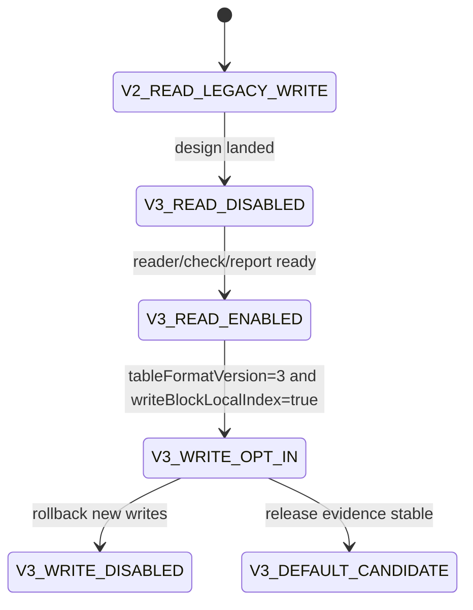

# LDB 0.11.0 SST block-local index 文件格式设计

[English](storage-format-0.11-block-index-design.en.md) | 中文

## 背景

0.10.0 已完成 direct point lookup、MemTable 最新点值索引、MultiGet batch direct get、同 data block 打开复用、restart key cache，以及显式 opt-in 的 `blockCacheWarmOnOpen`。这些改动保持 SST 文件格式不变，已经移除了点查热路径中的通用 iterator 链和部分 restart entry 重复解码成本。

剩余瓶颈集中在 data block 内部：direct get 已经能定位到目标 data block，但 `Block.seek` 仍需要从 restart point 开始顺序解码 entry，直到遇到第一个大于等于目标 internal key 的候选项。0.10.0 已评估并否决两个无格式变更方案：full-entry 内存块内索引会把完整 entry 解码成本过早前移；同 SST 内 index-block 批量定位会让稀疏随机 MultiGet 因排序和批量扫描成本回退。

因此下一阶段应引入紧凑、按需读取、可校验、可回滚的持久化 block-local index，而不是继续临时构建完整 entry 内存索引。

## 目标

| 目标 | 说明 |
| --- | --- |
| 减少 block 内线性解码 | 对点查和 MultiGet 提供比 restart 区间顺序扫描更短的定位路径。 |
| 避免 full-entry 预解码 | 索引只保存定位锚点，不保存 value，不强制解码所有 entry。 |
| 保持旧格式可读 | 新 reader 默认继续读取 v1/v2 SST；v3 写入必须显式 opt-in。 |
| 支持灰度和回滚 | Options 控制写入；已有 v3 SST 需要当前 reader；新写入可回滚到 v1/v2。 |
| 可观测和可验收 | check/repair/report/releaseGate 能说明索引存在性、覆盖率、损坏分类和性能证据。 |

## 非目标

- 不承诺 RocksDB/LevelDB 原生工具读取 LDB v3 SST。
- 不改变 InternalKey 排序、sequence、value type、range delete、snapshot 可见性语义。
- 不在本阶段引入 partitioned index/filter。
- 不把 `blockCacheWarmOnOpen` 改成默认开启。
- 不在 v3 首版中持久化完整 key/value 数组。

## 现状/已有流程

| 路径 | 当前事实 | 不足 | v3 方向 |
| --- | --- | --- | --- |
| `Table.get(internalKey)` | index block 定位 data block，data block 内 `Block.seek` | restart 区间内仍顺序解码 | 利用 block-local index 缩小 entry 解码范围 |
| `Table.get(List<Slice>)` | 同 SST 内按 data block handle 分组，同 block 打开一次 | 同 block 内仍逐 key seek | 对同 block 多 key 共享 block-local index |
| `Block.seek` | restart key cache 避免二分阶段重复解码 restart entry | restart 到目标 key 之间仍线性解码 | 二级锚点把线性扫描窗口限制到更小区间 |
| `warmDataBlocks` | 可显式预读 data block 到 block cache | full-entry 预索引会拖慢 cold benchmark | 只预读轻量索引或 index handle，不预解码完整 entry |
| v2 properties | 已记录 table format、feature set、entry/block/filter/checksum 元信息 | 没有 per-block index 元信息 | 扩展 properties 与 metaindex，记录 block-local index feature |

## 核心约束

| 约束 | 要求 |
| --- | --- |
| JDK | 保持 JDK 8 兼容。 |
| 编码 | 文档、源码、报告保持 UTF-8。 |
| 兼容 | 新版本必须默认读取旧 v1/v2 SST。 |
| Fail-fast | 旧 reader 或未声明能力的 reader 不能静默误读 v3 block-local index。 |
| 性能 | 索引读取不能让 scan、iterator 和普通打开库默认显著变慢。 |
| 空间 | block-local index 的空间放大需要可观测，首版目标控制在 data block 原始数据的低个位数百分比。 |
| 先文档后代码 | 实现前必须维护本文档及英文副本，并补充 release gate 证据。 |

## 接口设计

### Options

| API | 默认值 | 说明 |
| --- | --- | --- |
| `Options.tableFormatVersion()` | `1` | v3 写入仍通过该接口 opt-in，候选值为 `3`。 |
| `Options.writeTableProperties()` | `true` for v2/v3 | v3 必须写 properties，否则无法说明 feature 和回滚边界。 |
| `Options.writeBlockLocalIndex()` | `false` | 新增候选接口；仅在 `tableFormatVersion>=3` 时允许写入。 |
| `Options.blockLocalIndexInterval()` | 待定 | 每隔多少 restart 区间或 entry 写一个轻量锚点，默认值需 benchmark 校准。 |

### 诊断属性

| 属性 | 内容 |
| --- | --- |
| `ldb.tableFormat` | 增加 v3 table 数量、block-local index table 数量。 |
| `ldb.sstReadStats` | 增加 blockLocalIndexRequests/hits/misses/fallbacks 候选计数。 |
| `ldb.blockLocalIndex` | 可选调试属性，汇总索引覆盖率、锚点数量、字节数、回退原因。 |

## 数据结构

### Feature set

| feature | 类型 | 说明 |
| --- | --- | --- |
| `block.local_index.v1` | incompatible | data block 旁路存在新的 block-local index 布局；不理解时不能假装支持。 |
| `table.properties` | compatible | 复用 v2 properties。 |
| `index.single level` | compatible | 继续保留当前 index block 类型。 |

### Properties 字段

| Key | 示例 | 含义 |
| --- | --- | --- |
| `ldb.table.block_local_index` | `true` | 当前 SST 是否写入 block-local index。 |
| `ldb.table.block_local_index.version` | `1` | block-local index 子格式版本。 |
| `ldb.table.block_local_index.policy` | `restart-anchor` | 索引策略。 |
| `ldb.table.block_local_index.interval` | `4` | 锚点间隔。 |
| `ldb.table.block_local_index.bytes` | `12345` | 索引总字节数。 |
| `ldb.table.block_local_index.covered_blocks` | `128` | 有索引的 data block 数。 |

### Metaindex 布局

| metaindex key | 指向 | 说明 |
| --- | --- | --- |
| `properties` | properties block | v2 已有。 |
| `block_local_index` | block-local index directory block | v3 新增，记录每个 data block 对应的索引 block handle。 |

### Block-local index directory

建议首版复用普通 block key/value 编码。key 使用 data block handle 的规范字符串或 offset varint，value 使用 block-local index block handle。首版优先可诊断，后续如要改为更紧凑二进制目录，必须使用新的 feature/version。

### Block-local index block

| 字段 | 编码 | 说明 |
| --- | --- | --- |
| magic/version | varint/text | 子格式版本，便于损坏诊断。 |
| entryCount | varint | 锚点数量。 |
| anchor entries | repeated | 每个锚点包含完整 key 或 key suffix、data block 内 offset、restart index。 |
| checksum | 复用 block trailer | 继续通过 block trailer 校验。 |

锚点策略：不保存 value，不保存每个 entry，至少保存每 N 个 restart 区间的首 key 和 data offset。读取时先在锚点二分，再从锚点 offset 顺序解码到目标 key。若索引缺失、损坏或策略不匹配，按配置 fail-fast 或安全回退；生产默认建议损坏 fail-fast，缺失仅在显式 partial 声明时回退。

## 状态机

非法转换：reader/check/report 未完成前不允许 v3 写入；releaseGate 未覆盖 mixed v2/v3 前不允许默认 v3 写入；未记录 no-downgrade 边界前不允许发布 v3 opt-in。

## 时序流程

### 写入 v3 SST

1. TableBuilder 按现有流程写 data blocks。
2. 每个 data block 写完后，收集轻量锚点候选：key、restart index、block offset。
3. 写 filter block。
4. 写 block-local index blocks。
5. 写 block-local index directory block。
6. 写 properties block，记录 `block.local_index.v1` feature 与统计字段。
7. 写 metaindex，包含 `properties` 和 `block_local_index`。
8. 写 index block 和 footer。

### 读取 v3 SST

1. Table 打开 footer、index、metaindex。
2. 读取 properties，识别 `block.local_index.v1`。
3. 若 reader 支持该 feature，加载 block-local index directory；否则 fail-fast。
4. `Block.seek` 时优先查对应 block 的 local index handle。
5. index 命中后从锚点 offset 解码；若缺失且允许回退，则走现有 restart seek。
6. 统计 hit/miss/fallback/corrupt。

## 异常处理

| 场景 | 处理 |
| --- | --- |
| properties 标记有 feature 但 metaindex 缺少目录 | 打开失败，check 报 `BLOCK_LOCAL_INDEX_DIRECTORY_MISSING`。 |
| directory 指向越界 | 打开失败或 check 报 `BLOCK_LOCAL_INDEX_HANDLE_OUT_OF_RANGE`。 |
| index block checksum 错误 | 打开失败，check 记录 block offset/size。 |
| 单个 data block 缺少索引 | 若 table feature 声明为全覆盖则 fail-fast；若声明 partial 则安全回退。首版建议全覆盖。 |
| 运行时关闭 block-local index 读取 | 仅允许 diagnostic fallback；生产回滚应停止写 v3 并保留当前 reader。 |

## 幂等性

读取 block-local index 不修改数据库文件。check/repair 多次运行应输出一致的索引统计和损坏分类。compaction 生成 v3 SST 可以作为迁移手段，但不得原地改写旧 SST。回滚新写入只影响后续 flush/compaction，不删除已有 v3 SST。

## 回滚策略

| 阶段 | 回滚 |
| --- | --- |
| reader only | 关闭诊断入口即可；旧数据不受影响。 |
| v3 opt-in writes | 恢复 `tableFormatVersion=1/2` 或 `writeBlockLocalIndex=false`；已有 v3 SST 仍需当前 reader。 |
| v3 default candidate | 退回 opt-in；发布说明保留 no-downgrade 边界。 |
| 发现索引损坏 | 停止 compaction/flush 写 v3，运行 check 分类；必要时从 checkpoint/backup 恢复。 |

## 兼容性

| 场景 | 要求 |
| --- | --- |
| 新版本读 v1/v2 | 必须支持。 |
| 新版本读 v3 | 仅当支持 `block.local_index.v1` 时支持。 |
| 旧版本读 v3 | 不承诺；必须通过 incompatible feature 避免静默误读。 |
| v2/v3 混合 DB | 新版本必须支持。 |
| backup/restore | 必须保留 index blocks、directory 和 properties。 |
| repair | 默认不重建索引；只能生成计划或在显式 rebuild 模式下重写 SST。 |

## 灰度/迁移

| 阶段 | 内容 | 验收 | 中止条件 |
| --- | --- | --- | --- |
| BI G0 | 本设计文档和英文副本 | 设计完整，边界明确 | 与现有格式事实冲突 |
| BI G1 | reader skeleton | 能识别 feature、directory 缺失和损坏 | 旧 SST 打开失败 |
| BI G2 | writer opt-in | v3 SST 可写可读，mixed v2/v3 可读 | check/repair 无法解释 v3 |
| BI G3 | read path integration | point get/MultiGet 结果一致，统计可见 | 任一语义回归 |
| BI G4 | benchmark gate | cold_readrandom/MultiGet 至少不低于 0.10 稳定基线，并证明目标场景收益 | 稀疏随机回退未归因 |
| BI G5 | release gate | storageFormatGates 增加 block-local index 证据 | 任一 gate 缺失 |

## 测试方案

| 类型 | 用例 |
| --- | --- |
| 单元测试 | index block 编解码、directory 编解码、anchor lower-bound、损坏字段解析。 |
| 行为测试 | v1/v2/v3 get、iterator、snapshot cursor、range delete、MultiGet 结果一致。 |
| 兼容测试 | mixed v2/v3 DB、旧 fixture 新 reader 打开、新 v3 no-downgrade 文档。 |
| 损坏测试 | directory 缺失、handle 越界、index checksum 错误、anchor 无序。 |
| 性能测试 | warm_readrandom、cold_readrandom、multiget_random、dense same-block MultiGet、scan 回归。 |
| release gate | 新增 `blockLocalIndexFormatCoverage`、`blockLocalIndexBenchmarkEvidence`。 |

## 风险点

| 风险 | 严重性 | 缓解 |
| --- | --- | --- |
| 索引空间放大过高 | 中 | properties 记录字节数；release gate 设上限。 |
| 稀疏随机场景再次回退 | 高 | 保留 opt-in，benchmark gate 覆盖 sparse 和 dense 两类 MultiGet。 |
| 旧 reader 静默误读 | 高 | 使用 incompatible feature 和 future-version fail-fast。 |
| check/repair 不会解释新 block | 高 | reader/writer 前先完成报告字段和损坏分类。 |
| scan 被索引加载拖慢 | 中 | iterator 默认不加载 block-local index。 |

## 分阶段实施计划

| 阶段 | 优先级 | 交付物 | 验收 |
| --- | --- | --- | --- |
| BI 01 | P0 | 本设计文档与英文副本 | 文档落地并连接 0.10 计划/CHANGELOG。 |
| BI 02 | P0 | feature/properties/check skeleton | v3 feature 可识别，旧 SST 不受影响。 |
| BI 03 | P1 | block-local index writer opt-in | v3 SST 可生成，index directory 可读。 |
| BI 04 | P1 | point get/MultiGet 读取接入 | 行为测试一致，统计字段可见。 |
| BI 05 | P1 | benchmark 和 release gate | 稳定收益或明确回退，不达标不得默认启用。 |

## BI 02 当前落地边界

当前实现已先落地 v3 properties 骨架和公开配置入口：`Options.tableFormatVersion(3)`、`Options.writeBlockLocalIndex(false)` 与 `Options.blockLocalIndexInterval(...)`。当 `writeBlockLocalIndex=false` 时，v3 SST 只写入 block-local index 的 disabled 诊断字段，不声明 `block.local_index.v1` incompatible feature，也不写入 `block_local_index` metaindex 目录。

BI 03 已接管 `writeBlockLocalIndex(true)` 路径；该开关现在会生成真实 index block 与 directory。BI 02 的 disabled 骨架边界仅保留为历史阶段说明。

## BI 03 当前落地边界

当前实现已进一步落地 block-local index writer opt-in：当 `tableFormatVersion(3)` 且 `writeBlockLocalIndex(true)` 时，TableBuilder 会为每个 data block 写入轻量 restart-anchor index block，并写入 `block_local_index` directory。properties 会声明 `block.local_index.v1` incompatible feature，并记录 version、policy、interval、bytes 与 covered_blocks。读侧当前会识别该 feature 并加载 directory；若声明 feature 但缺少 directory，会在打开 SST 时 fail-fast。BI 04 已让 point get 和 MultiGet 在有 directory 时通过 local index floor anchor 定位 data block 内起始 offset。

## BI 04 当前落地边界

当前实现已把 block-local index 接入 point get 与 MultiGet：Table 定位到 data block 后，如果该 block 在 `block_local_index` directory 中有 local index handle，会先在 local index block 中查找不大于目标 internal key 的 floor anchor，再从 anchor 记录的 data-block offset 开始顺序解码。没有 local index、目标 key 位于首 anchor 之前或旧格式 SST 时，仍回退到原 `Block.seek`。

该阶段保持 iterator/scan 不加载 block-local index，避免 scan 路径被索引读取拖慢；table 级 `getBlockLocalIndexStats()` 暴露 directoryEntries、seekCount、hitCount 与 fallbackCount，用于行为测试和后续 release gate 归档。性能门禁和默认启用仍留给 BI 05。

## BI 05 当前落地边界

当前实现已把 block-local index 纳入 dbBench 可重复证据入口：`:ldb-longrun:ldbDbBenchReport` 支持 `-Pldb.dbBench.tableFormatVersion=3`、`-Pldb.dbBench.writeTableProperties=true`、`-Pldb.dbBench.writeBlockLocalIndex=true` 和 `-Pldb.dbBench.blockLocalIndexInterval=N`。生成的 JSON/CSV 报告会记录 tableFormatVersion、writeBlockLocalIndex 和 blockLocalIndexInterval，避免把 v3 opt-in 结果与默认 v1/v2 路径混淆。

正式性能结论仍需执行 200k 级 `cold_readrandom`、`multiget_random`、dense same-block MultiGet 和 scan 回归对比；在这些证据证明稳定收益前，block-local index 继续保持 opt-in，不默认开启。
## 开放问题

| 编号 | 问题 | 默认建议 |
| --- | --- | --- |
| BI OQ 01 | 锚点按 entry 间隔还是 restart 间隔？ | 先按 restart 间隔，避免依赖完整 entry 序号。 |
| BI OQ 02 | directory 使用文本 key 还是二进制 offset？ | 首版偏文本/诊断友好；性能确认后再二进制化。 |
| BI OQ 03 | 缺失单 block 索引能否回退？ | 首版全覆盖，缺失 fail-fast；partial 后续再设计。 |
| BI OQ 04 | 是否与 block cache 共享生命周期？ | 是，索引 block 进入同一 cache 体系或独立统计，需实现阶段确认。 |