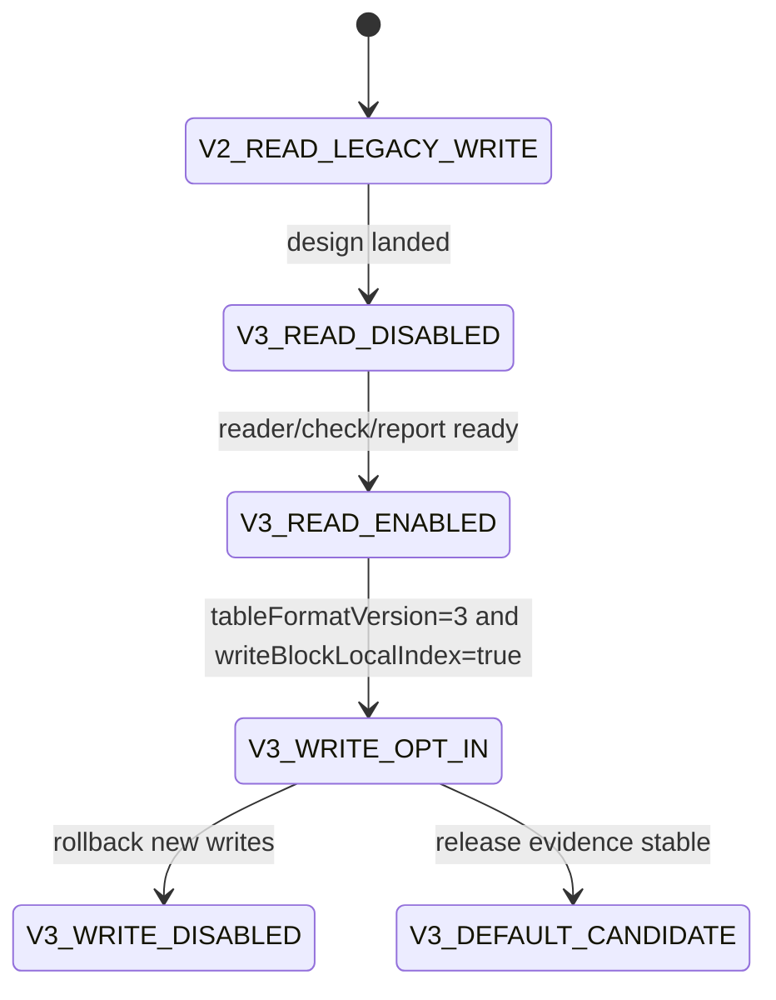

# LDB 0.11.0 SST block-local index 文件格式设计

[English](storage-format-0.11-block-index-design.en.md) | 中文

## 背景

0.10.0 已完成 direct point lookup、MemTable 最新点值索引、MultiGet batch direct get、同 data block 打开复用、restart key cache，以及显式 opt-in 的 `blockCacheWarmOnOpen`。这些改动保持 SST 文件格式不变，已经移除了点查热路径中的通用 iterator 链和部分 restart entry 重复解码成本。

剩余瓶颈集中在 data block 内部：direct get 已经能定位到目标 data block，但 `Block.seek` 仍需要从 restart point 开始顺序解码 entry，直到遇到第一个大于等于目标 internal key 的候选项。0.10.0 已评估并否决两个无格式变更方案：full-entry 内存块内索引会把完整 entry 解码成本过早前移；同 SST 内 index-block 批量定位会让稀疏随机 MultiGet 因排序和批量扫描成本回退。

因此下一阶段应引入紧凑、按需读取、可校验、可回滚的持久化 block-local index，而不是继续临时构建完整 entry 内存索引。

## 目标

| 目标 | 说明 |
| --- | --- |
| 减少 block 内线性解码 | 对点查和 MultiGet 提供比 restart 区间顺序扫描更短的定位路径。 |
| 避免 full-entry 预解码 | 索引只保存定位锚点，不保存 value，不强制解码所有 entry。 |
| 保持旧格式可读 | 新 reader 默认继续读取 v1/v2 SST；v3 写入必须显式 opt-in。 |
| 支持灰度和回滚 | Options 控制写入；已有 v3 SST 需要当前 reader；新写入可回滚到 v1/v2。 |
| 可观测和可验收 | check/repair/report/releaseGate 能说明索引存在性、覆盖率、损坏分类和性能证据。 |

## 非目标

- 不承诺 RocksDB/LevelDB 原生工具读取 LDB v3 SST。
- 不改变 InternalKey 排序、sequence、value type、range delete、snapshot 可见性语义。
- 不在本阶段引入 partitioned index/filter。
- 不把 `blockCacheWarmOnOpen` 改成默认开启。
- 不在 v3 首版中持久化完整 key/value 数组。

## 现状/已有流程

| 路径 | 当前事实 | 不足 | v3 方向 |
| --- | --- | --- | --- |
| `Table.get(internalKey)` | index block 定位 data block，data block 内 `Block.seek` | restart 区间内仍顺序解码 | 利用 block-local index 缩小 entry 解码范围 |
| `Table.get(List<Slice>)` | 同 SST 内按 data block handle 分组，同 block 打开一次 | 同 block 内仍逐 key seek | 对同 block 多 key 共享 block-local index |
| `Block.seek` | restart key cache 避免二分阶段重复解码 restart entry | restart 到目标 key 之间仍线性解码 | 二级锚点把线性扫描窗口限制到更小区间 |
| `warmDataBlocks` | 可显式预读 data block 到 block cache | full-entry 预索引会拖慢 cold benchmark | 只预读轻量索引或 index handle，不预解码完整 entry |
| v2 properties | 已记录 table format、feature set、entry/block/filter/checksum 元信息 | 没有 per-block index 元信息 | 扩展 properties 与 metaindex，记录 block-local index feature |

## 核心约束

| 约束 | 要求 |
| --- | --- |
| JDK | 保持 JDK 8 兼容。 |
| 编码 | 文档、源码、报告保持 UTF-8。 |
| 兼容 | 新版本必须默认读取旧 v1/v2 SST。 |
| Fail-fast | 旧 reader 或未声明能力的 reader 不能静默误读 v3 block-local index。 |
| 性能 | 索引读取不能让 scan、iterator 和普通打开库默认显著变慢。 |
| 空间 | block-local index 的空间放大需要可观测，首版目标控制在 data block 原始数据的低个位数百分比。 |
| 先文档后代码 | 实现前必须维护本文档及英文副本，并补充 release gate 证据。 |

## 接口设计

### Options

| API | 默认值 | 说明 |
| --- | --- | --- |
| `Options.tableFormatVersion()` | `1` | v3 写入仍通过该接口 opt-in，候选值为 `3`。 |
| `Options.writeTableProperties()` | `true` for v2/v3 | v3 必须写 properties，否则无法说明 feature 和回滚边界。 |
| `Options.writeBlockLocalIndex()` | `false` | 新增候选接口；仅在 `tableFormatVersion>=3` 时允许写入。 |
| `Options.blockLocalIndexInterval()` | 待定 | 每隔多少 restart 区间或 entry 写一个轻量锚点，默认值需 benchmark 校准。 |

### 诊断属性

| 属性 | 内容 |
| --- | --- |
| `ldb.tableFormat` | 增加 v3 table 数量、block-local index table 数量。 |
| `ldb.sstReadStats` | 增加 blockLocalIndexRequests/hits/misses/fallbacks 候选计数。 |
| `ldb.blockLocalIndex` | 可选调试属性，汇总索引覆盖率、锚点数量、字节数、回退原因。 |

## 数据结构

### Feature set

| feature | 类型 | 说明 |
| --- | --- | --- |
| `block.local_index.v1` | incompatible | data block 旁路存在新的 block-local index 布局；不理解时不能假装支持。 |
| `table.properties` | compatible | 复用 v2 properties。 |
| `index.single level` | compatible | 继续保留当前 index block 类型。 |

### Properties 字段

| Key | 示例 | 含义 |
| --- | --- | --- |
| `ldb.table.block_local_index` | `true` | 当前 SST 是否写入 block-local index。 |
| `ldb.table.block_local_index.version` | `1` | block-local index 子格式版本。 |
| `ldb.table.block_local_index.policy` | `restart-anchor` | 索引策略。 |
| `ldb.table.block_local_index.interval` | `4` | 锚点间隔。 |
| `ldb.table.block_local_index.bytes` | `12345` | 索引总字节数。 |
| `ldb.table.block_local_index.covered_blocks` | `128` | 有索引的 data block 数。 |

### Metaindex 布局

| metaindex key | 指向 | 说明 |
| --- | --- | --- |
| `properties` | properties block | v2 已有。 |
| `block_local_index` | block-local index directory block | v3 新增，记录每个 data block 对应的索引 block handle。 |

### Block-local index directory

建议首版复用普通 block key/value 编码。key 使用 data block handle 的规范字符串或 offset varint，value 使用 block-local index block handle。首版优先可诊断，后续如要改为更紧凑二进制目录，必须使用新的 feature/version。

### Block-local index block

| 字段 | 编码 | 说明 |
| --- | --- | --- |
| magic/version | varint/text | 子格式版本，便于损坏诊断。 |
| entryCount | varint | 锚点数量。 |
| anchor entries | repeated | 每个锚点包含完整 key 或 key suffix、data block 内 offset、restart index。 |
| checksum | 复用 block trailer | 继续通过 block trailer 校验。 |

锚点策略：不保存 value，不保存每个 entry，至少保存每 N 个 restart 区间的首 key 和 data offset。读取时先在锚点二分，再从锚点 offset 顺序解码到目标 key。若索引缺失、损坏或策略不匹配，按配置 fail-fast 或安全回退；生产默认建议损坏 fail-fast，缺失仅在显式 partial 声明时回退。

## 状态机

非法转换：reader/check/report 未完成前不允许 v3 写入；releaseGate 未覆盖 mixed v2/v3 前不允许默认 v3 写入；未记录 no-downgrade 边界前不允许发布 v3 opt-in。

## 时序流程

### 写入 v3 SST

1. TableBuilder 按现有流程写 data blocks。
2. 每个 data block 写完后，收集轻量锚点候选：key、restart index、block offset。
3. 写 filter block。
4. 写 block-local index blocks。
5. 写 block-local index directory block。
6. 写 properties block，记录 `block.local_index.v1` feature 与统计字段。
7. 写 metaindex，包含 `properties` 和 `block_local_index`。
8. 写 index block 和 footer。

### 读取 v3 SST

1. Table 打开 footer、index、metaindex。
2. 读取 properties，识别 `block.local_index.v1`。
3. 若 reader 支持该 feature，加载 block-local index directory；否则 fail-fast。
4. `Block.seek` 时优先查对应 block 的 local index handle。
5. index 命中后从锚点 offset 解码；若缺失且允许回退，则走现有 restart seek。
6. 统计 hit/miss/fallback/corrupt。

## 异常处理

| 场景 | 处理 |
| --- | --- |
| properties 标记有 feature 但 metaindex 缺少目录 | 打开失败，check 报 `BLOCK_LOCAL_INDEX_DIRECTORY_MISSING`。 |
| directory 指向越界 | 打开失败或 check 报 `BLOCK_LOCAL_INDEX_HANDLE_OUT_OF_RANGE`。 |
| index block checksum 错误 | 打开失败，check 记录 block offset/size。 |
| 单个 data block 缺少索引 | 若 table feature 声明为全覆盖则 fail-fast；若声明 partial 则安全回退。首版建议全覆盖。 |
| 运行时关闭 block-local index 读取 | 仅允许 diagnostic fallback；生产回滚应停止写 v3 并保留当前 reader。 |

## 幂等性

读取 block-local index 不修改数据库文件。check/repair 多次运行应输出一致的索引统计和损坏分类。compaction 生成 v3 SST 可以作为迁移手段，但不得原地改写旧 SST。回滚新写入只影响后续 flush/compaction，不删除已有 v3 SST。

## 回滚策略

| 阶段 | 回滚 |
| --- | --- |
| reader only | 关闭诊断入口即可；旧数据不受影响。 |
| v3 opt-in writes | 恢复 `tableFormatVersion=1/2` 或 `writeBlockLocalIndex=false`；已有 v3 SST 仍需当前 reader。 |
| v3 default candidate | 退回 opt-in；发布说明保留 no-downgrade 边界。 |
| 发现索引损坏 | 停止 compaction/flush 写 v3，运行 check 分类；必要时从 checkpoint/backup 恢复。 |

## 兼容性

| 场景 | 要求 |
| --- | --- |
| 新版本读 v1/v2 | 必须支持。 |
| 新版本读 v3 | 仅当支持 `block.local_index.v1` 时支持。 |
| 旧版本读 v3 | 不承诺；必须通过 incompatible feature 避免静默误读。 |
| v2/v3 混合 DB | 新版本必须支持。 |
| backup/restore | 必须保留 index blocks、directory 和 properties。 |
| repair | 默认不重建索引；只能生成计划或在显式 rebuild 模式下重写 SST。 |

## 灰度/迁移

| 阶段 | 内容 | 验收 | 中止条件 |
| --- | --- | --- | --- |
| BI G0 | 本设计文档和英文副本 | 设计完整，边界明确 | 与现有格式事实冲突 |
| BI G1 | reader skeleton | 能识别 feature、directory 缺失和损坏 | 旧 SST 打开失败 |
| BI G2 | writer opt-in | v3 SST 可写可读，mixed v2/v3 可读 | check/repair 无法解释 v3 |
| BI G3 | read path integration | point get/MultiGet 结果一致，统计可见 | 任一语义回归 |
| BI G4 | benchmark gate | cold_readrandom/MultiGet 至少不低于 0.10 稳定基线，并证明目标场景收益 | 稀疏随机回退未归因 |
| BI G5 | release gate | storageFormatGates 增加 block-local index 证据 | 任一 gate 缺失 |

## 测试方案

| 类型 | 用例 |
| --- | --- |
| 单元测试 | index block 编解码、directory 编解码、anchor lower-bound、损坏字段解析。 |
| 行为测试 | v1/v2/v3 get、iterator、snapshot cursor、range delete、MultiGet 结果一致。 |
| 兼容测试 | mixed v2/v3 DB、旧 fixture 新 reader 打开、新 v3 no-downgrade 文档。 |
| 损坏测试 | directory 缺失、handle 越界、index checksum 错误、anchor 无序。 |
| 性能测试 | warm_readrandom、cold_readrandom、multiget_random、dense same-block MultiGet、scan 回归。 |
| release gate | 新增 `blockLocalIndexFormatCoverage`、`blockLocalIndexBenchmarkEvidence`。 |

## 风险点

| 风险 | 严重性 | 缓解 |
| --- | --- | --- |
| 索引空间放大过高 | 中 | properties 记录字节数；release gate 设上限。 |
| 稀疏随机场景再次回退 | 高 | 保留 opt-in，benchmark gate 覆盖 sparse 和 dense 两类 MultiGet。 |
| 旧 reader 静默误读 | 高 | 使用 incompatible feature 和 future-version fail-fast。 |
| check/repair 不会解释新 block | 高 | reader/writer 前先完成报告字段和损坏分类。 |
| scan 被索引加载拖慢 | 中 | iterator 默认不加载 block-local index。 |

## 分阶段实施计划

| 阶段 | 优先级 | 交付物 | 验收 |
| --- | --- | --- | --- |
| BI 01 | P0 | 本设计文档与英文副本 | 文档落地并连接 0.10 计划/CHANGELOG。 |
| BI 02 | P0 | feature/properties/check skeleton | v3 feature 可识别，旧 SST 不受影响。 |
| BI 03 | P1 | block-local index writer opt-in | v3 SST 可生成，index directory 可读。 |
| BI 04 | P1 | point get/MultiGet 读取接入 | 行为测试一致，统计字段可见。 |
| BI 05 | P1 | benchmark 和 release gate | 稳定收益或明确回退，不达标不得默认启用。 |

## BI 02 当前落地边界

当前实现已先落地 v3 properties 骨架和公开配置入口：`Options.tableFormatVersion(3)`、`Options.writeBlockLocalIndex(false)` 与 `Options.blockLocalIndexInterval(...)`。当 `writeBlockLocalIndex=false` 时，v3 SST 只写入 block-local index 的 disabled 诊断字段，不声明 `block.local_index.v1` incompatible feature，也不写入 `block_local_index` metaindex 目录。

BI 03 已接管 `writeBlockLocalIndex(true)` 路径；该开关现在会生成真实 index block 与 directory。BI 02 的 disabled 骨架边界仅保留为历史阶段说明。

## BI 03 当前落地边界

当前实现已进一步落地 block-local index writer opt-in：当 `tableFormatVersion(3)` 且 `writeBlockLocalIndex(true)` 时，TableBuilder 会为每个 data block 写入轻量 restart-anchor index block，并写入 `block_local_index` directory。properties 会声明 `block.local_index.v1` incompatible feature，并记录 version、policy、interval、bytes 与 covered_blocks。读侧当前会识别该 feature 并加载 directory；若声明 feature 但缺少 directory，会在打开 SST 时 fail-fast。BI 04 已让 point get 和 MultiGet 在有 directory 时通过 local index floor anchor 定位 data block 内起始 offset。

## BI 04 当前落地边界

当前实现已把 block-local index 接入 point get 与 MultiGet：Table 定位到 data block 后，如果该 block 在 `block_local_index` directory 中有 local index handle，会先在 local index block 中查找不大于目标 internal key 的 floor anchor，再从 anchor 记录的 data-block offset 开始顺序解码。没有 local index、目标 key 位于首 anchor 之前或旧格式 SST 时，仍回退到原 `Block.seek`。

该阶段保持 iterator/scan 不加载 block-local index，避免 scan 路径被索引读取拖慢；table 级 `getBlockLocalIndexStats()` 暴露 directoryEntries、seekCount、hitCount 与 fallbackCount，用于行为测试和后续 release gate 归档。性能门禁和默认启用仍留给 BI 05。

## BI 05 当前落地边界

当前实现已把 block-local index 纳入 dbBench 可重复证据入口：`:ldb-longrun:ldbDbBenchReport` 支持 `-Pldb.dbBench.tableFormatVersion=3`、`-Pldb.dbBench.writeTableProperties=true`、`-Pldb.dbBench.writeBlockLocalIndex=true` 和 `-Pldb.dbBench.blockLocalIndexInterval=N`。生成的 JSON/CSV 报告会记录 tableFormatVersion、writeBlockLocalIndex 和 blockLocalIndexInterval，避免把 v3 opt-in 结果与默认 v1/v2 路径混淆。

正式性能结论仍需执行 200k 级 `cold_readrandom`、`multiget_random`、dense same-block MultiGet 和 scan 回归对比；在这些证据证明稳定收益前，block-local index 继续保持 opt-in，不默认开启。
## 开放问题

| 编号 | 问题 | 默认建议 |
| --- | --- | --- |
| BI OQ 01 | 锚点按 entry 间隔还是 restart 间隔？ | 先按 restart 间隔，避免依赖完整 entry 序号。 |
| BI OQ 02 | directory 使用文本 key 还是二进制 offset？ | 首版偏文本/诊断友好；性能确认后再二进制化。 |
| BI OQ 03 | 缺失单 block 索引能否回退？ | 首版全覆盖，缺失 fail-fast；partial 后续再设计。 |
| BI OQ 04 | 是否与 block cache 共享生命周期？ | 是，索引 block 进入同一 cache 体系或独立统计，需实现阶段确认。 |
## BI 05 快速门禁补充：单点路径接入缺口

50k `read_optimized` opt-in 快速门禁补测了 `blockLocalIndexInterval=1/4/8`。结果显示 interval=8 的 `readrandom_hit=184,987.728 ops/s` 接近但仍未超过 release baseline `185,760.216 ops/s`；interval=1 为 `175,576.224 ops/s`，interval=4 为 `161,593.493 ops/s`。更关键的是，`readrandom_hit` 的 `sstReadStats` 中 `blockLocalIndexSeekCount=0`、`blockLocalIndexHitCount=0`，说明当前单点 `Table.get(Slice)` 在 v3 opt-in 下仍未使用 block-local index，只是在定位 data block 后继续走 `seekWithBlockSeekIndex`。因此继续调 interval 不能证明 v3 local index 对主指标有效。

下一步 BI 05 实验应先补齐单点路径接入：`Table.get(Slice)` 在已有 data block handle 和 data block 后，若 SST 声明了 block-local index，应调用同一套 local-index floor-anchor 路径；旧格式、未声明 local index、anchor 缺失或目标位于首个 anchor 前时仍安全回退到现有 block-open-time restart/anchor seek。该改动仍保持 v3 opt-in，不改变默认 v1/v2 行为，也不引入 full-entry index。验收继续以 `readrandom_hit` 为主，同时看 sameblock、burst、scan 和 MultiGet 是否回退。
## BI 05 最终快速门禁结论：v3 block-local index 不能默认启用

补齐单点 `Table.get(Slice)` 接入后，50k `read_optimized` v3 opt-in 再次验证了 `blockLocalIndexInterval=1/8` 与默认路径。结果表明：

| 路径 | readrandom_hit | sameblock | burst | multiget_mixed | multiget_sameblock | scan | 关键统计 |
| --- | ---: | ---: | ---: | ---: | ---: | ---: | --- |
| 默认 v1/v2 路径 | 187,915.881 | 402,373.035 | 423,437.431 | 380,699.741 | 470,505.426 | 1,680,937.829 | `blockSeekIndexHits=50000`，`blockLocalIndexSeekCount=0` |
| v3 local index interval=1 | 156,978.429 | 348,163.957 | 366,713.019 | 274,553.453 | 322,701.190 | 1,625,234.034 | `blockLocalIndexSeekCount=50000`，`blockLocalIndexHitCount=48680`，`blockLocalIndexFallbackCount=1320` |
| v3 local index interval=8 | 175,827.762 | 360,811.537 | 392,632.949 | 335,035.986 | 373,739.843 | 1,415,568.421 | `blockLocalIndexTables=0`，本轮数据分布下没有生成可用 local index |

该证据把问题边界收窄为：v3 block-local index 已经能被单点路径命中，但当前“独立 local-index block + directory”的格式成本高于减少 data block 内线性扫描带来的收益。`interval=8` 没有生成可用索引，不能证明该方向有效；`interval=1` 真正命中 local index，但主指标和 MultiGet 均明显低于默认路径。因此 BI 05 结论是：当前 v3 block-local index 只能保留为 opt-in 实验/兼容能力，不允许默认启用，也不能作为发布性能收益点。

## BI 06 建议切口：data block inline mini-index

下一阶段应从文件格式上降低索引访问成本，而不是继续调 `blockLocalIndexInterval`。建议新增一个 v0.11/v4 候选格式：把 point-get 所需的极小 floor-anchor 索引内联到 data block 自身，避免单点读为了定位块内 offset 再访问独立 directory 和 local-index block。

最小设计边界如下：

| 项目 | 建议 |
| --- | --- |
| 写入位置 | data block payload 末尾、restart array 之前，或 data block trailer 前的可解析 mini-index 区域；必须由新 block format 标记保护 |
| 索引粒度 | 仍以 restart 区间或稀疏 anchor 为单位，禁止 full-entry index |
| 热路径 | `Block` 打开时一次性解析 inline mini-index 到轻量内存结构；`Block.seek` 仍优先使用内存 anchor 缩小扫描范围 |
| 回退 | 没有 inline mini-index、anchor 不适用、旧格式 block 时回退现有 `Block.seek` restart/anchor 路径 |
| 统计 | 复用并继续保留 `blockSeekIndexHits/Misses/Fallbacks`，新增格式统计只能作为补充，不替代主统计 |
| 默认策略 | 新格式继续 opt-in；只有 `readrandom_hit` 稳定超过默认路径并且 sameblock/burst/scan/MultiGet 不回退后，才能考虑默认开启 |

验收门禁继续以 `readrandom_hit` 为主，同时比较 sameblock、burst、scan、MultiGet。阶段目标不是“写更多索引”，而是证明 point-get 的块内定位成本比当前 block-open-time 轻量索引更低。
## BI 06 当前落地边界

当前实现已落地 v4 opt-in 的 data block inline mini-index 最小路径：`Options.writeInlineBlockSeekIndex(true)` 且 `tableFormatVersion(4)` 时，data block 使用带 magic 的新块布局写入稀疏 seek anchor。新布局为 `entries + inlineMiniIndex + restartPositions + restartCount + inlineMiniIndexOffset + magic`；没有 magic 的旧 block 仍按原布局解析。

inline mini-index 只保存 anchor key、data-block offset、previous key 和 restart index，不保存 value、不保存完整 entry 列表，因此仍满足“不引入 full-entry index”的约束。`Block` 打开时如果识别到 magic，会直接从 inline mini-index 构建内存 seek anchors；否则继续从 data entries 扫描构建当前轻量 anchors。默认 v1/v2/v3 路径不写该格式，v4 也必须显式打开 `writeInlineBlockSeekIndex` 才写入。

已固定的行为边界：

| 项目 | 当前状态 |
| --- | --- |
| 格式保护 | `block.inline_seek_index.v1` incompatible feature |
| 写入门槛 | `tableFormatVersion >= 4`，低版本显式开启会失败 |
| admission | `inlineBlockSeekIndexAdmissionMinAnchors` 控制小 block 是否跳过 |
| 统计 | 继续保留 `blockSeekIndexHits/Misses/Fallbacks`，inline 格式属性记录 bytes、covered_blocks、anchor_count |
| 回退 | 无 magic/无 inline index 的 block 走旧解析与旧 seek anchors |

下一步需要把 dbBench 暴露 `writeInlineBlockSeekIndex`、`inlineBlockSeekIndexInterval` 和 admission 参数，然后跑 `readrandom_hit`、sameblock、burst、scan、MultiGet 对比；只有证明主指标提升且无关键回退，才能把该格式从实验能力推进到默认候选。
## BI 06 快速门禁结果：inline mini-index 暂不达标

在补齐 `writeInlineBlockSeekIndex` 的 dbBench 参数后，50k `read_optimized` 快速门禁对比了默认路径与 v4 inline mini-index：

| 路径 | readrandom_hit | sameblock | burst | multiget_mixed | multiget_sameblock | scan |
| --- | ---: | ---: | ---: | ---: | ---: | ---: |
| 默认路径（hash mix 后） | 200,202.044 | 418,842.905 | 415,931.508 | 406,329.971 | 465,903.765 | 1,948,968.216 |
| v4 inline interval=4 | 180,808.482 | 427,825.057 | 527,255.970 | 374,228.808 | 463,119.051 | 1,433,424.595 |
| v4 inline interval=8 | 191,085.918 | 346,204.765 | 336,938.576 | 347,258.636 | 455,467.569 | 1,645,429.655 |
| v4 inline interval=16 | 177,820.202 | 287,829.752 | 278,555.567 | 347,598.788 | 450,914.771 | 1,553,958.087 |

同时，point-get direct block cache 的 slot hash 从简单 offset/dataSize 混合改为 64-bit 混合后，v4 interval=4 的 `tablePointGetSlotCollisions` 从 19,339 降到 6,900，说明缓存槽分布问题已经被缓解。但主指标仍低于默认路径，且 interval=8/16 会明显伤害 sameblock/burst/scan。因此当前 inline mini-index 只能作为 v4 实验格式保留，不能进入默认候选。

下一步最有价值的方向不再是继续调 inline interval，而是减少 data block 打开和 seek 过程中的对象分配/重复 key materialization，尤其是 `Block.seek` 命中候选前的 key 构造成本；该方向不需要增加落盘索引字节，也更贴近当前默认路径已经跑到 200k 的事实。
## BI 07 建议切口：Block.seek 复用 key buffer

BI 06 证明继续增加或调密落盘索引收益不足，下一步改为降低现有默认路径的 CPU/分配成本。当前 `Block.seek` 在线性扫描 restart 区间时，会为每条 prefix-compressed entry 重建完整 `Slice` key；即使该 entry 小于目标 key、最终会被跳过，也会产生 key materialization 成本。

BI 07 的最小实现边界是：默认 bytewise/internal-bytewise comparator 使用单个可增长 byte[] 作为当前 key buffer，扫描时复用该 buffer 解码 shared/non-shared key，并直接与 target key 比较；只有命中候选 entry 时才创建返回用 `Slice`。自定义 comparator 或无法证明 bytewise 语义的场景继续走旧实现，避免改变用户自定义排序语义。

该优化不改变文件格式，不增加任何落盘索引字节，不引入 full-entry index，也不改变 `blockSeekIndexHits/Misses/Fallbacks` 统计语义。验收仍以 `readrandom_hit` 为主，同时观察 sameblock、burst、scan 与 MultiGet 是否回退。
## BI 07 快速门禁结果：复用 key buffer 默认关闭

BI 07 的复用 key buffer fast path 通过了编译和核心行为测试，但 50k 默认路径快速门禁显示 `readrandom_hit=157,558.325 ops/s`，低于同代码阶段关闭该 fast path 时的默认路径 `200,202.044 ops/s`。sameblock 基本持平，burst 和 dense MultiGet 有改善，但主指标明显回退，因此该 fast path 不满足验收标准。

当前处理是保留实验代码边界但默认关闭，不进入生产热路径。结论是：简单用 byte[] 复用替换 `Slice` materialization 并不能降低主指标成本，可能因为额外拷贝、手写 internal-key 比较和候选 materialize 抵消了分配减少收益。下一步若继续优化 `Block.seek`，应优先做更窄的 profiling 或只优化 block-open 阶段的 anchor 构建，而不是替换 seek-time 比较路径。
## BI 08 建议切口：point-get block cache 小型组相联

BI 07 证明替换 seek-time key materialization 会伤害主指标，下一步转向更窄的 point-get data block 复用成本。当前 point-get 专用 block cache 是 direct-mapped：同一个 cache slot 只能保存一个 data block。即使底层 direct read block cache 已经命中，point-get 层发生 slot collision 时仍会重新进入 `openBlockForDirectRead` 并构造/返回 block 对象路径，增加随机读热路径成本。

BI 08 的最小实现边界是把 point-get 专用 cache 改为固定 4-way set-associative，总容量仍保持 `POINT_GET_BLOCK_CACHE_LIMIT`，不增加 full-entry index，不改变 `Block.seek`、`blockSeekIndexHits/Misses/Fallbacks` 和文件格式。命中时把命中 way 移到 set 头部；未命中时淘汰 set 尾部。验收仍以 `readrandom_hit` 为主，同时观察 sameblock、burst、scan 和 MultiGet 是否回退。
## BI 08 快速门禁结果：4-way point-get cache 不进入主线

BI 08 的 4-way set-associative point-get cache 通过了编译和核心行为测试，但 50k 默认路径快速门禁显示主指标明显回退：`readrandom_hit=159,767.991 ops/s`，低于关闭该改动后的默认路径 `204,126.040 ops/s`。同一轮中，sameblock 为 `327,944.549 ops/s`，burst 为 `403,173.134 ops/s`，multiget_mixed 为 `340,933.654 ops/s`，multiget_sameblock 为 `435,747.315 ops/s`，scan 为 `1,481,652.695 ops/s`，整体也低于前一轮默认路径。

因此该方向不满足验收标准：组相联结构虽然理论上减少 slot collision，但更复杂的 set 扫描、move-to-front 和写入路径抵消甚至超过了收益。当前主线应撤回 4-way 结构，保留已经证明有效的 64-bit hash mix，并恢复 direct-mapped point-get cache。该结论不改变文件格式、不改变 `Block.seek`，也不改变 `blockSeekIndexHits/Misses/Fallbacks` 统计语义。
## BI 09 建议切口：清理已否决 seek-time fast path 残留

BI 07 的 reusable-key-buffer fast path 已经通过快速门禁证明会让 `readrandom_hit` 明显回退，因此不应继续作为生产热类中的隐藏实验分支保留。即使当前实现用常量布尔值关闭该路径，`Block` 类中仍残留 fast-path 字段、分支、手写 bytewise/internal-key 比较和 `ReusableKey` 临时结构，这会增加热类复杂度，也让后续判断默认路径性能时混入已经否决的实现细节。

BI 09 的最小边界是删除该 fast path 残留，让 `Block.seek` 只保留当前被接受的 block-open-time restart/sparse-anchor 内存索引路径：打开 block 时构建轻量 anchor，seek 时通过 anchor 缩小线性扫描窗口，命中候选 entry 时再 materialize key/value。该清理不改变文件格式，不引入 full-entry index，不改变 v4 inline mini-index 的 opt-in 兼容边界，也不改变 `blockSeekIndexHits/Misses/Fallbacks` 统计语义。验收仍以 `readrandom_hit` 为主，同时观察 sameblock、burst、scan 和 MultiGet 是否回退。
## BI 10 建议切口：移除 Table.get 冗余候选比较

当前默认点查路径中，`Table.get(Slice)` 定位到 data block 后调用 `seekWithBlockSeekIndex`，而该路径最终由 `Block.seekWithIndex`/`Block.seek` 返回第一个大于等于目标 internal key 的候选 entry；v3/v4 opt-in 的 `seekFromOffset` 路径也保持同一语义。因此 `Table.get` 在候选不为 `null` 后再次执行 `comparator.compare(candidate.getKey(), internalKey) < 0` 属于热路径冗余校验。

BI 10 的最小边界是删除该重复比较，保留 `candidate == null` 判断，并把“候选必须不小于目标 key”的责任收敛到 `Block.seek`/`seekFromOffset` 的既有语义上。该优化不改变文件格式，不引入 full-entry index，不改变 block-open-time anchor 构建，也不改变 `blockSeekIndexHits/Misses/Fallbacks` 统计语义。验收仍以 `readrandom_hit` 为主，同时观察 sameblock、burst、scan 和 MultiGet 是否回退。
## BI 10 快速门禁结果：冗余候选比较不删除

BI 10 删除 `Table.get` 末尾候选再比较后，通过了编译和核心行为测试，但 50k `readrandom_hit` 单项快速门禁下降到 `177,107.948 ops/s`，低于 BI09 清理后的 `180,841.441 ops/s`，也低于此前 direct-mapped 恢复后的 `182,281.043 ops/s`。因此该改动不满足主指标验收，代码应恢复原有候选再比较。

当前结论是：即使该比较从语义上看是重复保护，删除它也没有形成可接受的性能收益，可能还会改变 JIT 形态或热路径布局。该方向只保留为失败证据，不进入主线；后续优化应继续寻找能同时提升 `readrandom_hit` 且不伤害 sameblock、burst、scan、MultiGet 的更大成本点。
## BI 11 建议切口：扩大 point-get direct cache 容量

BI 08 已证明 4-way set-associative 结构会伤害主指标，因此下一步不再增加每次 lookup 的 set 扫描和 move-to-front 成本。当前 BI09/BI10 快速门禁中，`readrandom_hit` 仍显示 `tablePointGetSlotCollisions=7726`、`tableDataBlockOpens=8898`，说明 direct-mapped point-get cache 仍有明显槽位冲突和重复 data block 打开成本。

BI 11 的最小边界是仅扩大 point-get direct cache 总容量，例如从 `4096` 扩到 `8192`，继续保持 direct-mapped 策略和已验证较好的 64-bit hash mix。该实验不改变文件格式，不改变 `Block.seek`，不引入 full-entry index，也不改变 `blockSeekIndexHits/Misses/Fallbacks` 统计语义；代价是每个 `Table` 多持有一组较小的 handle/block 引用数组。验收仍以 `readrandom_hit` 为主，同时观察 sameblock、burst、scan 和 MultiGet 是否回退；若主指标不升反降，则撤回容量调整，仅保留失败证据。
## BI 11 快速门禁结果：point-get direct cache 不扩大到 8192

BI 11 将 point-get direct cache 容量从 `4096` 扩到 `8192` 后，通过了编译和核心行为测试，也确实降低了部分缓存冲突：`tablePointGetSlotCollisions` 从 BI09/BI10 同档门禁中的 `7726` 降到 `3943`，`tableDataBlockOpens` 从 `8898` 降到 `5218`。但是 50k `readrandom_hit` 主指标下降到 `159,942.523 ops/s`，明显低于 4096 容量下的 `180k` 档结果。

因此该容量调整不满足验收标准，应恢复 `POINT_GET_BLOCK_CACHE_LIMIT=4096`。结论是：在当前工作负载中，减少 direct cache collision 并不自动转化为主指标收益；更大的数组可能伤害缓存局部性、对象访问路径或 JIT 形态。后续不应继续盲目扩大 point-get cache，而应转向更直接的 block 构建成本、anchor 构建成本或真实性能 profiling。
## BI 12 建议切口：观测 Block 打开时 anchor 构建成本

BI 08 到 BI 11 证明，继续猜测缓存形态或删除微小分支并不能稳定提升 `readrandom_hit`。当前主线真正需要先回答的是：data block 打开时构建 restart/sparse-anchor 轻量内存索引到底消耗了多少，以及这些成本和 `tableDataBlockOpens`、`blockSeekIndexHits` 之间的关系。

BI 12 的最小边界是在 `Block` 构造完成后暴露轻量统计：本次 block 是否通过 inline mini-index 构建 seek anchors、是否通过扫描 data entries 构建 seek anchors、anchor 总数以及构建耗时。`Table` 只在真正 readBlock/cache miss 后累加这些数值，避免缓存命中重复计数；`TableCache.readStats()` 把汇总值并入 `ldb.sstReadStats`，供 dbBench CSV/JSON 直接记录。该改动只增加观测，不改变文件格式、不改变 `Block.seek` 语义、不引入 full-entry index，也不改变 `blockSeekIndexHits/Misses/Fallbacks` 统计语义。验收重点是编译和行为不变，并通过 `readrandom_hit` 门禁判断观测开销是否可接受。
## BI 12 快速门禁结果：纳秒计时默认关闭

BI 12 首版把 anchor 构建次数、anchor 数量和构建纳秒全部默认计入 `ldb.sstReadStats`。字段成功进入 dbBench 报告，50k `readrandom_hit` 中观测到 `tableBlockOpenSeekAnchorBuilds=1391`、`tableBlockOpenSeekAnchors=8334`、`tableBlockOpenSeekAnchorBuildNanos=8046800`，说明当前默认路径仍通过扫描 data entries 构建 anchors，且每个被实际读取的 block 平均约 6 个 anchor。

但是该首版默认纳秒计时把 `readrandom_hit` 拉低到 `157,664.547 ops/s`，不满足主指标门禁。因此纳秒计时不得默认开启；主线只保留低成本计数字段，`tableBlockOpenSeekAnchorBuildNanos` 默认输出 `0`，需要诊断时再通过 `-Dldb.block.recordSeekAnchorBuildNanos=true` 显式启用。该调整保留观测入口，同时避免把 profiling 成本带入默认发布路径。
## BI 12 快速门禁最终结论：默认路径不保留 Block anchor 构建观测代码

将纳秒计时改为默认关闭后，BI 12 仍然只得到 `readrandom_hit=149,420.994 ops/s`，低于完整计时版本的 `157,664.547 ops/s`，也明显低于 BI09/恢复版的 180k 档。虽然报告能输出 `tableBlockOpenSeekAnchorBuilds=1391`、`tableBlockOpenSeekAnchors=8334`、`tableBlockOpenScannedSeekAnchorBuilds=1391`，但这类字段和累加逻辑本身已经显著扰动默认热路径。

因此 BI 12 观测代码不得保留在默认主线中，应撤回实现，只保留失败证据。后续如果需要该类数据，应通过独立 profiling 运行、采样器或显式诊断构建实现，而不是把 per-block 构造统计字段放入生产默认路径。当前主线继续保持轻量 anchor 索引本身，不额外携带构建观测成本。
## BI 13 建议切口：调稀 Block 打开时的内存 sparse-anchor 间隔

当前默认路径在 `Block` 打开时通过扫描 data entries 构建内存 seek anchors，`SEEK_ANCHOR_INTERVAL=4` 表示每个 restart 区间内每 4 条 entry 记录一个轻量 anchor。BI12 的失败实验虽然不能保留观测代码，但暴露出当前 50k readrandom 数据集中每个实际读取 block 平均只有约 6 个 anchors，说明 anchor 数量不大，但构建仍需要扫描 block 内 entries。

BI 13 的最小边界是把内存 sparse-anchor 间隔从 `4` 调整到 `8`，减少 anchor 对象数量和 per-restart anchor 数组大小，同时保持 block-open-time 构建、`Block.seek` 通过 anchor 缩小线性扫描窗口、禁止 full-entry index、文件格式不变、`blockSeekIndexHits/Misses/Fallbacks` 语义不变。验收仍以 `readrandom_hit` 为主，同时必须继续观察 sameblock、burst、scan 和 MultiGet；如果主指标不升或旁路明显回退，则撤回该间隔调整。
## BI 13 快速门禁结果：内存 sparse-anchor 间隔保持 4

BI 13 将 `SEEK_ANCHOR_INTERVAL` 从 `4` 调稀到 `8` 后，通过了编译和核心行为测试，但 50k `readrandom_hit` 下降到 `161,432.331 ops/s`，明显低于 interval=4 主线的 180k 档结果。因此该调整不满足主指标门禁，代码应恢复 `SEEK_ANCHOR_INTERVAL=4`。

结论是：当前内存 sparse-anchor 并不是过密导致主指标受损；调稀后减少的 anchor 数量不足以抵消 seek-time 线性扫描窗口变大的成本。后续不应继续简单调大 interval，而应保留 interval=4，并寻找 block 构造扫描、point-get block 复用或更底层 key decode 成本的其他切口。
## BI 14 建议切口：restart key 构建避免无用 value materialization

当前 `Block` 打开时会为 restart 二分构建 `restartKeys`。这一步只需要每个 restart entry 的 key，但实现通过 `readEntry(input, null).getKey()` 读取，顺带构造了不需要的 `BlockEntry` 和 value `Slice`。这属于 block-open-time 的纯额外对象成本，且不参与后续 seek 返回值。

BI 14 的最小边界是让 `readRestartKeys` 直接读取 shared/nonShared/valueLength，materialize restart key 后跳过 value bytes，不再创建临时 `BlockEntry` 和 value slice。该改动不改变文件格式，不改变 `Block.seek` 语义，不改变 sparse-anchor 间隔，不引入 full-entry index，也不改变 `blockSeekIndexHits/Misses/Fallbacks` 统计语义。验收仍以 `readrandom_hit` 为主，同时关注 sameblock、burst、scan 和 MultiGet 是否回退。
## BI 14 快速门禁结果：restart key 只读 key 的改动暂时保留

BI 14 将 `readRestartKeys` 从 `readEntry(input, null).getKey()` 改为直接读取 key 并跳过 value 后，通过了编译和核心行为测试。50k `readrandom_hit` 单项快速门禁达到 `186,433.739 ops/s`，高于 BI09 清理后的 `180,841.441 ops/s`，也高于 direct-mapped 恢复后的 `182,281.043 ops/s`。该结果说明减少 restart key 构建阶段的无用 `BlockEntry`/value slice materialization 对主指标有正向收益。

该改动不改变文件格式、不改变 `Block.seek` 语义、不改变内存 sparse-anchor 间隔、不引入 full-entry index，也不改变 `blockSeekIndexHits/Misses/Fallbacks` 统计语义。进入主线前仍需要 full 指标门禁确认 sameblock、burst、scan 和 MultiGet 没有明显回退。
## BI 14 最终门禁结论：readrandom 正向但 MultiGet 回退，代码不保留

BI 14 在单项和 full 门禁中证明了一个有价值的信号：restart key 构建阶段避免无用 value materialization 可以把 `readrandom_hit` 推高到 `205,131.992 ops/s`，明显高于当前 180k 档默认路径。但是 full 指标门禁同时显示 `multiget_mixed=316,182.339 ops/s`，低于恢复版约 349k；随后单独复跑 `multiget_mixed` 进一步下降到 `210,193.635 ops/s`。该旁路风险不能按噪声忽略。

因此 BI 14 不能进入主线，代码恢复 `readEntry(input, null).getKey()` 的原实现，只保留实验结论。该结果说明 block-open 减少无用对象分配确实可能帮助 readrandom，但必须找到不会伤害混合 MultiGet 的实现方式；后续若继续沿该方向，应把 point get 和 MultiGet 的 block 打开/批量 seek 路径分开评估，而不是只看单点 readrandom。
## BI 15 建议切口：将 key-only restart key 构建隔离到单点 direct get

BI 14 证明 key-only restart key 构建能显著提升 `readrandom_hit`，但无差别应用到所有 block 打开路径会让 `multiget_mixed` 出现明显回退。BI 15 的目标不是恢复 BI14 的全局改动，而是隔离其影响面：默认 `Block` 构造和 MultiGet 路径继续使用原始 `readEntry(input, null).getKey()` 行为，仅单点 `Table.get(Slice)` 的 direct point get block miss 构造尝试使用 key-only restart key 构建。

该实验不改变文件格式、不改变 `Block.seek` 语义、不改变内存 sparse-anchor 间隔、不引入 full-entry index，也不改变 `blockSeekIndexHits/Misses/Fallbacks` 统计语义。验收仍以 `readrandom_hit` 为主，但必须用 full 指标门禁确认 sameblock、burst、scan 和 MultiGet，尤其是 `multiget_mixed`，没有重演 BI14 的回退；若 MultiGet 仍回退，则撤回隔离实现。
## BI 15 最终门禁结论：隔离到单点 direct get 仍不保留

BI 15 将 key-only restart-key 构建限制在单点 `Table.get(Slice)` 的 direct point-get block miss 路径，避免再次影响 MultiGet 的普通 block 打开路径。该实现通过了编译和核心行为测试，但 50k full 门禁显示主指标没有改善：`readrandom_hit=160,674.834 ops/s`，低于当前恢复基线 `167,244.385 ops/s`。同轮结果为 `readrandom_sameblock=614,041.659 ops/s`、`readrandom_burst=323,419.658 ops/s`、`multiget_mixed=336,831.894 ops/s`、`multiget_sameblock=416,727.787 ops/s`、`scan=1,363,579.341 ops/s`。

因此 BI 15 不满足“以 `readrandom_hit` 为主验收指标”的要求，代码回退到默认 `Block` 构造和 direct read 共享同一路径：`readRestartKeys` 继续使用 `readEntry(input, null).getKey()`，`Table.get(Slice)` 的 point-get block miss 继续调用 `openBlockForDirectRead`。该结论保留为失败证据，但不进入主线。

连续 BI 07 到 BI 15 的结果说明，继续在当前默认读路径上做小型 CPU/JIT/cache 形态猜测，收益已经很不稳定。下一阶段最有价值的工作应转回文件格式层：把 block 内 seek anchor 作为受 feature guard 保护的持久化格式能力完善，并以 `readrandom_hit`、sameblock、burst、scan、MultiGet 全门禁决定是否从实验能力推进为候选默认能力。