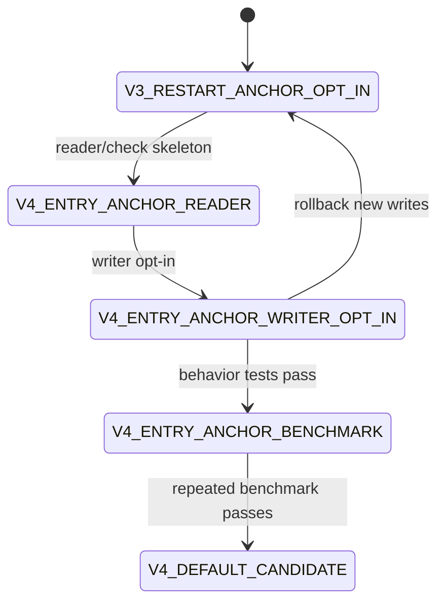

# LDB 0.12.0 SST Sparse Entry-Anchor Index Format Design

[中文](storage-format-0.12-entry-anchor-index-design.md) | English

## Background

The 0.10.x random-read workstream proved that building a lightweight in-memory index when a `Block` is opened, with one sparse anchor every four entries inside restart regions, lets `Block.seek` narrow its linear scan before decoding entries. This avoids the earlier full-entry index regression. The stable path reports `blockSeekIndexHits=50000`, `blockSeekIndexMisses=0`, and `blockSeekIndexFallbacks=0`, proving that random point reads do use the Block open-time seek index.

However, the default `readrandom_hit` path has not been proven stable above 50% of RocksDB JNI. The better recent 50k sample reached `179,215.195 ops/s`, while same-host RocksDB JNI reached `369,105.296 ops/s`, or `48.55%`. A rerun dropped to `23.55%` under local noise. Anchor interval experiments at `2/3/5/8` did not produce a retainable overall win, so continuing to tune the current in-memory anchor density has limited value.

The 0.11 v3 `block.local_index.v1` persisted local index uses restart anchors. A negative experiment showed that forcing single-key `Table.get(Slice)` through that persisted restart-anchor index drove `blockLocalIndexSeekCount=50000`, but dropped `readrandom_hit` from `192,795.093 ops/s` in the v3 opt-in sample without forced local-index usage to `123,006.344 ops/s`. Therefore the next file-format index must not simply reuse restart-anchor directories. It should persist something much closer to the effective in-memory form: sparse entry anchors plus `previousKey` or equivalent recovery data.

## Goals

| Goal | Meaning |
| --- | --- |
| Persist the effective index shape | Move the useful `Block` open-time sparse entry-anchor data into the SST format. |
| Avoid full-entry indexes | Do not store every entry, values, or predecode complete blocks. |
| Reduce Block open and seek cost | Let readers load/parse sparse entry-anchor indexes on demand instead of scanning data blocks to rebuild anchors. |
| Keep `readrandom_hit` primary | Any enablement must prioritize `readrandom_hit`, while checking sameblock, burst, scan, and MultiGet regressions. |
| Define compatibility and rollback | v1/v2/v3 SSTs remain readable; the new format is opt-in until evidence supports default enablement. |

## Non Goals

- Do not create a full-entry key/value index.
- Do not change data-block entry encoding, restart encoding, or InternalKey ordering.
- Do not replace the existing v3 restart-anchor local-index semantics directly; this is a new sub-format.
- Do not promise old readers can open new-format SSTs.
- Do not make scan/iterator load the entry-anchor index by default.

## Current State

| Path | Current Fact | Gap | This Design |
| --- | --- | --- | --- |
| `Block.seek` | Has open-time restart keys plus sparse entry anchors. | Building anchors still scans entries when the block is opened. | Persist anchors to reduce repeated build cost. |
| `Table.get` | Single-key path avoids table index seeks; `tableIndexSeeks=0`. | Remaining cost is data-block key decode/compare. | Use entry-near anchors to shorten seek decoding. |
| v3 block-local index | Persisted restart anchors can help dense MultiGet. | Forcing it into single-key gets regresses badly. | New format must encode entry offsets and previous-key recovery data. |
| `scan` | Does not use block seek indexes and reports zero counters. | Must not be slowed by index loading. | Iterators/scans do not load entry-anchor indexes by default. |

## Core Constraints

| Constraint | Requirement |
| --- | --- |
| JDK | Keep JDK 8 compatibility. |
| Encoding | Keep source and docs in UTF-8. |
| Format compatibility | New readers must read old SSTs; new SSTs use an incompatible feature marker. |
| Space amplification | Record bytes, covered blocks, and anchor count for release-gate limits. |
| Hot path cost | Extra directory lookups, index block decoding, or object creation must not erase the benefit. |
| Acceptance | `readrandom_hit >= 50% RocksDB JNI` is only a candidate gate; sameblock, burst, scan, and MultiGet must also be checked. |

## Interface Design

| API / Option | Default | Meaning |
| --- | --- | --- |
| `Options.tableFormatVersion()` | `1` | Candidate new value should be `4` to avoid confusion with v3 restart-anchor indexes. |
| `Options.writeEntryAnchorIndex()` | `false` | Explicit opt-in for sparse entry-anchor index writes. |
| `Options.entryAnchorIndexInterval()` | `4` | Matches the current stable in-memory setting: one anchor every four entries. |
| `Options.entryAnchorIndexAdmissionMinAnchors()` | `2` | Skip low-value blocks with fewer than two anchors. |

Suggested diagnostics:

| Property | Content |
| --- | --- |
| `ldb.sstReadStats` | Add `entryAnchorIndexTables`, `entryAnchorIndexSeekCount`, `entryAnchorIndexHitCount`, and `entryAnchorIndexFallbackCount`. |
| `ldb.tableFormat` | Record new-format tables, entry-anchor bytes, and covered blocks. |
| check/repair report | Record directory presence, handle bounds, anchor ordering, and previous-key recovery validity. |

## Data Structures

### Feature Set

| Feature | Type | Meaning |
| --- | --- | --- |
| `block.entry_anchor_index.v1` | incompatible | SST contains sparse entry-anchor indexes; unsupported readers must fail fast. |
| `table.properties` | compatible | Reuse the v2/v3 properties mechanism. |

### Properties Fields

| Key | Example | Meaning |
| --- | --- | --- |
| `ldb.table.entry_anchor_index` | `true` | Whether the SST contains entry-anchor indexes. |
| `ldb.table.entry_anchor_index.version` | `1` | Sub-format version. |
| `ldb.table.entry_anchor_index.interval` | `4` | Entry-anchor interval. |
| `ldb.table.entry_anchor_index.bytes` | `12345` | Total index bytes. |
| `ldb.table.entry_anchor_index.covered_blocks` | `128` | Number of covered data blocks. |
| `ldb.table.entry_anchor_index.anchor_count` | `4096` | Total anchors. |
| `ldb.table.entry_anchor_index.policy` | `sparse-entry-anchor` | Policy label. |

### Metaindex Layout

| Metaindex Key | Points To | Meaning |
| --- | --- | --- |
| `entry_anchor_index` | entry-anchor directory block | Maps data-block handles to entry-anchor index block handles. |

### Entry-Anchor Index Block

The first version can reuse normal block encoding to store anchor entries, prioritizing diagnostics. A denser binary layout should use a new version.

| Field | Encoding | Meaning |
| --- | --- | --- |
| anchor key | full internal key | Full internal key of the anchor entry for floor/lower-bound. |
| entry offset | varint/int text | Start offset of the anchor entry inside the data block. |
| previous key mode | enum | `NONE` when no previous key is needed; `FULL` when a previous full key is stored. |
| previous full key | bytes/base64 | Used to restore shared-key decoding state when the anchor entry has a shared prefix. |
| restart index | varint | Optional diagnostic field for anchor restart-region validation. |

Hard constraints:

- Do not store value offset or value length; do not return exact-hit values directly.
- Do not store every entry; store sparse anchors only.
- `previousKey` exists only to restore shared-key decoding from the anchor offset.
- After an anchor hit, the reader should use a path like `Block.seekFromOffset(target, offset, previousKey)` instead of scanning from the restart point.

## State Machine

## Sequence Flow

### Write

1. `TableBuilder` completes raw data-block encoding.
2. Scan the raw data block only to collect every-N-entry anchors.
3. For each anchor, store the full key, entry offset, required previous full key, and restart index.
4. Skip the block if it does not meet the admission threshold.
5. Write entry-anchor index blocks and the directory.
6. Declare `block.entry_anchor_index.v1` in properties and record bytes, covered blocks, and anchor count.
7. Write `entry_anchor_index` into the metaindex.

### Read

1. `Table` reads properties and detects `block.entry_anchor_index.v1`.
2. Scan/iterator paths do not load the directory by default.
3. After point get locates the data block, it loads the relevant entry-anchor index according to policy.
4. Find the floor anchor for the target key.
5. If present, resume sequential decoding from anchor offset plus previous-key state.
6. Missing, corrupt, or disallowed indexes follow fail-fast/fallback policy; before release, corrupt indexes should fail fast.

## Failure Handling

| Scenario | Handling |
| --- | --- |
| Feature declared but metaindex missing | Open fails; check reports `ENTRY_ANCHOR_INDEX_DIRECTORY_MISSING`. |
| Directory handle out of range | Open fails or check reports `ENTRY_ANCHOR_INDEX_HANDLE_OUT_OF_RANGE`. |
| Anchors unsorted | check reports `ENTRY_ANCHOR_INDEX_UNSORTED`; production read fails fast. |
| Previous key missing when anchor entry has shared prefix | check reports `ENTRY_ANCHOR_PREVIOUS_KEY_MISSING`; production read fails fast. |
| One block has no index | If full coverage is declared, fail fast; if partial coverage is declared, fall back. First version should record actual covered blocks after admission. |

## Idempotency

Reading entry-anchor indexes never changes SST files. check/repair runs should produce stable corruption classes. repair does not rebuild indexes in place by default; only explicit rebuild or compaction can create new-format SSTs.

## Rollback Strategy

| Stage | Rollback |
| --- | --- |
| Reader skeleton | Disable diagnostics; old SSTs are unaffected. |
| Writer opt-in | Set `writeEntryAnchorIndex=false` or lower `tableFormatVersion`; existing new-format SSTs still require a new reader. |
| Default candidate | Return to opt-in and document the no-downgrade boundary. |
| Performance regression | Stop default enablement and archive the negative benchmark evidence. |

## Compatibility

| Scenario | Requirement |
| --- | --- |
| New reader opens v1/v2/v3 | Required. |
| New reader opens entry-anchor SST | Supported when `block.entry_anchor_index.v1` is understood. |
| Old reader opens entry-anchor SST | Not promised; incompatible features prevent silent misreads. |
| Mixed DB | New readers must allow v1/v2/v3/v4 SSTs together. |
| backup/restore | Must preserve entry-anchor index blocks, directory, properties, and metaindex. |

## Rollout And Migration

| Stage | Content | Acceptance | Abort Condition |
| --- | --- | --- | --- |
| EA G0 | This design and Chinese copy | Format boundary is clear | Conflicts with existing v3 facts |
| EA G1 | reader/check skeleton | Feature and corruption classes recognized | Old SST read failure |
| EA G2 | writer opt-in | New-format SST can be written and read | check/repair cannot explain it |
| EA G3 | point get integration | Behavior matches existing results; stats visible | Any semantic test fails |
| EA G4 | 50k/200k benchmark | `readrandom_hit` is stably >= 50%; surrounding workloads do not regress meaningfully | Primary or surrounding workload regression |
| EA G5 | release gate | Adds format, performance, and space-amplification gates | Gate incomplete |

## Test Plan

| Type | Cases |
| --- | --- |
| Unit | anchor encode/decode, previous-key recovery, floor lookup, admission. |
| Behavior | v1/v2/v3/v4 get, MultiGet, iterator, snapshot cursor return identical results. |
| Corruption | missing directory, out-of-range handle, unsorted anchor, missing previous key, checksum error. |
| Performance | `readrandom_hit`, `readrandom_sameblock`, `readrandom_burst`, `multiget_mixed`, `scan`. |
| Space | index-bytes/data-block-bytes ratio and anchor-count/entry-count ratio. |
| Release | releaseGate adds entry-anchor format coverage and benchmark evidence. |

## Risks

| Risk | Severity | Mitigation |
| --- | --- | --- |
| `previousKey` causes too much space amplification | High | Record bytes and anchor count; set a release-gate upper bound; consider compressed recovery encoding later. |
| Extra directory/index-block lookup erases point-read gains | High | Lazy-load directory, cache index blocks, and prioritize 50k/200k `readrandom_hit`. |
| Scan slows due to index loading | Medium | Do not load entry-anchor indexes in scan/iterator paths. |
| Confusion with v3 restart-anchor format | High | Use new feature, properties keys, and metaindex key. |
| Exact-hit direct-return temptation returns | Medium | Explicitly forbid value storage/direct value return; anchors only narrow scans. |

## Phased Implementation Plan

| Phase | Priority | Deliverable | Acceptance |
| --- | --- | --- | --- |
| EA 01 | P0 | This design and Chinese copy | Docs landed and linked to readrandom evidence. |
| EA 02 | P0 | feature/properties/check skeleton | Old formats unaffected; new feature recognized. |
| EA 03 | P1 | writer opt-in | Directory and entry-anchor index blocks can be written. |
| EA 04 | P1 | `Block.seekFromOffset` previousKey API | Shared-prefix recovery covered by behavior tests. |
| EA 05 | P1 | Table point-get read path | Stats visible and behavior unchanged. |
| EA 06 | P1 | benchmark/release gate | Do not default-enable unless repeated evidence clears the bar. |

## Open Questions

| ID | Question | Default Recommendation |
| --- | --- | --- |
| EA OQ 01 | Store full previous key or compressed recovery fragment? | Store full previous key first to prove performance, then optimize space. |
| EA OQ 02 | Preload directory? | No; lazy-load on first point-get need. |
| EA OQ 03 | Support partial coverage? | Yes after admission, but properties must record covered blocks. |
| EA OQ 04 | Reuse normal Block encoding for index blocks? | Yes for v1; introduce binary layout only if needed. |
## EA Implementation Note

The 2026-06-21 EA 03/04/05 experiment completed the `tableFormatVersion=4` and `writeEntryAnchorIndex=true` write path, metaindex directory, properties, and reader recognition loop. Forcing point gets through the persisted entry-anchor index regressed the 50k `readrandom_hit` workload to `106,962.945 ops/s`, while the same-run RocksDB JNI result was `377,236.067 ops/s`, or only `28.35%`. After restoring the point-get hot path to the open-time `Block` seek index, the v4 opt-in result improved to `120,191.614 ops/s`, but still did not meet the retention bar.

Therefore the current conclusion is that the entry-anchor v4 format may remain as an opt-in/diagnostic foundation, but production point gets must not load the directory/index block by default. Any future hot-path integration must first introduce a lighter binary anchor block, a block-local anchor cache, or a path that avoids rebuilding anchors when opening data blocks, and then re-pass `readrandom_hit >= 50% RocksDB JNI` with no meaningful sameblock, burst, scan, or MultiGet regression.
