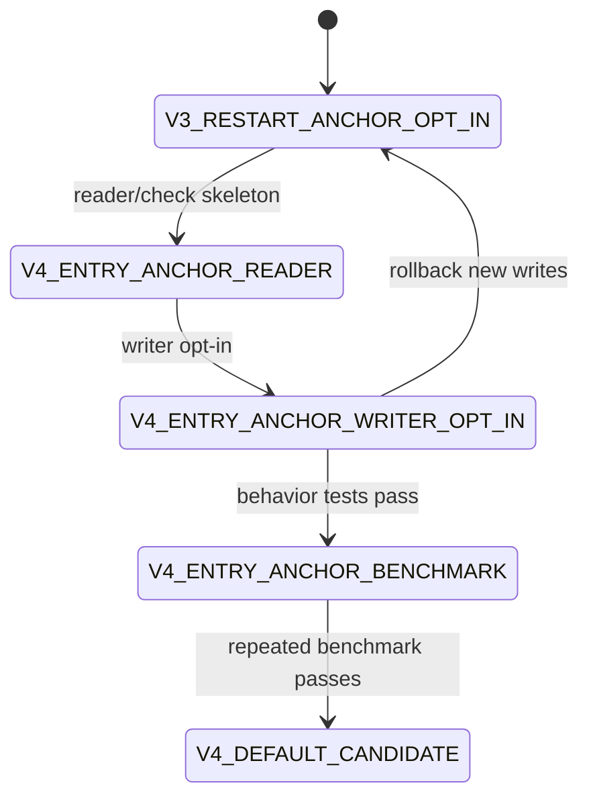

# LDB 0.12.0 SST 稀疏 entry-anchor 索引文件格式设计

[English](storage-format-0.12-entry-anchor-index-design.en.md) | 中文

## 背景

0.10.x 随机读专项已经证明：在 `Block` 打开时构建轻量内存索引，并在 restart 区间内每 4 条 entry 保存一个稀疏 anchor，可以让 `Block.seek` 先通过 anchor 缩小线性扫描范围，且不会引入 full-entry index 的预解码回退。当前稳定路径的关键统计为 `blockSeekIndexHits=50000`、`blockSeekIndexMisses=0`、`blockSeekIndexFallbacks=0`，说明随机点读确实走到了 Block open-time seek index。

但是当前默认路径的 `readrandom_hit` 仍未稳定达到 RocksDB JNI 的 50%。最新 50k 证据显示，较好样本为 `179,215.195 ops/s`，同机 RocksDB JNI 为 `369,105.296 ops/s`，比例 `48.55%`；复测样本受环境波动影响降至 `23.55%`。同时，`2/3/5/8` 等 anchor interval 调参均未形成可保留整体收益，说明继续调当前内存 anchor 密度价值有限。

0.11 v3 `block.local_index.v1` 的 persisted local index 采用 restart-anchor 粒度。负实验表明，把单点 `Table.get(Slice)` 强制接入该 persisted restart-anchor index 后，虽然 `blockLocalIndexSeekCount=50000`，但 `readrandom_hit` 从 v3 opt-in 未强制接入时的 `192,795.093 ops/s` 回退到 `123,006.344 ops/s`。因此，下一版文件格式不能简单复用 restart-anchor directory，而应持久化更接近当前有效内存索引的“稀疏 entry anchor + previousKey/等价恢复信息”。

## 目标

| 目标 | 说明 |
| --- | --- |
| 持久化当前有效索引形态 | 将 `Block` open-time sparse entry anchor 的关键定位信息前移到 SST 文件格式。 |
| 避免 full-entry index | 不保存每条 entry，不保存 value，不提前解码完整 block。 |
| 降低 Block 打开和 seek 成本 | Reader 可以按需加载/解析稀疏 entry-anchor 索引，减少打开时扫描 data block 构建 anchor 的成本。 |
| 保持 readrandom_hit 主指标优先 | 任何启用策略必须以 `readrandom_hit` 为主验收，同时约束 sameblock/burst/scan/MultiGet 不明显回退。 |
| 明确兼容和回滚边界 | v1/v2/v3 SST 继续可读；新格式 opt-in；未达标不得默认启用。 |

## 非目标

- 不做 full-entry key/value index。
- 不改变 data block 原有 entry 编码、restart 编码、InternalKey 排序语义。
- 不直接替换 v3 restart-anchor local index 的已存在语义；本设计是新子格式。
- 不承诺旧 reader 可读取新格式 SST。
- 不把 scan/iterator 默认接入 entry-anchor 索引。

## 现状/已有流程

| 路径 | 当前事实 | 不足 | 本设计方向 |
| --- | --- | --- | --- |
| `Block.seek` | 已有 open-time restart key + sparse entry anchor 内存索引 | anchor 构建仍需打开 block 时扫描 entry | 将 anchor 持久化，减少重复构建成本 |
| `Table.get` | 单点路径已避开 table index seek，`tableIndexSeeks=0` | 剩余瓶颈在 data block key 解码/比较 | 使用更贴近 entry 的 anchor 缩短 seek 解码窗口 |
| v3 block-local index | persisted restart-anchor，可服务 dense MultiGet | 单点强制使用会大幅回退 | 新格式必须表达 entry offset 与 previousKey 恢复信息 |
| `scan` | 不使用 block seek index，统计为 0 | 不能被索引加载拖慢 | iterator/scan 默认不加载 entry-anchor index |

## 核心约束

| 约束 | 要求 |
| --- | --- |
| JDK | 保持 JDK 8 兼容。 |
| 编码 | 源码和文档保持 UTF-8。 |
| 格式兼容 | 新 reader 必须继续读取旧 SST；新格式通过 incompatible feature 声明。 |
| 空间放大 | entry-anchor 索引必须记录 bytes、covered blocks、anchor count，用于 release gate 上限。 |
| 热路径成本 | 单点 get 不得因为额外目录查找、local-index block 解码或对象创建抵消收益。 |
| 验收 | `readrandom_hit >= 50% RocksDB JNI` 只是候选门槛，还必须看 sameblock/burst/scan/MultiGet。 |

## 接口设计

| API / 配置 | 默认值 | 说明 |
| --- | --- | --- |
| `Options.tableFormatVersion()` | `1` | 新格式候选值建议为 `4`，避免和 v3 restart-anchor 混淆。 |
| `Options.writeEntryAnchorIndex()` | `false` | 显式 opt-in 写入稀疏 entry-anchor 索引。 |
| `Options.entryAnchorIndexInterval()` | `4` | 与当前内存索引稳定点对齐，默认每 4 条 entry 一个 anchor。 |
| `Options.entryAnchorIndexAdmissionMinAnchors()` | `2` | 少于 2 个 anchor 的 data block 不写索引，避免低收益 metadata 污染。 |

诊断属性建议：

| 属性 | 内容 |
| --- | --- |
| `ldb.sstReadStats` | 增加 `entryAnchorIndexTables`、`entryAnchorIndexSeekCount`、`entryAnchorIndexHitCount`、`entryAnchorIndexFallbackCount`。 |
| `ldb.tableFormat` | 记录新格式 table 数、entry-anchor bytes、covered blocks。 |
| check/repair report | 记录目录存在性、handle 边界、anchor 有序性、previousKey 恢复字段合法性。 |

## 数据结构

### Feature set

| feature | 类型 | 说明 |
| --- | --- | --- |
| `block.entry_anchor_index.v1` | incompatible | SST 包含稀疏 entry-anchor 索引；不理解该 feature 的 reader 必须 fail-fast。 |
| `table.properties` | compatible | 复用 v2/v3 properties 机制。 |

### Properties 字段

| Key | 示例 | 含义 |
| --- | --- | --- |
| `ldb.table.entry_anchor_index` | `true` | 是否写入 entry-anchor 索引。 |
| `ldb.table.entry_anchor_index.version` | `1` | 子格式版本。 |
| `ldb.table.entry_anchor_index.interval` | `4` | entry anchor 间隔。 |
| `ldb.table.entry_anchor_index.bytes` | `12345` | 索引总字节数。 |
| `ldb.table.entry_anchor_index.covered_blocks` | `128` | 覆盖 data block 数。 |
| `ldb.table.entry_anchor_index.anchor_count` | `4096` | anchor 总数。 |
| `ldb.table.entry_anchor_index.policy` | `sparse-entry-anchor` | 策略说明。 |

### Metaindex 布局

| metaindex key | 指向 | 说明 |
| --- | --- | --- |
| `entry_anchor_index` | entry-anchor directory block | data block handle 到 entry-anchor index block handle 的映射。 |

### Entry-anchor index block

首版可以继续使用普通 block 编码承载 anchor entry，便于校验和调试；后续若二进制化，应使用新 version。

| 字段 | 编码 | 说明 |
| --- | --- | --- |
| anchor key | full internal key | anchor entry 的完整 internal key，用于 floor/lower-bound。 |
| entry offset | varint/int text | data block 内该 anchor entry 的起始 offset。 |
| previous key mode | enum | `NONE` 表示 anchor 是 restart 后第一条或 shared=0；`FULL` 表示保存 previous full key。 |
| previous full key | bytes/base64 | 当 anchor entry 依赖 shared prefix 时，用于从 anchor offset 直接恢复 key。 |
| restart index | varint | 可选诊断字段，用于校验 anchor 所属 restart 区间。 |

关键约束：

- 不保存 value offset/value length，不做 exact-hit direct return。
- 不保存每条 entry，只保存稀疏 anchor。
- previous key 只为从 anchor offset 恢复 shared-key 解码状态服务，不参与业务命中判断。
- Reader 命中 anchor 后调用类似 `Block.seekFromOffset(target, offset, previousKey)` 的路径，避免从 restart 开始扫描。

## 状态机

## 时序流程

### 写入

1. `TableBuilder` 完成 data block raw encoding。
2. 在 raw data block 上扫描 entry，仅采集每 N 条 entry 的 anchor。
3. 对每个 anchor 保存 full key、entry offset、必要 previous full key、restart index。
4. 若 anchor 数低于 admission 阈值，不写该 block 的 entry-anchor index。
5. 写 entry-anchor index block 和 directory。
6. properties 声明 `block.entry_anchor_index.v1`，并记录 bytes/covered blocks/anchor count。
7. metaindex 写入 `entry_anchor_index`。

### 读取

1. `Table` 打开 properties，识别 `block.entry_anchor_index.v1`。
2. 默认不为 scan/iterator 加载 directory。
3. 单点 get 定位 data block 后，按策略加载对应 entry-anchor index。
4. 在 entry-anchor index 中 floor 查找 target key。
5. 若 anchor 存在，从 anchor offset + previousKey 恢复状态后继续顺序 decode。
6. 若缺失、损坏或策略不允许，按 fail-fast/fallback 配置处理；发布前默认建议损坏 fail-fast，缺失仅在未声明覆盖时 fallback。

## 异常处理

| 场景 | 处理 |
| --- | --- |
| properties 声明 feature 但 metaindex 缺失 | 打开失败，check 报 `ENTRY_ANCHOR_INDEX_DIRECTORY_MISSING`。 |
| directory handle 越界 | 打开失败或 check 报 `ENTRY_ANCHOR_INDEX_HANDLE_OUT_OF_RANGE`。 |
| anchor 无序 | check 报 `ENTRY_ANCHOR_INDEX_UNSORTED`，生产读取 fail-fast。 |
| previousKey 缺失但 anchor entry 有 shared prefix | check 报 `ENTRY_ANCHOR_PREVIOUS_KEY_MISSING`，生产读取 fail-fast。 |
| 单个 block 未写索引 | 若 properties 声明全覆盖则 fail-fast；若声明 partial 则 fallback。首版建议 admission 后按实际 covered blocks 声明 partial。 |

## 幂等性

读取 entry-anchor index 不修改 SST。check/repair 多次运行应输出一致的损坏分类。repair 默认不原地重建索引；只有显式 rebuild/compaction 才能生成新格式 SST。

## 回滚策略

| 阶段 | 回滚 |
| --- | --- |
| reader skeleton | 删除/关闭诊断入口即可，旧 SST 不受影响。 |
| writer opt-in | 将 `writeEntryAnchorIndex=false` 或 `tableFormatVersion` 回退到旧值；已有新格式 SST 仍需新 reader。 |
| default candidate | 回退为 opt-in，并在 release notes 声明 no-downgrade 边界。 |
| 发现性能回退 | 停止默认开启，保留文档中的负实验和 benchmark 证据。 |

## 兼容性

| 场景 | 要求 |
| --- | --- |
| 新 reader 读 v1/v2/v3 | 必须支持。 |
| 新 reader 读 entry-anchor SST | 支持 `block.entry_anchor_index.v1` 时可读。 |
| 旧 reader 读 entry-anchor SST | 不承诺；必须通过 incompatible feature 避免静默误读。 |
| mixed DB | 新 reader 必须允许 v1/v2/v3/v4 混合存在。 |
| backup/restore | 必须保留 entry-anchor index blocks、directory、properties、metaindex。 |

## 灰度/迁移

| 阶段 | 内容 | 验收 | 中止条件 |
| --- | --- | --- | --- |
| EA G0 | 本设计文档和英文副本 | 文件格式边界清晰 | 与现有 v3 事实冲突 |
| EA G1 | reader/check skeleton | 能识别 feature 和损坏分类 | 旧 SST 读取失败 |
| EA G2 | writer opt-in | 新格式 SST 可写可读 | check/repair 无法解释 |
| EA G3 | point get 接入 | 行为一致，统计可见 | 任一语义测试失败 |
| EA G4 | 50k/200k benchmark | `readrandom_hit` 稳定 >= 50%，周边不明显回退 | 主指标或周边回退 |
| EA G5 | release gate | 增加格式/性能/空间放大门禁 | gate 不完整 |

## 测试方案

| 类型 | 用例 |
| --- | --- |
| 单元 | anchor encode/decode、previousKey 恢复、floor lookup、admission。 |
| 行为 | v1/v2/v3/v4 get、MultiGet、iterator、snapshot cursor 结果一致。 |
| 损坏 | missing directory、out-of-range handle、unsorted anchor、missing previousKey、checksum error。 |
| 性能 | `readrandom_hit`、`readrandom_sameblock`、`readrandom_burst`、`multiget_mixed`、`scan`。 |
| 空间 | index bytes/data block bytes 比例，anchor_count/entry_count 比例。 |
| 发布 | releaseGate 增加 entry-anchor format coverage 和 benchmark evidence。 |

## 风险点

| 风险 | 严重性 | 缓解 |
| --- | --- | --- |
| previousKey 字段导致空间放大过高 | 高 | 记录 bytes/anchor_count，上线前设置空间上限；必要时改为 shared-prefix recovery 编码。 |
| 单点 get 多一次 directory/index block 查找抵消收益 | 高 | directory lazy-load，index block 缓存，50k/200k 主指标优先。 |
| scan 被索引加载拖慢 | 中 | scan/iterator 默认不加载 entry-anchor index。 |
| 格式与 v3 restart-anchor 混淆 | 高 | 使用新 feature、新 properties key、新 metaindex key。 |
| 稀疏 anchor exact-hit direct return 诱惑复现 | 中 | 明确禁止保存 value/直接返回 value；只用于缩小扫描窗口。 |

## 分阶段实施计划

| 阶段 | 优先级 | 交付物 | 验收 |
| --- | --- | --- | --- |
| EA 01 | P0 | 本设计和英文副本 | 文档落地，链接 readrandom 证据。 |
| EA 02 | P0 | feature/properties/check skeleton | 旧格式不受影响，新 feature 可识别。 |
| EA 03 | P1 | writer opt-in | 能写 directory 和 entry-anchor index block。 |
| EA 04 | P1 | Block.seekFromOffset previousKey 接口 | 行为测试覆盖 shared-prefix anchor 恢复。 |
| EA 05 | P1 | Table point get read path | 统计可见，行为一致。 |
| EA 06 | P1 | benchmark/release gate | 未稳定过 50% 不默认开启。 |

## 开放问题

| 编号 | 问题 | 默认建议 |
| --- | --- | --- |
| EA OQ 01 | previousKey 保存 full key 还是压缩恢复片段？ | 首版 full previous key，先证明性能，再优化空间。 |
| EA OQ 02 | directory 是否预加载？ | 不预加载；point get 首次需要时 lazy-load。 |
| EA OQ 03 | 是否支持 partial coverage？ | 支持 admission 后的 partial，但 properties 必须记录 covered_blocks。 |
| EA OQ 04 | 是否复用普通 Block 编码承载 index block？ | 首版复用，便于校验；性能不足再引入二进制子格式。 |
## EA 实施备忘

2026-06-21 的 EA 03/04/05 实验已完成 `tableFormatVersion=4`、`writeEntryAnchorIndex=true` 的写入、metaindex directory、properties 和读侧识别闭环。点查读路径强制使用 persisted entry-anchor index 时，50k `readrandom_hit` 为 `106,962.945 ops/s`，同次 RocksDB JNI 为 `377,236.067 ops/s`，比例仅 `28.35%`，明显回退。将 point-get 热路径恢复为 open-time `Block` seek index 后，v4 opt-in `readrandom_hit` 为 `120,191.614 ops/s`，但仍未达到可保留标准。

因此当前结论是：entry-anchor v4 格式能力可保留为 opt-in/diagnostic 基础，但不得在生产点查热路径默认加载 directory/index block。后续若要重新接入热路径，必须先完成更轻量的 binary anchor block、block-local anchor cache，或避免 data block 打开时重建 anchor 的新路径，并重新通过 `readrandom_hit >= 50% RocksDB JNI` 及 sameblock/burst/scan/MultiGet 无明显回退的验收。
