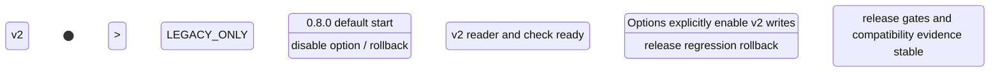

# LDB 0.8.0 Storage Format Evolution Design

[中文](storage-format-0.8-design.md) | English

## Background

`0.7.0` completed the random read performance workstream, deeper MultiGet SST batching, and release gates. The main goal of `0.8.0-SNAPSHOT` now shifts to improving the LDB file format, especially SST/table self description, format versioning, compatibility policy, migration/rollback boundaries, and release acceptance.

The current table/SST implementation already has a LevelDB style foundation: data blocks, index block, metaindex block, footer, block trailer CRC32C, optional filter block, optional LZ4 block compression, and in block key prefix compression with restart points. The gap is not the absence of a format foundation. The gap is the lack of a unified format version, feature set, properties block, cross file compatibility matrix, stable format reference, and observable metadata for check/repair/report.

## Goals

  Establish stable file format evolution boundaries and acceptance criteria for `0.8.0`.
  Define new SST/table capabilities: format version, feature set, properties block, filter metadata, compression metadata, sequence/key bounds, checksum coverage, and magic/version validation.
  Define compatibility matrices across WAL, MANIFEST, CURRENT, COLUMN-FAMILIES, backup metadata, and SST/table files.
  Guarantee that new versions can read old databases by default, and unknown incompatible features or future table format versions fail-fast instead of being silently misread.
  Make check/repair/report explain format versions, features, properties, checksums, and corruption classes.
  Split implementation into reviewable, rollback safe, testable phases.

## Non Goals

  Do not become compatible with native RocksDB/LevelDB on disk formats or promise that RocksDB tools can read LDB files.
  Do not rewrite WAL, MANIFEST, backup metadata, and all SST/table structures in one increment.
  Do not promise that older LDB versions can open databases written with the `0.8.0` new format.
  Do not persist the benchmark `read_optimized` profile as default format behavior.
  Do not change existing key ordering, sequence number, value type, range delete, or snapshot visibility semantics.

## Current State

| File/Structure | Current Fact | Main Gap | 0.8.0 Direction |
| --- | --- | --- | --- |
| SST/table footer | Fixed length footer with metaindex/index block handles and table magic number | No format version, feature set, or footer checksum | Keep legacy footer reads; add v2 footer later or record format info through meta properties |
| Data block | In block key prefix compression and restart points already exist | No per-block properties, prefix policy description, or compression stats | Document current encoding first, then summarize block stats in properties |
| Block trailer | 1 byte compression type plus 4 byte masked CRC32C | Checksum coverage exists, but error classification and reports are incomplete | Define checksum coverage and report block level failure classes |
| Metaindex block | uan map `filter.<policy>` to a filter block handle | No `properties`, format, compression/filter metadata | Add a `properties` meta entry pointing to a properties block |
| Filter block | Written when FilterPolicy is enabled | Filter parameters, bits per key, and prefix/full key semantics are not self described | Record filter policy, parameters, and scope in the properties block |
| Index block | Records data block handles using shortest separator/successor | No index type, partitioned index capability, or stats | First record index type=`binary search single level` |
| TableBuilder | Writes data/filter/metaindex/index/footer and supports conditional LZ4 compression | Entry count is only in builder memory and is not persisted as self description | Persist entry count, block count, compression/filter info in properties |
| Table reader | Reads footer, index, metaindex, filter block, and checksum as requested by options | Does not expose table properties; unknown new features have no unified behavior | Add properties reading and incompatible feature fail-fast |

## uore uonstraints

| uonstraint | Requirement |
| --- | --- |
| JDK | Keep JDK 8 compatibility |
| Encoding | Keep all documents, source files, and reports in UTF-8 |
| Default compatibility | `0.8.0` must open and read databases written by `0.7.0` and older versions by default |
| New format boundary | Newly written incompatible formats must carry version/feature markers; unsupported readers must fail-fast |
| Rollback | Options or format write policy must allow continued legacy format writes until new format gates are stable |
| Observability | check/repair/report must show file format version, features, properties, and checksum failure classes |
| Design first | Persistent format code changes must update this design and its English/uhinese counterpart first |

## Interface Design

### Options And Format Policy

| API | Type | Default | Meaning |
| --- | --- | --- | --- |
| `Options.tableFormatVersion()` | int | `1` or current compatible format | Controls new SST/table writes; v1 is current format, v2 adds properties/features |
| `Options.allowLegacyTableFormat()` | boolean | `true` | Allows reading legacy SST files |
| `Options.failOnUnknownTableFeature()` | boolean | `true` | Fails on unknown incompatible features or future table format versions to avoid silent misreads |
| `Options.writeTableProperties()` | boolean | `true` for v2 | Controls properties block writes; v1 does not write it |
Deferred API note: a broader `Options.tableFormatCompatibilityMode()` enum is intentionally not part of `0.8.0-SNAPSHOT`. This version keeps compatibility control explicit through `tableFormatVersion`, `writeTableProperties`, `allowLegacyTableFormat`, and `failOnUnknownTableFeature`.

### Properties And Reports

| Entry | uontent |
| --- | --- |
| `ldb.storageFormat` | Summarizes format versions and features across WAL/SST/MANIFEST/COLUMN-FAMILIES/backup metadata |
| `ldb.tableFormat` | Summarizes SST/table format version, properties block support, filter/compression/index type |
| `ldb.tableProperties.<file>` | Diagnostic per file view of key fields from the properties block |
| `LdbTool check` | Reports format version, unknown features, checksum failures, and properties read failures |
| `RELEASE-GATE-REPORT.json` | Adds `storageFormatGates` with legacy compatibility, new format read/write, mixed format, and repair/check results |

## Data Structures

### Table Format Version

| Version | State | Meaning |
| --- | --- | --- |
| v1 | legacy/current | Current format: footer + metaindex/index + optional filter, without a unified properties block |
| v2 | opt-in in 0.8.0-SNAPSHOT | Adds a properties block through metaindex; records format version, feature set, entries/blocks/filter/compression/checksum metadata |

### Feature Set

Features are split into compatible and incompatible features.

| Field | Type | Meaning |
| --- | --- | --- |
| `compatibleFeatures` | string set | Features that can be ignored without affecting correctness, such as diagnostic properties |
| `incompatibleFeatures` | string set | Features that may cause misreads if ignored, such as new block encodings or partitioned indexes/filters |
| `formatVersion` | int | Main table format version |
| `minReaderVersion` | string/int | Minimum reader version; concrete encoding is decided during implementation |
| `createdBy` | string | Writer version, for example `0.8.0-SNAPSHOT` |

Recommended initial features:

| Feature | Type | Initial v2 State | Meaning |
| --- | --- | --- | --- |
| `table.properties` | compatible | enabled | Adds the properties block |
| `block.trailer.crc32c` | compatible | enabled | Records current block trailer checksum semantics |
| `index.single level` | compatible | enabled | Current index block type |
| `filter.full key` | compatible | optional | Current full user key filter semantics |
| `compression.lz4 block` | compatible | optional | Current block level LZ4 compression |
| `index.partitioned` | incompatible | deferred | Partitioned index is future work |
| `filter.partitioned` | incompatible | deferred | Partitioned filter is future work |
| `block.encoding.v2` | incompatible | deferred | Any changed block entry encoding must be incompatible |

### Properties Block Fields

The properties block should initially reuse block key/value encoding. Keys are UTF-8 text; values use UTF-8 text or fixed little endian/varint encodings. The first version should prefer diagnostic, tool friendly UTF-8 values.

| Key | Example | Meaning |
| --- | --- | --- |
| `ldb.format.table.version` | `2` | Table format version |
| `ldb.format.created_by` | `vexra-ldb/0.8.0-SNAPSHOT` | Writer version |
| `ldb.format.compatible_features` | `table.properties,block.trailer.crc32c,index.single level` | Compatible features |
| `ldb.format.incompatible_features` | `` | Incompatible features; empty means no new incompatible encoding in initial v2 |
| `ldb.table.entry_count` | `123456` | SST entry count |
| `ldb.table.data_block_count` | `128` | Data block count |
| `ldb.table.index_type` | `single level` | Index type |
| `ldb.table.filter_policy` | `builtin bloom` or empty | Filter policy name |
| `ldb.table.filter_scope` | `full key` | Filter semantic scope |
| `ldb.table.compression` | `none,lz4` | uompression types present in the file |
| `ldb.table.smallest_key` | base64 | Smallest internal key |
| `ldb.table.largest_key` | base64 | Largest internal key |
| `ldb.table.checksum` | `crc32c block trailer` | Checksum strategy |

### Metaindex uontract

| Metaindex Key | Points To | Meaning |
| --- | --- | --- |
| `filter.<policy>` | filter block | Existing contract |
| `properties` | properties block | New in v2; old readers ignore unknown metaindex entries |
| `format` | optional format block | Not written in the first version unless footer v2 requires it |

## State Machine

Illegal transitions:

  Do not enable the v2 reader by default before old database compatibility tests pass.
  Do not allow v2 writes before check/repair/report can recognize the format.
  Keep an explicit legacy write mode before making v2 writes the default.

## Sequence Flow

### Writing a v2 SST

1. TableBuilder writes data blocks using the current flow.
2. Write the filter block if a filter policy is enabled.
3. Collect entry count, data block count, compression, filter, smallest/largest key, and feature set.
4. Write the properties block.
5. Write the metaindex block containing `filter.<policy>` and `properties`.
6. Write the index block.
7. Write the footer. Initially prefer keeping the v1 compatible footer layout and using properties to indicate v2; footer v2 requires a separate phase.

### Reading an SST

1. Read footer and magic number.
2. Open index and metaindex blocks.
3. Try to read the `properties` meta entry; if absent, classify the table as v1 legacy.
4. Validate `formatVersion` and `incompatibleFeatures`.
5. Fail fast if `formatVersion` is newer than the current reader support range, or if any unknown incompatible feature exists.
6. If validation passes, use the current table iterator and block-cache path.

### check/repair

1. Scan SST footer, metaindex, properties, index, data/filter blocks.
2. Summarize format version, features, missing properties, checksum errors, out of range block handles, and filter/properties decode failures.
3. repair must not automatically rewrite between formats. It should generate plans and safe recommendations unless the user explicitly asks for rebuild.

## Failure Handling

| Scenario | Handling |
| --- | --- |
| Missing properties block | Treat as v1 legacy table and continue |
| uorrupt properties block | Fail open only if strict validation is disabled; check reports `TABLE_PROPERTIES_uORRUPT` |
| Unknown compatible feature | Log/report warning and continue |
| Unknown incompatible feature | Fail fast with file name and feature name |
| Future table format version | Fail fast with file name, actual version, and current reader support limit |
| Malformed table format version | Fail fast with `Invalid table format version` and the raw value |
| Checksum mismatch | Throw IO error; check reports block offset, size, and type |
| Out of range block handle | Fail open/check and report `BLOCK_HANDLE_OUT_OF_RANGE` |
| Filter parameters conflict with runtime Options | Disable filter fast path, fall back to index/data reads, and report diagnostics |

## Idempotency

  Reading properties does not modify database files.
  check/repair/report should produce stable format diagnostics across repeated runs.
  v2 writes only affect newly generated SSTs; existing v1 SSTs are not rewritten in place.
  Compaction may be used as format migration, but only by generating new SSTs and atomically switching MANIFEST references.

## Rollback Strategy

| Stage | Rollback |
| --- | --- |
| Read only properties reader | Disable property/report entry points; existing data is unaffected |
| v2 opt-in writes | Disable `tableFormatVersion=2`; future flush/compaction writes v1, while existing v2 SSTs still require the current reader |
| v2 default writes | Restore v1 as default; do not promise older binaries can open already written v2 SSTs; use checkpoint/backup before binary rollback |
| v2 corruption discovered | Stop compaction/writes, run check for classification, restore from checkpoint/backup if needed |

## Compatibility

| Scenario | Requirement |
| --- | --- |
| New version opens old DB | Required |
| New version checks old DB | Required; old SSTs are reported as v1 legacy |
| New version writes old format | Required at least throughout 0.8.0 |
| Old version opens DB after v2 writes | Not promised; release notes must state the no downgrade boundary |
| Mixed v1/v2 SSTs | New version must read mixed files in the same DB |
| backup/restore | Must preserve properties and feature information; check after restore can explain the format |

## Rollout And Migration

| Stage | uontent | Acceptance | Abort uondition |
| --- | --- | --- | --- |
| SF G0 | Land this design and English/uhinese copy | uomplete docs and clear target | uonflicts with current format facts |
| SF G1 | Storage format reference docs | Current WAL/SST/MANIFEST/backup formats documented | Existing files cannot be explained |
| SF G2 | v1 properties reader preparation | No format writes; missing properties recognized | Old DB open fails |
| SF G3 | v2 properties block opt-in writes | New format read/write and mixed v1/v2 tests pass | check/repair cannot explain v2 |
| SF G4 | release gate integration | storageFormatGates record old DB, new DB, mixed DB, corrupted DB | Any compatibility gate fails |
| SF G5 | v2 default write review | At least one release candidate evidence round is stable | Unclassified performance or compatibility regression |

## Test Plan

| Type | uases |
| --- | --- |
| Unit | Footer/metaindex/properties block encode/decode; feature set parsing; unknown feature classification; future format-version fail-fast |
| Compatibility | Open/check/backup/restore `0.7.0` fixtures; mixed v1/v2 SST reads |
| Corruption | Truncated properties block, CRC error, out of range block handle, malformed table format version, unknown incompatible feature, future table format version |
| Behavior | v1/v2 get, iterator, snapshot cursor, range delete, and MultiGet return identical results |
| Performance | readrandom, multiget_random, and cold_readrandom do not regress materially due to properties reads |
| Release gate | Add `storageFormatGates` with legacyOpen, v2ReadWrite, mixedFormat, and corruptionCheck |

## Risks

| Risk | Severity | Mitigation |
| --- | --- | --- |
| New format causes older versions to misread | High | Require version/feature markers and document no downgrade boundaries in release notes |
| Properties fields freeze too early | Medium | Freeze key semantics, not the full field set; allow additive fields |
| v2 writes affect read performance | Medium | Read properties once when opening a table; never decode them on every get |
| Filter metadata conflicts with runtime Options | High | Disable filter fast path on conflict; never allow missed reads |
| Compaction based migration is complex | High | Never rewrite in place; migrate only through new SSTs plus atomic MANIFEST switch |
| check/repair reports are insufficient | Medium | Complete error classification before opt-in v2 writes |

## Phased Implementation Plan

| Phase | Priority | uontent | Deliverable | Acceptance |
| --- | --- | --- | --- | --- |
| SF 01 | P0 | File format reference docs | `docs/storage-format.md`, `docs/storage-format.en.md` | WAL/SST/MANIFEST/CURRENT/COLUMN-FAMILIES/backup metadata fields and compatibility documented |
| SF 02 | P0 | Table properties block design and reader | `TableProperties` data structure, metaindex `properties` reader | Old SSTs are v1; new properties read without affecting old DBs |
| SF 03 | P0 | Format version and feature set | `formatVersion`, compatible/incompatible feature parsing | Unknown incompatible feature and future format-version fail-fast tests pass |
| SF 04 | P1 | v2 opt-in writes | TableBuilder writes properties block; Options controls v2 | v2 read/write, mixed v1/v2, check/report pass |
| SF 05 | P1 | check/repair/report integration | `ldb.storageFormat`, `ldb.tableFormat`, release gate `storageFormatGates` | release gate includes format evidence |
| SF 06 | P1 | Backup metadata schema hardening | backup metadata schema version, chain/generation design | backup/restore preserve and explain format information |
| SF 07 | P2 | Partitioned index/filter preview | Design only, not default implementation | Decide whether it enters 0.9.0 |

## Open Questions

| ID | Question | Default Recommendation |
| --- | --- | --- |
| SF OQ 01 | Should v2 keep the v1 footer layout or introduce footer v2 magic? | Initial 0.8.0 keeps the v1 footer and uses properties to indicate v2; footer v2 is separate design |
| SF OQ 02 | Should `tableFormatVersion=2` be default in 0.8.0? | Start opt-in; review default only after at least one release candidate evidence round |
| SF OQ 03 | Should properties values be UTF-8 text or binary varints? | Use UTF-8 text first for diagnostics; binary encode hot fields later if needed |
| SF OQ 04 | Should older versions open new format DBs? | No promise; guarantee new versions open old DBs and fail-fast on unknown features |
| SF OQ 05 | Should backup metadata land together with SST v2? | Design in the same version, implement in phases; do not block the first SST properties increment |

## Current Conclusion

The right `0.8.0-SNAPSHOT` entry point is not rewriting the entire storage layer. It is establishing format versioning, properties blocks, feature sets, compatibility matrices, and check/repair/report evidence while preserving the stable `0.7.0` read/write path. This creates the foundation for later partitioned index/filter, additional compression strategies, backup schema evolution, and stricter manifest feature management.
## SF 01 Completion Record

Added current format reference documents:

  `docs/storage-format.md`
  `docs/storage-format.en.md`

Coverage includes file naming, CURRENT, WAL physical format, WAL logical records, InternalKey, MANIFEST/VersionEdit, SST/table v1, COLUMN-FAMILIES, backup metadata, check/repair behavior, and current format gaps.

SF 01 conclusion: current format facts now have a unified reference entry. SF 02/SF 03 can build on this baseline to implement the table properties block reader, format version, and feature set.
## SF 02/SF 03 Reader Skeleton Completion Record

Completed the reader side skeleton for table properties and feature sets:

  Added `net.xdob.vexra.ldb.table.TableProperties`.
  `Table` now tries to read a properties block through the metaindex `properties` entry when opening an SST.
  Old SSTs without a `properties` entry are classified as `formatVersion=1`, `legacy=true`.
  `ldb.format.table.version`, `ldb.format.compatible_features`, and `ldb.format.incompatible_features` are parsed at table open time.
  Unknown incompatible features and future table format versions fail-fast by default, preventing new encodings from being silently misread by the old read path.
  Added reader side protection switches: `Options.allowLegacyTableFormat(boolean)` and `Options.failOnUnknownTableFeature(boolean)`.
  `Tableuache#getTableProperties(long)` is available for later check/repair/report integration.

Current boundary: this increment implemented only the reader and validation skeleton and did not change the default SST/table write format; later 0.8 increments added v2 opt-in properties writes.
## SF 04 Opt-In Writer Skeleton uompletion Record

uompleted the opt-in writer skeleton for v2 properties blocks:

  Added `Options.tableFormatVersion(int)`, currently allowing `1` or `2`, defaulting to `1`.
  Added `Options.writeTableProperties(boolean)`, defaulting to `true`, but properties blocks are written only when `tableFormatVersion=2`.
  `TableBuilder` writes a regular block encoded properties block in v2 opt-in mode and adds a `properties` entry to the metaindex.
  The properties block currently records format version, created_by, compatible/incompatible features, entry count, data block count, index type, filter policy/scope, compression, smallest/largest key, and checksum strategy.
  The initial v2 `incompatible_features` set is empty because current block/index/filter encodings remain unchanged.

Current boundary: v2 writes remain opt-in. The default table format is still v1, and old databases plus old write paths remain unchanged. Focused tests, check/repair/report evidence, backup metadata schema evidence, plugin read-only option visibility, and release gate `storageFormatGates` have been connected; final release still requires executing Gradle validation.
## SF 04 Focused Test Addendum

Added `src/test/java/net/xdob/vexra/ldb/table/TablePropertiesTest.java`, covering:

  SSTs written with default `Options` are classified as v1 legacy and contain no properties fields.
  SSTs written with explicit `Options.tableFormatVersion(2)` can read back the properties block.
  v2 properties include format version, compatible features, entry count, data block count, index type, checksum, and related fields.
  Unknown incompatible features and future table format versions fail-fast by default, while disabling `failOnUnknownTableFeature` allows diagnostic reads.
  `Options.tableFormatVersion` rejects unsupported version numbers.

Current status: test code is in place, but Gradle validation has not been run in this turn.
## SF 05 Diagnostic Property First Increment

uompleted the first storage format diagnostic property increment:

  Added `VersionSet#tableFormatStats()`, summarizing table format information for all SSTs in the current Version.
  Added `VersionSet#storageFormatStats()`, summarizing current format policy for table/WAL/MANIFEST/CURRENT/COLUMN-FAMILIES/backup metadata.
  Added `ldb.tableFormat` and `ldb.storageFormat` to `LDbImpl#getProperty`.
  Extended `LdbObservabilityTest` to cover default v1 legacy and v2 opt-in properties diagnostics.

Current boundary: runtime properties are now complemented by offline check/repair report fields and release gate `storageFormatGates`. Finer block-level checksum error classification remains deferred to a later file-format increment.
## SF 05 Check Report Field uompletion Record

Storage format evidence is now connected to offline check reports:

  `CheckReport` adds a `storageFormat` JSON field summarizing current table/WAL/MANIFEST/CURRENT/COLUMN-FAMILIES/backup metadata format policy.
  `CheckReport` adds a `tableFormats` JSON field recording per SST formatVersion, legacy flag, and compatible/incompatible features.
  `CheckReport` adds `legacyTables`, `v2Tables`, and `incompatibleTables` counters.
  `LdbTool check` reuses `CheckReport#toJson()`, so uLI check output includes these fields as well.
  `LdbVerifyCheckTest` covers storage format evidence in check reports for v2 opt-in SSTs.

Current boundary: repair reports now have dedicated structured storage format fields. The release gate `storageFormatGates` group is connected and reuses the unit gate for table/check/repair/backup schema coverage.
## SF 05 Release Gate Integration uompletion Record

Gradle `releaseGate` now includes a `storageFormatGates` group:

- `storageFormatDocs`: requires the Chinese and English `docs/storage-format*.md`, `docs/storage-format-0.8-design*.md`, `docs/storage-format-0.8-acceptance*.md`, README, user manual, operations runbook, and Options API contract to exist and include table/backup/repair/mixed-format/malformed-version/future-version/rollback, `ldb.tableFormat`, `ldb.storageFormat`, `CheckReport.storageFormat`, `RepairReport.storageFormat`, `Options.tableFormatVersion`, `OptionsView.failOnUnknownTableFeature`, and `diagnostic-only` keywords.
- `tablePropertiesUnitCoverage`: reuses the unit gate and requires tests such as `TablePropertiesTest` to pass, covering v1 legacy behavior, v2 opt-in properties, malformed/future format-version fail-fast, and incompatible-feature fail-fast behavior.
- `checkReportStorageFormatEvidence`: reuses the unit gate and requires `LdbVerifyCheckTest` check-report storage-format evidence to pass.
- `mixedFormatCheckCoverage`: reuses the unit gate and requires `LdbVerifyCheckTest` coverage for mixed v1/v2 SST `legacyTables/v2Tables/tableFormats` evidence in one database directory.
- `repairReportStorageFormatEvidence`: reuses the unit gate and requires `LdbToolTest` coverage for repair and repair-plan `storageFormat/tableFormats` report fields, plus `LdbRepairTest` coverage for v2 SST repair format preservation evidence.
- `backupMetadataSchemaCoverage`: reuses the unit gate and requires `LdbBackupTest` coverage for `BACKUP-MANIFEST.json` and `OBJECT-REFS.json` schema fields.
- `defaultLegacyWritePolicy`: records that default writes remain table format v1 and v2 properties blocks require explicit opt-in.

`storageFormatGates` now contributes to the overall release-gate PASS/FAILED result and is emitted in both `RELEASE-GATE-REPORT.json` and `RELEASE-GATE-REPORT.md`.
## SF 06 Backup Metadata Schema Implementation

  `BACKUP-MANIFEST.json` now includes `schemaVersion=backup-metadata-v2`, stable `chainId`, and `generation` to identify backup chains and generations.
  `OBJECT-REFS.json` now includes `schemaVersion=backup-object-refs-v2`, `objectStoreVersion=1`, and `generatedBy=vexra-ldb`, defining a schema boundary for future object reference migrations.
  Incremental backups inherit `chainId` from the parent manifest when possible. If the parent manifest cannot be read, the code falls back to the parent directory name so legacy backup chain operations remain available.
  Regression coverage: `LdbBackupTest.shouldureateIncrementalBackupManifestAndRestoreLatestView` verifies manifest schema, stable chain identity, generation fields, parent backup fields, and object reference schema.
## 0.9.0-SNAPSHOT SF-06 Production Switch

SF-06 does not change the on-disk format. It adds production observability through `ldb.tableFormatPolicy`, which puts the v2 write switch, properties writing, legacy v1 read policy, unknown/future-format fail-fast policy, and the rollback action for new writes into one diagnostic line.

The release gate adds `tableFormatPolicyCoverage`, requiring tests to prove default v1 writes, explicit opt-in for v2 writes, rollback by restoring `tableFormatVersion=1`, and the rule that diagnostic-only reads are not a production rollback strategy.

## RR-01 Completion Record: Bloom/Filter Block Random-Read Short Circuit

This version keeps the LevelDB-style full user key filter semantics: when a `FilterPolicy` is configured, `TableBuilder` collects distinct user keys and writes a `filter.<policyName>` metaindex entry; `Table` loads the filter block only when Options provide the matching policy. The read path calls `TableCache.mayContain` before opening candidate SST iterators in Level0, LevelN, and MultiGet. When Bloom returns false, the read records `filterSkips` and skips the table iterator.

The release gate adds `filterBlockCoverage`, requiring `LdbObservabilityTest` to prove that a BloomFilterPolicy-backed SST produces `mayContainFalse` and `filterSkips>0` for an in-range missing key. The compatibility boundary is unchanged: missing filters, absent policy configuration, or policy-name mismatches conservatively return may-contain=true so diagnostic optimization cannot cause missed reads.
