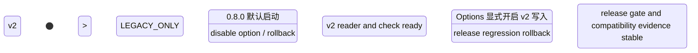

# LDB 0.8.0 文件格式演进设计

[English](storage-format-0.8-design.en.md) | 中文

## 背景

`0.7.0` 已完成随机读性能专项、MultiGet SST 批量优化和发布前 gate。`0.8.0-SNAPSHOT` 的主目标切换为完善和改进 LDB 文件格式，尤其是 SST/table 自描述能力、格式版本、兼容策略、迁移/回滚边界和发布验收。

当前 table/SST 实现已经具备 LevelDB 风格的基础结构：data block、index block、metaindex block、footer、block trailer CRC32C、可选 filter block、可选 LZ4 block compression，以及 block 内 key 前缀压缩和 restart points。缺口不在“完全没有格式基础”，而在缺少统一的格式版本、feature set、properties block、跨文件类型兼容矩阵、文件格式参考文档和面向 check/repair/report 的可观测元信息。

## 目标

  为 `0.8.0` 建立稳定的文件格式演进边界和验收标准。
  明确 SST/table 新格式能力：format version、feature set、properties block、filter 元信息、compression 元信息、sequence/key 范围、checksum 覆盖和 magic/version 校验。
  明确 WAL、MANIFEST、CURRENT、COLUMN-FAMILIES、backup metadata 与 SST/table 的兼容矩阵。
  保证新版本默认可读旧库，遇到未知不兼容 feature 或未来 table format version 必须 fail-fast，不允许静默误读。
  让 check/repair/report 能解释格式版本、feature、properties、checksum 和损坏分类。
  为后续实现拆出可评审、可回滚、可测试的阶段。

## 非目标

  不兼容 RocksDB/LevelDB 原生磁盘格式，不承诺 RocksDB 工具可直接读取 LDB 文件。
  不在一个增量内同时重写 WAL、MANIFEST、backup metadata 和 SST/table 所有格式。
  不承诺旧版本 LDB 可以打开 `0.8.0` 新格式写出的库。
  不把 benchmark profile 的 `read_optimized` 参数直接固化成默认格式行为。
  不改变已有 key 排序、sequence number、value type、range delete 和 snapshot 可见性语义。

## 现状/已有流程

| 文件/结构 | 当前事实 | 主要不足 | 0.8.0 方向 |
| --- | --- | --- | --- |
| SST/table footer | 固定长度 footer，包含 metaindex/index block handle 和 table magic number | 无 format version、feature set、footer checksum | 保留旧 footer 读取；新增 v2 footer 或通过 meta properties 记录格式信息 |
| data block | block 内已做 key 前缀压缩和 restart points | 缺少 per-block 属性、prefix 策略自描述、压缩统计 | 先文档化现有编码，再在 properties 中汇总 block 统计 |
| block trailer | 1 字节 compression type + 4 字节 masked CRC32C | checksum 覆盖粒度已有，但错误分类和 report 不够完整 | 明确 checksum 覆盖范围，check/repair 输出 block 级错误分类 |
| metaindex block | 当前可记录 `filter.<policy>` 到 filter block handle | 缺少 `properties`、format、compression/filter 参数元信息 | 增加 `properties` meta entry，指向 properties block |
| filter block | 启用 FilterPolicy 时写入 filter bytes | filter 参数、bits per key、prefix/full key 语义不自描述 | 在 properties block 记录 filter policy、参数和适用语义 |
| index block | 记录 data block handle，使用 shortest separator/successor | 缺少 index type、分区索引能力和统计 | 0.8.0 先记录 index type=`binary search single level` |
| TableBuilder | 写 data/filter/metaindex/index/footer，支持 LZ4 条件压缩 | entry count 只在构建器内存中，不落入文件自描述属性 | 将 entry count、block count、compression/filter 信息落入 properties block |
| Table reader | 读取 footer、index、metaindex、filter block，按 options 校验 checksum | 未暴露 table properties，未知新 feature 行为未统一 | 新增 properties 读取路径和不兼容 feature fail-fast |

## 核心约束

| 约束 | 要求 |
| --- | --- |
| JDK | 保持 JDK 8 兼容，不引入高版本 API |
| 编码 | 所有文档、源码、报告保持 UTF-8 |
| 默认兼容 | `0.8.0` 必须默认打开并读取 `0.7.0` 及更早版本写出的库 |
| 新格式边界 | 新写出的不兼容格式必须带 version/feature 标记，旧工具或不支持的新工具必须 fail-fast |
| 可回滚 | 通过 Options 或格式写入策略允许继续写旧格式，直到新格式 gate 稳定 |
| 可观测 | check/repair/report 必须能展示文件格式版本、feature、properties、checksum 错误分类 |
| 先文档后代码 | 涉及持久化格式的代码修改前必须先更新本文档和英文副本 |

## 接口设计

### Options 与格式策略

| 接口 | 类型 | 默认值 | 说明 |
| --- | --- | --- | --- |
| `Options.tableFormatVersion()` | int | `1` 或当前兼容格式 | 控制新 SST/table 写入格式；v1 代表现有格式，v2 代表带 properties/feature set 的新格式 |
| `Options.allowLegacyTableFormat()` | boolean | `true` | 允许读取旧格式 SST |
| `Options.failOnUnknownTableFeature()` | boolean | `true` | 遇到未知不兼容 feature 或未来 table format version 时失败，避免静默误读 |
| `Options.writeTableProperties()` | boolean | `true` for v2 | 控制是否写 properties block；v1 不写 |
暂缓接口说明：更宽的 `Options.tableFormatCompatibilityMode()` enum 不进入 `0.8.0-SNAPSHOT`。本版本继续通过 `tableFormatVersion`、`writeTableProperties`、`allowLegacyTableFormat` 和 `failOnUnknownTableFeature` 这几个显式开关控制兼容边界。

### Property 与报告入口

| 入口 | 内容 |
| --- | --- |
| `ldb.storageFormat` | 汇总当前库目录中 WAL/SST/MANIFEST/COLUMN-FAMILIES/backup metadata 的格式版本和 feature 摘要 |
| `ldb.tableFormat` | 汇总 SST/table format version、properties block 支持、filter/compression/index 类型 |
| `ldb.tableProperties.<file>` | 调试入口，按文件展示 properties block 中的核心字段 |
| `LdbTool check` | 输出格式版本、未知 feature、checksum 错误、properties 读取失败分类 |
| `RELEASE-GATE-REPORT.json` | 增加 `storageFormatGates` 分组，记录旧库兼容、新格式读写、混合格式、repair/check 结果 |

## 数据结构

### Table format version

| 版本 | 状态 | 说明 |
| --- | --- | --- |
| v1 | legacy/current | 当前格式：footer + metaindex/index + optional filter，无统一 properties block |
| v2 | 0.8.0-SNAPSHOT opt-in | 在 metaindex 中加入 properties block；记录 format version、feature set、entry/block/filter/compression/checksum 等元信息 |

### Feature set

feature 分为兼容 feature 和不兼容 feature：

| 字段 | 类型 | 说明 |
| --- | --- | --- |
| `compatibleFeatures` | string set | 不理解也不影响正确读取的能力，例如诊断性 properties 字段 |
| `incompatibleFeatures` | string set | 不理解会导致误读或漏读的能力，例如新的 block 编码、partitioned index/filter |
| `formatVersion` | int | table format 主版本 |
| `minReaderVersion` | string/int | 最低读取器版本，待实现时确定编码 |
| `createdBy` | string | 写入 LDB 版本，例如 `0.8.0-SNAPSHOT` |

建议首批 feature：

| feature | 类型 | v2 首批状态 | 说明 |
| --- | --- | --- | --- |
| `table.properties` | compatible | enabled | 新增 properties block |
| `block.trailer.crc32c` | compatible | enabled | 记录当前 block trailer checksum 语义 |
| `index.single level` | compatible | enabled | 当前 index block 类型 |
| `filter.full key` | compatible | optional | 当前 filter 以 user key 建 full key filter |
| `compression.lz4 block` | compatible | optional | 当前 block 级 LZ4 压缩 |
| `index.partitioned` | incompatible | deferred | 分区索引后续再做 |
| `filter.partitioned` | incompatible | deferred | 分区 filter 后续再做 |
| `block.encoding.v2` | incompatible | deferred | 如果改变 block entry 编码，必须作为不兼容 feature |

### Properties block 字段

properties block 建议继续使用 block key/value 编码，key 为 UTF-8 文本，value 使用 UTF-8 或固定 little endian/varint 编码；首版优先选择可诊断、易兼容的 UTF-8 文本值。

| Key | 示例 | 含义 |
| --- | --- | --- |
| `ldb.format.table.version` | `2` | table format version |
| `ldb.format.created_by` | `vexra-ldb/0.8.0-SNAPSHOT` | 写入版本 |
| `ldb.format.compatible_features` | `table.properties,block.trailer.crc32c,index.single level` | 兼容 feature 列表 |
| `ldb.format.incompatible_features` | `` | 不兼容 feature 列表，空表示 v2 首批没有新不兼容编码 |
| `ldb.table.entry_count` | `123456` | SST entry 数量 |
| `ldb.table.data_block_count` | `128` | data block 数量 |
| `ldb.table.index_type` | `single level` | index 类型 |
| `ldb.table.filter_policy` | `builtin bloom` 或空 | filter policy 名称 |
| `ldb.table.filter_scope` | `full key` | filter 语义范围 |
| `ldb.table.compression` | `none,lz4` | 文件内实际出现的压缩类型 |
| `ldb.table.smallest_key` | base64 | 最小 internal key，避免直接写不可见字节 |
| `ldb.table.largest_key` | base64 | 最大 internal key |
| `ldb.table.checksum` | `crc32c block trailer` | checksum 策略 |

### Metaindex 约定

| metaindex key | 指向 | 说明 |
| --- | --- | --- |
| `filter.<policy>` | filter block | 保持现有约定 |
| `properties` | properties block | v2 新增，旧 reader 不理解时会忽略 metaindex entry |
| `format` | 可选 format block | 首版不单独写，除非 footer v2 设计需要 |

## 状态机

非法转换：

  未完成旧库兼容测试，不得开启 v2 reader 默认路径。
  未完成 check/repair/report 识别，不得允许 v2 写入。
  v2 写入默认开启前必须保留显式 legacy write mode。

## 时序流程

### 写入 v2 SST

1. TableBuilder 按现有流程写 data blocks。
2. 写 filter block，如果启用 filter policy。
3. 汇总 entry count、data block count、compression、filter、smallest/largest key 和 feature set。
4. 写 properties block。
5. 写 metaindex block，包含 `filter.<policy>` 和 `properties`。
6. 写 index block。
7. 写 footer。首版优先保持 footer v1 兼容布局，通过 properties 表示 v2；如后续需要 footer v2，必须作为单独阶段设计。

### 读取 SST

1. 读取 footer 和 magic number。
2. 打开 index block 和 metaindex block。
3. 尝试读取 `properties` meta entry；不存在则判定为 v1 legacy table。
4. 校验 `formatVersion` 和 `incompatibleFeatures`。
5. 如果存在未知不兼容 feature，打开失败并输出明确错误。
6. 如果校验通过，按现有 table iterator 和 block-cache 路径读取。

### check/repair

1. 扫描 SST footer、metaindex、properties、index、data/filter blocks。
2. 汇总格式版本、feature、properties 字段缺失、checksum 错误、block handle 越界、filter/properties 解码失败。
3. repair 不应自动重写新旧格式；只生成计划和安全建议，除非用户显式要求重建。

## 异常处理

| 场景 | 处理 |
| --- | --- |
| properties block 缺失 | 视为 v1 legacy table，继续读取 |
| properties block 损坏 | 如果 Options 要求严格校验则打开失败；check 报告 `TABLE_PROPERTIES_CORRUPT` |
| 未知 compatible feature | 记录 warning/property，允许读取 |
| 未知 incompatible feature | fail-fast，错误中包含文件名和 feature 名称 |
| 未来 table format version | fail-fast，错误中包含文件名、实际版本和当前 reader 支持上限 |
| malformed table format version | fail-fast，错误中包含 `Invalid table format version` 和原始值 |
| checksum 不匹配 | 抛出 IO 错误，check 报告 block offset/size/type |
| block handle 越界 | 打开失败，repair/check 报告 `BLOCK_HANDLE_OUT_OF_RANGE` |
| filter 参数与 Options 不一致 | 不使用 filter 快路径，回退到 data/index 读取，并记录诊断 |

## 幂等性

  读取 properties 不改变数据库文件。
  check/repair/report 多次执行应输出一致的格式诊断。
  v2 写入只影响新生成 SST；已有 v1 SST 不做原地改写。
  compaction 可作为格式迁移手段，但必须是生成新 SST、原子替换 MANIFEST 引用，不能原地修改旧 SST。

## 回滚策略

| 阶段 | 回滚方式 |
| --- | --- |
| 只读 properties reader | 关闭 property/report 入口即可，旧数据不受影响 |
| v2 opt-in 写入 | 关闭 `tableFormatVersion=2`，后续 flush/compaction 继续写 v1；已存在 v2 SST 仍需当前版本读取 |
| v2 默认写入 | 恢复默认写 v1，但不能承诺旧版本打开已有 v2 SST；需要 checkpoint/backup 后回滚二进制 |
| 发现 v2 损坏 | 停止 compaction/写入，运行 check 归类；必要时从 checkpoint/backup 恢复 |

## 兼容性

| 场景 | 要求 |
| --- | --- |
| 新版本打开旧库 | 必须支持 |
| 新版本 check 旧库 | 必须支持，旧 SST 显示为 v1 legacy |
| 新版本写旧格式 | 至少在 0.8.0 内保留 |
| 新版本写 v2 后旧版本打开 | 不承诺；如果旧版本不能识别，应通过文档和发布说明说明不可降级 |
| 混合 v1/v2 SST | 新版本必须支持同一 DB 内混合读取 |
| backup/restore | 必须保留 properties 和 feature 信息；restore 后 check 能解释格式 |

## 灰度/迁移

| 阶段 | 内容 | 验收 | 中止条件 |
| --- | --- | --- | --- |
| SF G0 | 本设计和英文副本落档 | 文档完整、目标明确 | 与当前格式事实冲突 |
| SF G1 | storage format 参考文档 | 列出 WAL/SST/MANIFEST/backup 当前格式 | 文档无法解释现有文件 |
| SF G2 | v1 properties reader 预留 | 无格式写入变化，能识别缺失 properties | 旧库打开失败 |
| SF G3 | v2 properties block opt-in 写入 | 新格式读写、混合 v1/v2 测试通过 | check/repair 无法解释 v2 |
| SF G4 | release gate 接入 | storageFormatGates 记录旧库、新库、混合库、损坏库 | 任一兼容 gate 失败 |
| SF G5 | v2 默认写入评审 | 至少一轮 release candidate 证据稳定 | 性能或兼容性退化未归因 |

## 测试方案

| 类型 | 用例 |
| --- | --- |
| 单元测试 | Footer/metaindex/properties block 编解码；feature set 解析；未知 feature 分类；未来 format version fail-fast |
| 兼容测试 | `0.7.0` fixture 新版本打开/check/backup/restore；混合 v1/v2 SST 读取 |
| 损坏测试 | properties block 截断、CRC 错误、block handle 越界、malformed table format version、unknown incompatible feature、future table format version |
| 行为测试 | v1/v2 get、iterator、snapshot cursor、range delete、MultiGet 结果一致 |
| 性能测试 | readrandom、multiget_random、cold_readrandom 不因 properties reader 明显退化 |
| release gate | 增加 `storageFormatGates`，至少包含 legacyOpen、v2ReadWrite、mixedFormat、corruptionCheck |

## 风险点

| 风险 | 严重性 | 缓解 |
| --- | --- | --- |
| 新格式导致旧版本误读 | 高 | 新格式必须有 version/feature 标记；旧版本兼容边界写入 release notes |
| properties 字段过早冻结 | 中 | 只冻结 key 的语义，不冻结完整字段集合；允许追加字段 |
| v2 写入影响读性能 | 中 | properties 只在打开 table 时读取；读路径不为每次 get 解码 properties |
| filter 参数自描述与运行时 Options 冲突 | 高 | 冲突时禁用 filter 快路径，不允许漏读 |
| compaction 混合格式迁移复杂 | 高 | 不做原地修改；只通过生成新 SST 和 MANIFEST 原子切换迁移 |
| check/repair 报告不足 | 中 | 新格式进入 opt-in 写入前，先完成报告错误分类 |

## 分阶段实施计划

| 阶段 | 优先级 | 内容 | 交付物 | 验收 |
| --- | --- | --- | --- | --- |
| SF 01 | P0 | 文件格式参考文档 | `docs/storage-format.md`、`docs/storage-format.en.md` | 当前 WAL/SST/MANIFEST/CURRENT/COLUMN-FAMILIES/backup metadata 均有字段和兼容说明 |
| SF 02 | P0 | table properties block 设计与 reader | `TableProperties` 数据结构、metaindex `properties` 读取 | 旧 SST 识别为 v1，新 properties 读取不影响旧库 |
| SF 03 | P0 | format version 与 feature set | `formatVersion`、compatible/incompatible features 解析 | unknown incompatible feature 与 future format-version fail-fast 测试通过 |
| SF 04 | P1 | v2 opt-in 写入 | TableBuilder 写 properties block，Options 控制 v2 | v2 read/write、混合 v1/v2、check/report 通过 |
| SF 05 | P1 | check/repair/report 集成 | `ldb.storageFormat`、`ldb.tableFormat`、release gate `storageFormatGates` | release gate 有格式证据 |
| SF 06 | P1 | backup metadata schema 加固 | backup metadata schema version、chain/generation 设计 | backup/restore 保留并解释格式信息 |
| SF 07 | P2 | partitioned index/filter 预研 | 设计草案，不默认实现 | 明确是否进入 0.9.0 |

## 开放问题

| 编号 | 问题 | 默认建议 |
| --- | --- | --- |
| SF OQ 01 | v2 是否保持 footer v1 兼容布局，还是引入 footer v2 magic | 0.8.0 首批保持 footer v1，使用 properties 表示 v2；footer v2 单独设计 |
| SF OQ 02 | `tableFormatVersion=2` 是否在 0.8.0 默认开启写入 | 先 opt-in，至少一轮 release candidate 后再评审默认开启 |
| SF OQ 03 | properties value 使用 UTF-8 文本还是二进制 varint | 首版使用 UTF-8 文本，便于工具和人工诊断；高频字段后续可二进制化 |
| SF OQ 04 | 是否支持旧版本打开新格式库 | 不承诺；只保证新版本打开旧库和新版本 fail-fast 未知 feature |
| SF OQ 05 | Backup metadata 是否与 SST v2 同步落地 | 同版设计，分阶段实现；不要阻塞 SST properties 首批落地 |

## 当前结论

`0.8.0-SNAPSHOT` 的正确切入点不是重写整个存储层，而是先把格式版本、properties block、feature set、兼容矩阵和 check/repair/report 证据链建立起来。这样可以在保留 `0.7.0` 稳定读写路径的同时，为后续 partitioned index/filter、更多压缩策略、backup schema 和更严格 manifest feature 管理铺路。
## SF 01 完成记录

已新增当前格式参考文档：

  `docs/storage-format.md`
  `docs/storage-format.en.md`

覆盖范围包括文件命名、CURRENT、WAL 物理格式、WAL logical record、InternalKey、MANIFEST/VersionEdit、SST/table v1、COLUMN-FAMILIES、backup metadata、check/repair 行为和当前格式不足。

SF 01 结论：当前格式事实已经具备统一参考入口，后续 SF 02/SF 03 可以在此基础上实现 table properties block reader、format version 和 feature set。
## SF 02/SF 03 读侧骨架完成记录

已完成 table properties 与 feature set 的读侧骨架：

  新增 `net.xdob.vexra.ldb.table.TableProperties`。
  `Table` 打开 SST 时会尝试从 metaindex 的 `properties` entry 读取 properties block。
  缺少 `properties` entry 的旧 SST 被识别为 `formatVersion=1`、`legacy=true`。
  properties block 中的 `ldb.format.table.version`、`ldb.format.compatible_features`、`ldb.format.incompatible_features` 会在 table 打开阶段解析。
  默认启用 unknown incompatible feature 和 future table format version fail-fast，避免新编码被旧读路径静默误读。
  `Options.allowLegacyTableFormat(boolean)` 和 `Options.failOnUnknownTableFeature(boolean)` 已作为读侧保护开关加入。
  `TableCache#getTableProperties(long)` 已提供给后续 check/repair/report 使用。

当前边界：本次只实现 reader 和校验骨架，不写 v2 properties block，不改变默认 SST/table 写入格式。
## SF 04 opt-in writer 骨架完成记录

已完成 v2 properties block 的 opt-in 写入骨架：

  `Options.tableFormatVersion(int)` 已加入，当前允许 `1` 或 `2`，默认 `1`。
  `Options.writeTableProperties(boolean)` 已加入，默认 `true`，但只有 `tableFormatVersion=2` 时才会写入 properties block。
  `TableBuilder` 在 v2 opt-in 时写入普通 block 编码的 properties block，并在 metaindex 中加入 `properties` entry。
  properties block 当前写入 format version、created_by、compatible/incompatible features、entry count、data block count、index type、filter policy/scope、compression、smallest/largest key 和 checksum 策略。
  v2 首批 `incompatible_features` 为空，保持当前 block/index/filter 编码不变。

当前边界：v2 写入仍为 opt-in；默认 table format 仍是 v1，旧库和旧写入路径不变。专项测试、check/repair/report 证据、backup metadata schema 证据、插件只读配置可见性和 release gate `storageFormatGates` 已接入；正式发布前仍需要执行 Gradle 验证。
## SF 04 专项测试补充记录

已新增 `src/test/java/net/xdob/vexra/ldb/table/TablePropertiesTest.java`，覆盖：

  默认 `Options` 写出的 SST 识别为 v1 legacy，且不包含 properties 字段。
  显式 `Options.tableFormatVersion(2)` 写出的 SST 能读回 properties block。
  v2 properties 包含 format version、compatible features、entry count、data block count、index type 和 checksum 等字段。
  unknown incompatible feature 与 future table format version 默认 fail-fast，关闭 `failOnUnknownTableFeature` 时允许诊断性读取。
  `Options.tableFormatVersion` 拒绝非法版本号。

当前状态：测试代码已落地，尚未在本轮执行 Gradle 验证。
## SF 05 诊断属性首段完成记录

已完成 storage format 诊断属性的第一段接入：

  新增 `VersionSet#tableFormatStats()`，汇总当前 Version 中所有 SST 的 table format 摘要。
  新增 `VersionSet#storageFormatStats()`，汇总 table/WAL/MANIFEST/CURRENT/COLUMN-FAMILIES/backup metadata 的当前格式策略。
  `LDbImpl#getProperty` 新增 `ldb.tableFormat` 与 `ldb.storageFormat`。
  `LdbObservabilityTest` 已补充默认 v1 legacy 与 v2 opt-in properties 的诊断属性覆盖。

当前边界：运行时 property 已与离线 check/repair 报告字段和 release gate `storageFormatGates` 衔接；更细粒度的 block 级 checksum 错误分类仍延后到后续文件格式增量。
## SF 05 check 报告字段完成记录

已把 storage format 证据接入离线 check 报告：

  `CheckReport` 新增 `storageFormat` JSON 字段，汇总 table/WAL/MANIFEST/CURRENT/COLUMN-FAMILIES/backup metadata 当前格式策略。
  `CheckReport` 新增 `tableFormats` JSON 字段，逐 SST 记录 formatVersion、legacy、compatible/incompatible features。
  `CheckReport` 新增 `legacyTables`、`v2Tables`、`incompatibleTables` 计数字段。
  `LdbTool check` 复用 `CheckReport#toJson()`，因此命令行 check 输出也会包含上述字段。
  `LdbVerifyCheckTest` 已覆盖 v2 opt-in SST 的 check report storage format 证据。

当前边界：check 与 repair 报告均已输出结构化 storage format 字段；更细粒度的 block 级 checksum 错误分类仍待后续增强。
## SF 05 release gate 接入完成记录

已在 Gradle `releaseGate` 报告中接入 `storageFormatGates` 分组：

- `storageFormatDocs`：要求中英文 `docs/storage-format*.md`、`docs/storage-format-0.8-design*.md`、`docs/storage-format-0.8-acceptance*.md`、README、用户手册、运维 Runbook 和 Options API 契约存在，并包含 table/backup/repair/mixed-format/malformed-version/future-version/rollback、`ldb.tableFormat`、`ldb.storageFormat`、`CheckReport.storageFormat`、`RepairReport.storageFormat`、`Options.tableFormatVersion`、`OptionsView.failOnUnknownTableFeature`、`diagnostic-only` 等关键字段。
- `tablePropertiesUnitCoverage`：复用 unit gate，要求 `TablePropertiesTest` 等单测通过，用于覆盖 v1 legacy、v2 opt-in properties、malformed/future format-version fail-fast 和 incompatible feature fail-fast。
- `checkReportStorageFormatEvidence`：复用 unit gate，要求 `LdbVerifyCheckTest` 中的 check-report storage-format 证据通过。
- `mixedFormatCheckCoverage`：复用 unit gate，要求 `LdbVerifyCheckTest` 覆盖同一数据库目录内 v1/v2 SST 混合格式的 `legacyTables/v2Tables/tableFormats` 证据。
- `repairReportStorageFormatEvidence`：复用 unit gate，要求 `LdbToolTest` 覆盖 repair 与 repair-plan 的 `storageFormat/tableFormats` 报告字段，并要求 `LdbRepairTest` 覆盖 v2 SST repair 格式保持证据。
- `backupMetadataSchemaCoverage`：复用 unit gate，要求 `LdbBackupTest` 覆盖 `BACKUP-MANIFEST.json` 与 `OBJECT-REFS.json` 的 schema 字段。
- `defaultLegacyWritePolicy`：记录默认写入仍为 table format v1，v2 properties block 必须显式 opt-in。

`storageFormatGates` 已纳入 release gate 的总体 PASS/FAILED 判定，并输出到 `RELEASE-GATE-REPORT.json` 与 `RELEASE-GATE-REPORT.md`。
## SF 06 备份元数据 schema 落地

  `BACKUP-MANIFEST.json` 新增 `schemaVersion=backup-metadata-v2`、稳定 `chainId`、`generation`，用于标识备份链和备份代际。
  `OBJECT-REFS.json` 新增 `schemaVersion=backup-object-refs-v2`、`objectStoreVersion=1`、`generatedBy=vexra-ldb`，为对象引用表后续迁移预留 schema 边界。
  增量备份优先继承父备份清单中的 `chainId`；父清单不可读时退化为父目录名，保持旧备份链可操作。
  回归覆盖：`LdbBackupTest.shouldCreateIncrementalBackupManifestAndRestoreLatestView` 验证备份清单 schema、稳定链标识、代际字段、父备份字段和对象引用表 schema。
## 0.9.0-SNAPSHOT SF-06 生产化开关

SF-06 不改变磁盘格式，新增生产化观测面：`ldb.tableFormatPolicy`。该属性把 v2 写入是否启用、是否写 properties、legacy v1 是否允许、未知/未来格式是否 fail-fast、以及回滚新写入的配置动作放入同一行诊断输出。

发布门禁新增 `tableFormatPolicyCoverage`，要求测试证明默认仍为 v1、新写 v2 必须显式 opt-in、回滚动作是恢复 `tableFormatVersion=1`，并且 diagnostic-only 读取边界不会被误当作生产回滚策略。

## RR-01 完成记录：Bloom/filter block 随机读短路

当前版本保留 LevelDB 风格的全 user key filter 语义：`TableBuilder` 在配置 `FilterPolicy` 时收集去重 user key，写入 `filter.<policyName>` metaindex entry；`Table` 只在 Options 中存在同名策略时加载 filter block。读路径在 Level0、LevelN 和 MultiGet 候选 SST 上先调用 `TableCache.mayContain`，当 Bloom 判断为 false 时记录 `filterSkips` 并跳过 table iterator。

发布门禁新增 `filterBlockCoverage`，要求 `LdbObservabilityTest` 证明 BloomFilterPolicy-backed SST 对范围内缺失 key 产生 `mayContainFalse` 和 `filterSkips>0`。兼容边界不变：filter 缺失、策略未配置或策略名不匹配时一律保守返回 may-contain=true，不允许因为诊断能力造成漏读。
